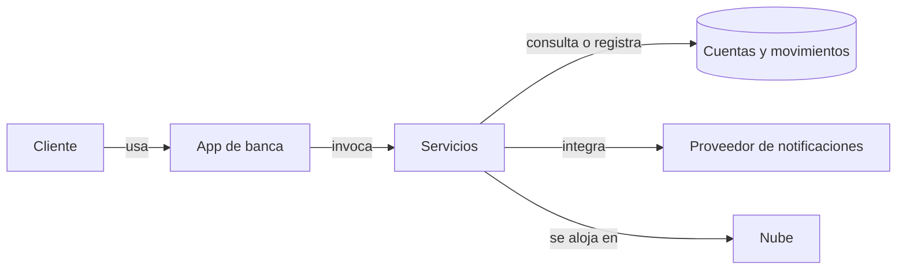
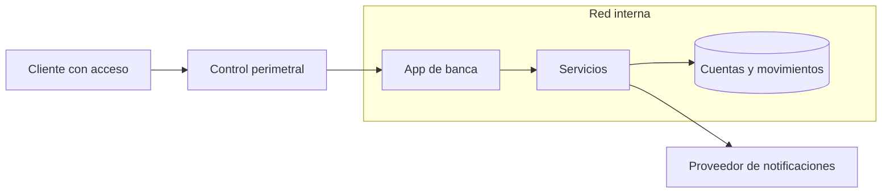
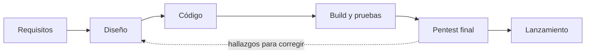
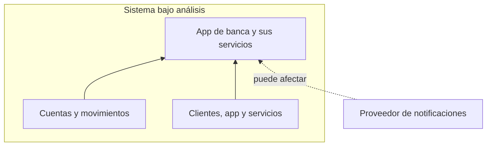
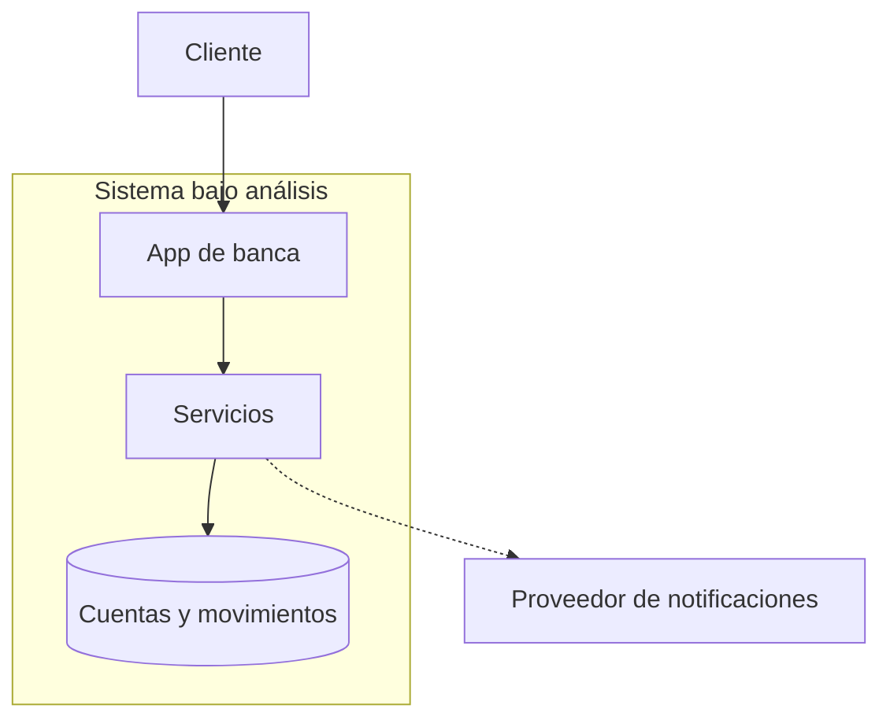
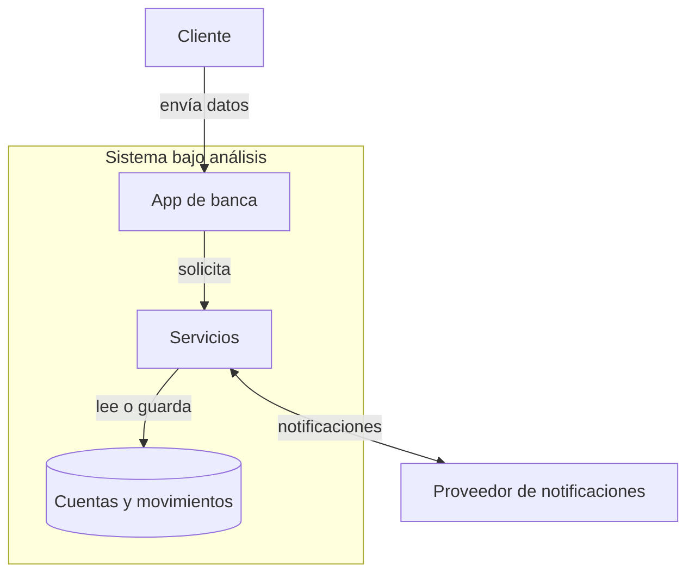
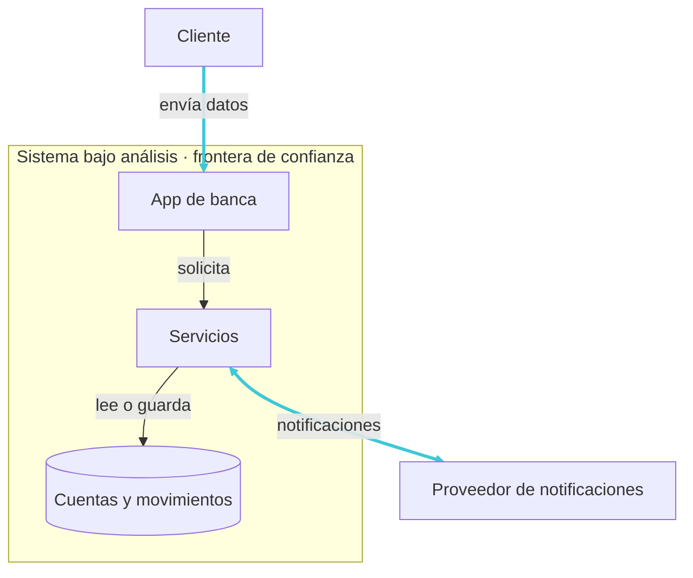
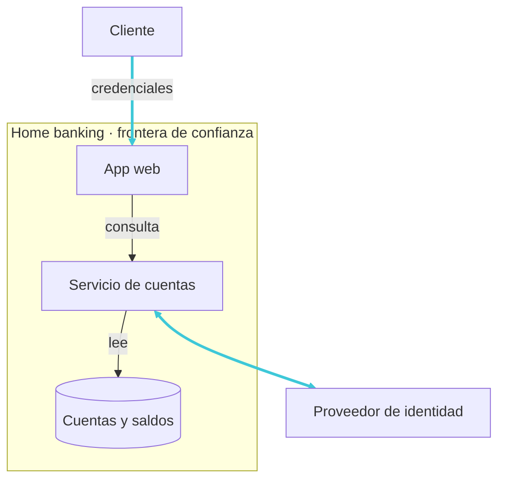

# Software seguro desde el diseño
## La seguridad se decide antes de escribir código.

  

    
Requisitos

    →
    
Diseño

    →
    
Código

    →
    
Operación

  

  
Las decisiones de diseño condicionan lo que podremos proteger después.

<!--
Notas para presentar:

Abrí con la idea central: un sistema no se vuelve seguro solo por agregar controles cuando ya está construido. Las decisiones tempranas definen qué información se maneja, quién puede acceder y cómo se conectan sus componentes.

Señalá el recorrido. El diseño merece atención porque allí se eligen estructuras y reglas que condicionan las etapas posteriores; la seguridad se sigue verificando durante la construcción, las pruebas y la operación.

En esta clase vamos a aprender a entender el sistema, modelar sus partes, anticipar amenazas y convertir ese análisis en decisiones de diseño. No hace falta empezar por una herramienta.

Transición: «Antes de pensar en defensas, preguntémonos: ¿dónde nace una vulnerabilidad y cuándo todavía es barato cambiar el rumbo?»

Fuente conceptual del ciclo de vida: NIST, Secure Software Development Framework (SSDF), SP 800-218. El marco recomienda integrar prácticas de desarrollo seguro en cada implementación del ciclo de vida del software.
https://www.nist.gov/publications/secure-software-development-framework-ssdf-version-11-recommendations-mitigating-risk
-->

---

# ¿Qué es una vulnerabilidad?

Una debilidad en un sistema, sus procedimientos, controles o implementación que una amenaza puede explotar o activar.

Puede estar en cualquier artefacto del SDLC:

  
Requisitos e historias

  
Diseño y arquitectura

  
Código y dependencias

  
Scripts, pipeline y build

  
Configuración e infraestructura

  
Software en operación

Una vulnerabilidad no está limitada al código fuente.

<!--
Notas para presentar:

Definí vulnerabilidad como una debilidad que una amenaza puede explotar o activar. No es lo mismo que un ataque: la debilidad puede existir sin que nadie la haya descubierto o utilizado.

Recorré los artefactos del SDLC con ejemplos:
- Requisitos e historias: no especificar quién puede acceder a un dato o qué validaciones debe cumplir una operación.
- Diseño y arquitectura: confiar en un componente sin verificarlo o no separar permisos entre servicios.
- Código y dependencias: una comprobación de autorización ausente o una biblioteca con una vulnerabilidad conocida.
- Scripts, pipeline y build: proteger de forma insuficiente el proceso que transforma el código o los artefactos que produce.
- Configuración e infraestructura: permisos excesivos, un servicio expuesto o almacenamiento accesible públicamente.
- Software en operación: una versión sin actualizar o una debilidad que se descubre después de su despliegue.

Una vulnerabilidad puede estar presente antes de conocerse; un nuevo hallazgo cambia lo que sabemos, aunque el código propio no cambie. Descubrimiento y explotación son estados distintos: el catálogo KEV de CISA identifica vulnerabilidades cuya explotación en el mundo real está confirmada.

El origen tampoco determina por sí solo el nivel de riesgo. Una debilidad en un requisito puede ser más riesgosa que una configuración concreta, o al revés; retomaremos la priorización según escenario, probabilidad e impacto cuando definamos riesgo.

Transición: «Ahora que sabemos que una vulnerabilidad puede afectar distintas partes del ciclo de vida, identifiquemos qué tiene valor en el sistema».

Fuentes: NIST, definición de vulnerabilidad; NIST SSDF, prácticas para proteger código, configuración y artefactos de software; NIST DevSecOps Reference Model, artefactos de desarrollo, build y release; CISA, Known Exploited Vulnerabilities Catalog.
https://csrc.nist.gov/glossary/term/vulnerability
https://csrc.nist.gov/pubs/sp/800/218/final
https://pages.nist.gov/nccoe-devsecops/notational-reference-model.html
https://www.cisa.gov/known-exploited-vulnerabilities-catalog
-->

---
layout: section
---

# Panorama de amenazas

  
Activos

  
Conexiones

  
Amenazas

  
Consecuencias

<!--
Notas para presentar:

Esta sección amplía la mirada: una debilidad importa por el sistema donde aparece, aquello que ese sistema protege y las consecuencias posibles.

Presentá el recorrido visual: primero identificaremos los activos; después miraremos las conexiones del software y las oportunidades de interacción; luego, las amenazas y sus posibles consecuencias.

Transición: «Empecemos por identificar qué tiene valor para cada sistema».

Marco de referencia: NIST SP 800-30 organiza la evaluación de riesgos alrededor de amenazas, vulnerabilidades, impacto y probabilidad. El recorrido de esta diapositiva es una síntesis didáctica para anticipar los temas de la sección.
https://csrc.nist.gov/pubs/sp/800/30/r1/final

PowerPoint original · diapositiva 5 · Panorama de Amenazas
-->

---

# Cada sistema tiene algo que proteger

**Activo:** algo que tiene valor para una persona u organización.

  
Personas y datos

  
Dinero y operaciones

  
Disponibilidad y confianza

Primero identificamos el valor; después, qué podría ponerlo en riesgo.

<!--
Notas para presentar:

Presentá «activo» como algo que tiene valor para alguien y que el sistema debe proteger. Puede ser tangible o intangible; no se limita a servidores o bases de datos.

Usá las tres tarjetas como ejemplos, no como una lista exhaustiva. En una app de banca, el activo puede ser la persona y sus datos, una transferencia correcta, la continuidad del servicio o la confianza para usarla.

El valor depende de quién necesita el sistema y qué perdería si una parte deja de funcionar, queda expuesta o se modifica sin autorización. Por eso conviene identificar activos antes de elegir controles.

Transición: «Para no hablar en abstracto, elijamos un sistema concreto que nos acompañe toda la clase».

Fuente de la definición: NIST CSRC Glossary, “Asset”; incluye entidades tangibles e intangibles cuyo valor determinan las partes interesadas.
https://csrc.nist.gov/glossary/term/asset
-->

---

# Nuestro caso: una app de banca digital

Un mismo sistema nos acompañará toda la clase: autenticarse, consultar y transferir.

  <section class="card px-4 py-6"><strong>Autenticarse</strong>
El cliente ingresa con su cuenta y verifica su identidad.
</section>
  <section class="card px-4 py-6"><strong>Consultar</strong>
Mira el saldo y los movimientos de su cuenta.
</section>
  <section class="card px-4 py-6"><strong>Transferir</strong>
Inicia una transferencia a otra cuenta.
</section>

Detrás de la app hay servicios, una base de datos y un proveedor externo de notificaciones.

<!--
Notas para presentar:

Presentá el caso que vamos a usar durante toda la clase: una app de banca digital. La elegimos porque es fácil de imaginar y concentra lo que aparece en casi cualquier sistema: personas, una aplicación, servicios que procesan, datos que se guardan y un proveedor externo.

Recorré los tres viajes del cliente: se autentica, consulta el saldo y los movimientos de su cuenta, inicia una transferencia a otra cuenta. Estos mismos viajes reaparecen en cada concepto de la clase: activos, flujos, fronteras de confianza, abusos y requisitos.

Aclará que la clase no trata de banca: el sistema es el vehículo para aprender decisiones de diseño seguro que aplican a cualquier software.

Pregunta para el intercambio: «¿Qué otro viaje harían con una app así?» Las respuestas —por ejemplo, descargar un extracto o cambiar el alias— sirven después cuando hablemos de superficie de ataque.

Transición: «Empecemos por mirar cómo se conectan las piezas de este sistema».
-->

---

# El software moderno está conectado

Cada vínculo requiere definir qué se intercambia, quién participa y qué permisos necesita.

<!--
Notas para presentar:

Presentá el dibujo como el mapa simplificado de nuestro caso: la app de banca, sus servicios, la base de cuentas y movimientos y el proveedor de notificaciones. Las flechas muestran que una misma operación pasa por varios componentes y llega también a un proveedor externo. La nube representa dónde pueden ejecutarse los servicios.

Recorré una transferencia del caso: el cliente confirma la operación desde la app, el servicio de pagos consulta o registra datos en la base y el sistema integra el proveedor de notificaciones para avisar que la transferencia se realizó. Preguntá: «¿Qué información necesita cada componente para completar la transferencia?». Usá las respuestas para señalar que cada vínculo requiere definir los datos que circulan y los permisos necesarios.

La ubicación de red por sí sola no determina si un componente es confiable. NIST recomienda centrar la protección en usuarios, dispositivos, activos y recursos, incluidas aplicaciones y servicios, sin conceder confianza implícita por estar dentro de una red.

Transición: «Como las aplicaciones se apoyan en muchos componentes y conexiones, proteger solo una entrada de la red no alcanza».

Fuente: NIST SP 800-207, Zero Trust Architecture.
https://csrc.nist.gov/pubs/sp/800/207/final
-->

---

# Defender solo el perímetro no alcanza

El control de entrada no vuelve confiables a todos los componentes internos.

  
<strong>Identidad</strong> Una cuenta legítima puede usarse mal o ser robada.

  
<strong>Servicios</strong> Un componente conectado puede quedar comprometido.

  
<strong>Comunicaciones</strong> Cada llamada requiere controles propios.

<!--
Notas para presentar:

Retomá el mapa anterior. El control perimetral puede filtrar una entrada, pero no verifica por sí mismo cada identidad, servicio ni llamada una vez que existen conexiones entre componentes. La red interna no es automáticamente confiable.

Recorré las tres tarjetas: una cuenta válida puede ser robada o usarse por error; un servicio interno puede tener una debilidad; una llamada entre componentes necesita permisos adecuados. Esto no vuelve inútiles al firewall ni a otros controles de red: muestra que hay que proteger también los recursos y sus interacciones.

Preguntá: «Si la solicitud ya llegó a la aplicación, ¿qué controles siguen haciendo falta entre la aplicación, el servicio y los datos?». Retomá autenticación, autorización y validación según lo que proponga el grupo.

Transición: «El enfoque centrado en el perímetro también tendía a dejar la seguridad de las aplicaciones para el final; veamos por qué eso se vuelve un límite en ciclos de desarrollo rápidos».

Fuente: NIST SP 800-207 explica que la ubicación de red no concede confianza implícita y que la protección debe centrarse en recursos, incluidos servicios y aplicaciones.
https://csrc.nist.gov/pubs/sp/800/207/final
-->

---

# El límite de la seguridad reactiva

El modelo de **fortaleza y foso** concentra la defensa en la red y deja la seguridad de la aplicación para una revisión antes del lanzamiento.

Una revisión tardía puede sumar retrabajo y tensionar la fecha de liberación.

<!--
Notas para presentar:

Explicá «fortaleza y foso» como un modelo que pone defensas fuertes en el borde de la red y confía en lo que queda adentro. Para las aplicaciones, reserva una revisión intensiva —por ejemplo, un pentest— cerca del lanzamiento.

Señalá la flecha de regreso: si el pentest encuentra un problema que requiere cambios, el equipo vuelve a diseño o código, repite pruebas y puede tener que revisar la fecha de salida. En ciclos cortos, ese control tardío puede acumular hallazgos y competir con la entrega; no significa que todo pentest bloquee un lanzamiento ni que deba quitarse.

La alternativa es integrar prácticas de seguridad a lo largo del ciclo y conservar pruebas especializadas antes de liberar. NIST recomienda incorporar prácticas de desarrollo seguro en cada implementación del SDLC. Su material de apoyo señala que, en general, atender la seguridad antes puede requerir menos esfuerzo y costo; presentá esto como una tendencia orientativa, no como una curva universal ni como una cifra fija.

Transición: «La seguridad necesita acompañar el sistema desde el diseño hasta la operación; no depende de una única herramienta o revisión final».

Fuentes: NIST, Secure Software Development Framework (SSDF), SP 800-218; NIST, Mitigating the Risk of Software Vulnerabilities by Adopting an SSDF (2020).
https://csrc.nist.gov/pubs/sp/800/218/final
https://nvlpubs.nist.gov/nistpubs/CSWP/NIST.CSWP.04232020.pdf

PowerPoint original · diapositiva 8 · Limitaciones de la seguridad tradicional reactiva
-->

---

# Seguridad es una propiedad del sistema

La seguridad no depende de una herramienta aislada, sino de decisiones coordinadas:

  <section class="card px-4 py-3" aria-label="Diseño">
    <strong>Diseño</strong>
    <ul class="mt-2 list-disc space-y-1 pl-5">
      <li>Modelado de amenazas y flujos de datos</li>
      <li>Límites de confianza entre componentes</li>
      <li>Reglas de autorización por operación</li>
    </ul>
  </section>
  <section class="card px-4 py-3" aria-label="Implementación">
    <strong>Implementación</strong>
    <ul class="mt-2 list-disc space-y-1 pl-5">
      <li>Validación de entradas según el dominio</li>
      <li>Consultas parametrizadas</li>
      <li>Autorización aplicada en el servidor</li>
    </ul>
  </section>
  <section class="card px-4 py-3" aria-label="Configuración">
    <strong>Configuración</strong>
    <ul class="mt-2 list-disc space-y-1 pl-5">
      <li>Cuentas de servicio con mínimo privilegio</li>
      <li>Secretos en un gestor con acceso restringido</li>
      <li>Desactivar cuentas y servicios innecesarios</li>
    </ul>
  </section>
  <section class="card px-4 py-3" aria-label="Operación">
    <strong>Operación</strong>
    <ul class="mt-2 list-disc space-y-1 pl-5">
      <li>Actualizar sistemas y dependencias</li>
      <li>Monitorear registros y alertas</li>
      <li>Probar restauraciones de copias de seguridad</li>
    </ul>
  </section>

<!--
Notas para presentar:

Retomá la idea anterior: una revisión final o una defensa perimetral no bastan. La matriz profundiza las cuatro dimensiones con ejemplos representativos; no es una lista completa ni una receta idéntica para todos los sistemas.

En diseño, modelar amenazas, flujos de datos y límites de confianza ayuda a decidir dónde ubicar controles y qué permisos hacen falta. En implementación, reglas de validación, consultas parametrizadas y verificaciones de autorización llevan esas decisiones al código. En configuración, las cuentas de servicio, los secretos y los valores predeterminados determinan la exposición concreta del despliegue. En operación, actualizar componentes, monitorear eventos y probar restauraciones mantienen la capacidad de proteger y recuperar el sistema.

Los ejemplos se condicionan entre sí. Un modelo de autorización correcto en el diseño no protege si no se verifica en cada operación; una implementación adecuada puede quedar expuesta por credenciales excesivas; y los controles pueden perder efectividad si no se mantienen.

Preguntá: «¿Qué parte de este sistema quedaría desprotegida si solo agregáramos una herramienta?».

NIST plantea integrar prácticas seguras en cada implementación del ciclo de desarrollo. OWASP recomienda modelar amenazas a partir de flujos de datos y límites de confianza, verificar autorización en cada solicitud y usar consultas parametrizadas. Sus guías de secretos y registros desarrollan controles para acceso, rotación, monitoreo y recuperación.

Transición: «Para tomar esas decisiones, primero identifiquemos qué tiene valor y necesita protección».

Fuentes: NIST SP 800-160 Vol. 1 Rev. 1, Engineering Trustworthy Secure Systems; NIST SP 800-218, Secure Software Development Framework (SSDF); NIST SP 800-53 Rev. 5, Security and Privacy Controls; OWASP Threat Modeling, Authorization, SQL Injection Prevention, Secrets Management y Logging Cheat Sheets.
https://csrc.nist.gov/pubs/sp/800/160/v1/r1/final
https://csrc.nist.gov/pubs/sp/800/218/final
https://csrc.nist.gov/pubs/sp/800/53/r5/upd1/final
https://cheatsheetseries.owasp.org/cheatsheets/Threat_Modeling_Cheat_Sheet.html
https://cheatsheetseries.owasp.org/cheatsheets/Authorization_Cheat_Sheet.html
https://cheatsheetseries.owasp.org/cheatsheets/SQL_Injection_Prevention_Cheat_Sheet.html
https://cheatsheetseries.owasp.org/cheatsheets/Secrets_Management_Cheat_Sheet.html
https://cheatsheetseries.owasp.org/cheatsheets/Logging_Cheat_Sheet.html
-->

---

# ¿Qué queremos proteger?

**En la app de banca:** los datos de clientes, el registro de movimientos y la disponibilidad del servicio.

  <section class="card px-4 py-4" aria-label="Confidencialidad">
    <strong>Confidencialidad</strong>
    
El saldo y los movimientos solo son visibles para el titular de la cuenta.

  </section>
  <section class="card px-4 py-4" aria-label="Integridad">
    <strong>Integridad</strong>
    
El importe y el destinatario de una transferencia permanecen correctos.

  </section>
  <section class="card px-4 py-4" aria-label="Disponibilidad">
    <strong>Disponibilidad</strong>
    
La app responde cuando el cliente necesita hacer una transferencia.

  </section>

<!--
Notas para presentar:

Retomá la definición de activo de la diapositiva anterior. Para concretarla, volvé al caso: la app de banca protege los datos de clientes, el registro de movimientos y la capacidad de completar transferencias.

Presentá confidencialidad, integridad y disponibilidad como tres objetivos clásicos de seguridad de la información. Confidencialidad limita quién puede conocer los datos; integridad protege contra modificaciones o destrucciones impropias; disponibilidad busca que la información y los sistemas se puedan usar de manera oportuna y confiable.

Recorré el ejemplo en las tres tarjetas: una consulta no autorizada afecta la confidencialidad; cambiar el importe o el destinatario sin autorización afecta la integridad; interrumpir la app cuando se necesita procesar una transferencia afecta la disponibilidad.

Las tres propiedades ayudan a analizar impactos, pero no agotan todos los atributos que pueden importar en un sistema; el contexto puede exigir otros, como autenticidad o trazabilidad de las acciones.

Preguntá: «Si una transferencia llega, pero con un importe distinto del autorizado, ¿qué propiedad se vio afectada?».

Transición: «Ya identificamos qué propiedades queremos preservar; ahora veamos qué situaciones podrían afectarlas».

Fuente: NIST CSRC Glossary, Information Security; deriva las definiciones de confidencialidad, integridad y disponibilidad de FIPS 200 y otras publicaciones NIST.
https://csrc.nist.gov/glossary/term/information_security
-->

---

# ¿Qué podría pasarle?

Una amenaza es una circunstancia o evento con potencial de afectar activos, personas u operaciones.

  <section class="card px-4 py-4" aria-label="Amenaza a la confidencialidad">
    <strong>Confidencialidad</strong>
    
Alguien consulta el saldo o los movimientos de otra cuenta.

  </section>
  <section class="card px-4 py-4" aria-label="Amenaza a la integridad">
    <strong>Integridad</strong>
    
Alguien modifica el importe o el destinatario sin autorización.

  </section>
  <section class="card px-4 py-4" aria-label="Amenaza a la disponibilidad">
    <strong>Disponibilidad</strong>
    
Una falla o un ataque impide realizar transferencias.

  </section>

<!--
Notas para presentar:

NIST define una amenaza como una circunstancia o evento con potencial de causar un impacto. Subrayá «potencial»: todavía no significa que el evento haya ocurrido ni que el daño sea inevitable.

Relacioná las tarjetas con la diapositiva anterior: los casos describen posibles efectos sobre confidencialidad, integridad y disponibilidad. La primera expone información; la segunda modifica una operación; la tercera interrumpe el servicio.

Amenaza y vulnerabilidad no son sinónimos. Una vulnerabilidad es una debilidad del sistema; una amenaza es una circunstancia o evento que podría aprovecharla o afectarlo. Tampoco todas las amenazas requieren un atacante: puede haber errores humanos, fallas técnicas u otros eventos no deliberados.

Preguntá: «¿Hace falta que exista un atacante para que ocurra una amenaza?». Retomá errores de configuración o fallas como ejemplos de eventos no deliberados.

Transición: «Ahora que identificamos los efectos posibles sobre el caso, miremos qué patrones se observan en brechas reales».

Fuentes: NIST CSRC Glossary, Threat; NIST SP 800-30 Rev. 1, Guide for Conducting Risk Assessments.
https://csrc.nist.gov/glossary/term/threat
https://csrc.nist.gov/pubs/sp/800/30/r1/final
-->

---

# Amenazas en organizaciones públicas y privadas

Patrones en brechas observadas globalmente, Verizon DBIR 2026

  <section class="card px-4 py-5" aria-label="Explotación de vulnerabilidades: 31 por ciento de las brechas">
    
Vulnerabilidades

    <strong class="text-3xl">31%</strong>
    
de las brechas se inició con explotación de vulnerabilidades de software

  </section>
  <section class="card px-4 py-5" aria-label="Ransomware presente en el 48 por ciento de las brechas">
    
Ransomware

    <strong class="text-3xl">48%</strong>
    
de las brechas incluyó ransomware

  </section>
  <section class="card px-4 py-5" aria-label="Terceros involucrados en el 48 por ciento de las brechas">
    
Terceros

    <strong class="text-3xl">48%</strong>
    
de las brechas involucró a terceros

  </section>

Las técnicas se repiten; los objetivos y servicios afectados dependen de cada organización.

<!--
Notas para presentar:

Usá las cifras como patrones transversales observados en brechas de distintos sectores, no como una estimación de riesgo para cada organización. En la edición 2026 del DBIR, el período analizado va del 1 de noviembre de 2024 al 31 de octubre de 2025.

Precisá que los porcentajes describen dimensiones diferentes y pueden superponerse: el 31% mide explotación de vulnerabilidades como vía de acceso inicial; el 48% indica presencia de ransomware en brechas; y el otro 48% señala participación de terceros. No se suman entre sí ni implican que todas las organizaciones enfrenten la misma frecuencia.

En ambos sectores pueden aparecer explotación de fallas, robo de credenciales, ingeniería social, ransomware y exposición por dependencias externas. Cambia qué busca el actor y qué impacto tiene: por ejemplo, interrumpir un servicio público, obtener información estratégica, extorsionar a una empresa o acceder a datos de clientes.

Como contraste situado, ENISA informa que la administración pública fue el sector más atacado en la Unión Europea durante 2025; el 82% de los incidentes registrados contra ese sector fueron DDoS. Aclará que esos datos describen organizaciones europeas y no representan por igual al sector privado ni a otros países.

Pregunta para abrir el intercambio: «¿Qué dependencia de una organización pública o privada podría transformar una falla técnica en una interrupción del servicio?»

Transición: «Estos patrones pueden afectar datos, operaciones o servicios. Ahora veamos cómo esas consecuencias se expresan como impacto y riesgo».

Fuentes: Verizon, 2026 Data Breach Investigations Report; ENISA, 2026 Threat Landscape.
https://www.verizon.com/business/resources/reports/dbir/
https://www.enisa.europa.eu/topics/cyber-threats/threat-landscape
-->

---

# Consecuencias reales de ciberataques

  <section class="border-t border-gray-400/60 pt-3" aria-label="WannaCry en el sistema público de salud de Inglaterra, 2017">
    
Sector público · Inglaterra · 2017

    <h2 class="mt-2 text-xl font-semibold">WannaCry y el NHS</h2>
    <strong class="mt-3 block text-3xl">Más de 19.000</strong>
    
citas estimadas canceladas; en cinco zonas, hospitales derivaron pacientes a otros servicios de urgencias.

  </section>
  <section class="border-t border-gray-400/60 pt-3" aria-label="Ataque a Colonial Pipeline, empresa privada de energía, 2021">
    
Sector privado · Estados Unidos · 2021

    <h2 class="mt-2 text-xl font-semibold">Colonial Pipeline</h2>
    <strong class="mt-3 block text-3xl">Combustible interrumpido</strong>
    
Un ataque a sistemas corporativos llevó a detener temporalmente el oleoducto por precaución.

  </section>

El impacto puede alcanzar a personas y servicios que dependen de los sistemas afectados.

<!--
Notas para presentar:

Usá los casos para darle contenido concreto a «impacto»: la magnitud del daño que puede producir un evento en operaciones, activos y personas. NIST incluye explícitamente esos efectos en su guía de evaluación de riesgos.

En Inglaterra, el ransomware WannaCry afectó al NHS en mayo de 2017. NHS England identificó 6.912 citas canceladas en los datos que pudo recoger y estimó más de 19.000 en total. La cifra es una estimación, no un conteo completo. Al menos 81 de 236 trusts resultaron afectados y hospitales de cinco zonas tuvieron que derivar pacientes a otros servicios de urgencias. El informe atribuyó la exposición a sistemas Windows sin actualizar o fuera de soporte que compartían una vulnerabilidad.

En Colonial Pipeline, el ransomware afectó los sistemas corporativos. La empresa desconectó preventivamente sistemas que monitoreaban y controlaban el oleoducto para evitar que el incidente llegara a ellos. No había indicios de compromiso de esos sistemas operativos al 12 de mayo, pero la desconexión detuvo temporalmente las operaciones y cortó la entrega de combustible en parte del sudeste de Estados Unidos. El oleoducto reanudó operaciones el 13 de mayo.

Pregunta para el intercambio: «En Colonial Pipeline, ¿por qué se interrumpió un servicio físico aunque el ataque afectó los sistemas corporativos?» Guiá la respuesta hacia las dependencias entre TI y operación, y hacia las decisiones de continuidad ante incertidumbre.

Transición: «En estos casos podemos separar tres piezas: la debilidad que existía, la amenaza que actuó y el riesgo que se materializó. Veámoslas por separado».

Fuentes: National Audit Office, Investigation: WannaCry cyber attack and the NHS; U.S. Government Accountability Office, Colonial Pipeline Cyberattack Highlights Need for Better Federal and Private-Sector Preparedness; NIST SP 800-30 Rev. 1.
https://www.nao.org.uk/reports/investigation-wannacry-cyber-attack-and-the-nhs/
https://www.gao.gov/blog/colonial-pipeline-cyberattack-highlights-need-better-federal-and-private-sector-preparedness-infographic
https://csrc.nist.gov/pubs/sp/800/30/r1/final
-->

---

# Amenaza y riesgo dependen del contexto

Una amenaza describe un evento con potencial de daño. El riesgo valora la posibilidad de que afecte a un sistema y la gravedad de sus consecuencias.

  

  <strong class="rounded-t-lg bg-gray-200/70 px-3 py-2 text-gray-900">Riesgo bajo</strong>
  <strong class="rounded-t-lg bg-gray-200/70 px-3 py-2 text-gray-900">Riesgo alto</strong>

  <strong class="rounded-l-lg bg-gray-200/70 px-3 py-3 text-gray-900">Amenaza baja</strong>
  
Evento poco probable y consecuencia acotada.

  
Evento poco probable, pero podría interrumpir un servicio esencial sin alternativa de recuperación.

  <strong class="rounded-l-lg bg-gray-200/70 px-3 py-3 text-gray-900">Amenaza alta</strong>
  
Intentos frecuentes; controles eficaces y recuperación rápida.

  
Ataque probable contra un servicio crítico expuesto, con recuperación insuficiente.

La amenaza influye en el escenario; la exposición, las vulnerabilidades, los controles y el impacto modifican el riesgo.

<!--
Notas para presentar:

Volvé al concepto después de los casos anteriores. Un caso real sirve para darle peso al tema, pero acá interesa la relación general entre amenaza y riesgo.

NIST define amenaza como una circunstancia o evento con potencial de causar daño. El riesgo considera la posibilidad de que ese escenario ocurra y la magnitud de sus consecuencias. La amenaza influye en la evaluación, pero por sí sola no determina el riesgo: importan el sistema concreto, sus vulnerabilidades, exposición, controles, criticidad y capacidad de recuperación.

Recorré la matriz como una clasificación cualitativa, no como una escala universal ni una fórmula matemática. En este ejemplo, amenaza baja o alta describe la actividad o posibilidad del escenario en un contexto; no es una etiqueta permanente para un actor. Una actividad de amenaza alta puede traducirse en riesgo bajo si los controles limitan la posibilidad de éxito y el impacto. Un evento poco probable puede implicar riesgo alto si compromete un servicio esencial sin alternativas de recuperación.

Pregunta para el intercambio: «¿Qué condición del sistema podría mover un escenario de riesgo bajo a riesgo alto, aunque la amenaza no cambie?»

Si sirve para fijar la idea, retomá brevemente los dos casos anteriores: WannaCry muestra cómo una debilidad de software permitió afectar la atención; Colonial Pipeline muestra cómo las dependencias y una decisión de continuidad ampliaron las consecuencias. Usalos como ejemplos, sin convertirlos en definiciones.

Transición: «Para estimar exposición e impacto necesitamos entender qué partes tiene el sistema y cómo se relacionan».

Fuentes: NIST CSRC Glossary, Threat and Risk; NIST SP 800-30 Rev. 1, Guide for Conducting Risk Assessments.
https://csrc.nist.gov/glossary/term/threat
https://csrc.nist.gov/glossary/term/risk
https://csrc.nist.gov/pubs/sp/800/30/r1/final
-->

---

# El alcance del sistema define el análisis

**Fuera de nuestro control no significa fuera del análisis.**

<!--
Notas para presentar:

Presentá el alcance como el objeto concreto que vamos a analizar: en nuestro caso, la app de banca y todo lo que la sostiene. Señalá el sistema protegido y después los datos, actores y componentes que lo sostienen. No alcanza con nombrar la aplicación: hay que entender qué servicio presta y de qué depende.

Señalá la dependencia externa. Aunque quede fuera del control directo de la organización, puede afectar la disponibilidad, integridad o confidencialidad del servicio.

NIST recomienda caracterizar el sistema y su contexto antes de evaluar el riesgo. OWASP propone entender la aplicación, sus flujos de datos y límites de confianza antes de identificar amenazas.

Pregunta para el intercambio: «Si el proveedor de notificaciones deja de responder, ¿qué parte del caso se ve afectada y cuál sigue funcionando?»

Transición: «Dibujemos el caso y hagamos visibles sus componentes y dependencias».

Fuentes: NIST SP 800-30 Rev. 1, Guide for Conducting Risk Assessments; OWASP Threat Modeling Cheat Sheet.
https://csrc.nist.gov/pubs/sp/800/30/r1/final
https://cheatsheetseries.owasp.org/cheatsheets/Threat_Modeling_Cheat_Sheet.html
-->

---
layout: two-cols-header
---

# Dibujemos el sistema

::left::

El recuadro marca el alcance; la línea punteada, una dependencia externa.

::right::

### Componentes, en nuestro caso

  <strong>Cliente</strong>persona con una cuenta
  <strong>App de banca</strong>app móvil o web
  <strong>Servicios</strong>autenticación, extractos, pagos
  <strong>Cuentas y movimientos</strong>saldos e historial
  <strong>Proveedor de notificaciones</strong>confirmaciones por SMS o correo

<!--
Notas para presentar:

Leé el dibujo de arriba hacia abajo. El cliente inicia una interacción con la app; los servicios procesan la solicitud y consultan la base de datos. La app, los servicios y los datos están dentro del alcance representado. El cliente y el proveedor de notificaciones interactúan desde fuera de ese límite. Usá la columna derecha para aterrizar cada etiqueta en el caso; la misma estructura sirve para otros sistemas: cambian los nombres, no la forma de mirar.

La línea punteada representa una dependencia externa: el proveedor que envía las notificaciones del caso. El esquema es un modelo inicial para conversar, no una arquitectura completa: alcanza para hacer visibles los componentes, las interacciones y los elementos que quedan fuera del control directo.

Pregunta para el intercambio: «Si el proveedor de notificaciones deja de responder, ¿qué funciones del caso siguen operando?»

Transición: «Ahora sigamos las conexiones y veamos qué información circula, quién la recibe y quién puede modificarla».

Fuente: OWASP Threat Modeling Cheat Sheet. Recomienda usar diagramas de flujo de datos para representar procesos, almacenes de datos, flujos, entidades externas y límites de confianza.
https://cheatsheetseries.owasp.org/cheatsheets/Threat_Modeling_Cheat_Sheet.html
-->

---
layout: two-cols-header
---

# La información se mueve

::left::

El intercambio con el proveedor externo se dibuja aparte del recorrido interno.

::right::

### Qué identificar

  <section class="card px-3 py-3"><strong>Origen</strong> Persona o sistema que genera la información.</section>
  <section class="card px-3 py-3"><strong>Destino</strong> Servicio, almacén o sistema que la recibe.</section>
  <section class="card px-3 py-3"><strong>Acceso</strong> Quién puede leerla o modificarla.</section>

<!--
Notas para presentar:

Recorré el flujo en el caso: el cliente envía credenciales o confirma una transferencia; la app solicita la operación; los servicios leen o guardan datos y pueden intercambiar información con el proveedor de notificaciones. El diagrama separa ese intercambio externo del recorrido interno: los datos no pasan necesariamente primero por el almacén y después al proveedor externo.

Usá las tres tarjetas para organizar el análisis: identificar quién origina el dato, dónde llega o queda almacenado y qué identidades tienen permiso para leerlo o modificarlo. El permiso de acceso es una propiedad de seguridad que analizamos junto con el flujo.

Pregunta para el intercambio: «¿Quién podría leer o alterar el importe de una transferencia durante su recorrido?»

Transición: «Además de seguir los datos, tenemos que decidir qué confianza merece cada origen y cada componente».

Fuentes: OWASP Threat Modeling Cheat Sheet; OWASP Secure Code Review Cheat Sheet. El modelado de amenazas recomienda hacer visibles flujos, almacenes, procesos, entidades externas y límites de confianza; la revisión de flujos identifica orígenes, procesamiento, destinos y controles en las fronteras.
https://cheatsheetseries.owasp.org/cheatsheets/Threat_Modeling_Cheat_Sheet.html
https://cheatsheetseries.owasp.org/cheatsheets/Secure_Code_Review_Cheat_Sheet.html
-->

---

# ¿En quién confiamos?

No todo componente, usuario o dato merece el mismo nivel de confianza.

  <section class="card px-4 py-4"><strong>Asumir</strong> Aceptar identidad, datos y respuestas sin comprobarlos. Es el camino por defecto, casi invisible.</section>
  <section class="card px-4 py-4"><strong>Verificar</strong> Comprobar quién envía, qué permisos tiene y si el dato es válido antes de actuar. Es una decisión de diseño.</section>

<!--
Notas para presentar:

Planteá la pregunta del título y pedí ejemplos de la experiencia del público: un correo que dice venir del banco, una notificación que pide reingresar credenciales, una respuesta inesperada del proveedor de notificaciones. En cada caso preguntá: ¿qué estamos asumiendo y qué podríamos comprobar?

Contrastá las dos tarjetas: asumir no requiere ninguna decisión y por eso pasa desapercibido; verificar hay que diseñarlo. La confianza no es binaria ni gratuita: se decide a partir de lo que sabemos del origen y de las validaciones que aplicamos antes de actuar.

Pregunta para el intercambio: «¿Qué validaciones hace hoy un sistema que ustedes conozcan antes de confiar en un dato?»

Transición: «Si la confianza cambia según el contexto, necesitamos marcar dónde cambia: ahí aparece la frontera de confianza».

Fuente: NIST SP 800-207, Zero Trust Architecture. Propone no asumir confianza por la ubicación en la red y verificar cada solicitud de forma explícita, sea cual sea su origen.
https://csrc.nist.gov/pubs/sp/800/207/final
-->

---
layout: two-cols-header
---

# Fronteras de confianza

::left::

Cada flecha que cruza el recuadro atraviesa la frontera: ahí va una validación.

::right::

Una frontera de confianza marca el paso entre contextos con distintos niveles de confianza. Su nombre técnico es **trust boundary**.

### Al cruzarla, validamos

  <strong>Identidad</strong>quién envía: autenticación
  <strong>Permisos</strong>qué puede hacer: autorización
  <strong>Datos</strong>que sean válidos: validación de entrada

<!--
Notas para presentar:

Señalá que es el mismo diagrama que venimos usando; lo que cambia es la pregunta. El recuadro ya no marca solo el alcance: es la frontera de confianza. Dentro, los componentes comparten un contexto de confianza; fuera, el cliente y el proveedor de notificaciones están en otro.

Señalá las dos flechas resaltadas: los datos que entran desde el cliente y el intercambio con el proveedor de notificaciones atraviesan la frontera. Usá la tabla de la derecha: en cada cruce validamos identidad (autenticación), permisos (autorización) y que los datos sean válidos (validación de entrada). Los flujos internos también pueden tener fronteras si los componentes tienen niveles de confianza distintos; empezamos por el borde porque es el cruce más visible.

Pregunta para el intercambio: «¿Qué validaciones hace hoy una aplicación que conozcan cuando una persona envía datos?»

Transición: «Cada cruce es también un lugar donde alguien puede interactuar con el sistema: esos puntos forman la superficie de ataque».

Fuente: OWASP Threat Modeling Cheat Sheet. Los diagramas de flujo de datos incluyen límites de confianza como elemento explícito del modelo.
https://cheatsheetseries.owasp.org/cheatsheets/Threat_Modeling_Cheat_Sheet.html
-->

---

# Superficie de ataque

Son los lugares donde alguien puede interactuar con el sistema o influir en él.

  <section class="card px-3 py-3"><strong>Entradas</strong> formulario de transferencia</section>
  <section class="card px-3 py-3"><strong>Cuentas</strong> credenciales de clientes</section>
  <section class="card px-3 py-3"><strong>APIs</strong> endpoints de saldo y pagos</section>
  <section class="card px-3 py-3"><strong>Archivos</strong> extractos descargables</section>
  <section class="card px-3 py-3"><strong>Interfaces</strong> pantallas de la app</section>
  <section class="card px-3 py-3"><strong>Servicios externos</strong> proveedor de notificaciones</section>

Reducir entradas innecesarias reduce oportunidades de abuso.

<!--
Notas para presentar:

Retomá la diapositiva anterior: los cruces de la frontera de confianza son parte de la superficie de ataque, pero la superficie incluye todo punto de interacción, visible o no. Recorré las seis fichas: cada una es un punto real de la app de banca que venimos dibujando.

Cerrá con la idea de reducción: cada entrada que no se necesita es una oportunidad menos para un abuso. Cada nueva funcionalidad, API o integración amplía la superficie; por eso conviene revisar qué queda expuesto y qué puede quitarse o restringirse.

Pregunta para el intercambio: «¿Qué entrada de la app de banca podría eliminarse o restringirse? Por ejemplo, ¿hace falta exponer la consulta de cualquier cuenta o solo de la propia?»

Transición: «Veamos por cuáles de estos lugares suelen llegar los incidentes reales».

Fuente: OWASP Attack Surface Analysis Cheat Sheet. Recomienda identificar los puntos donde el sistema recibe o expone datos y revisar qué partes de la superficie son realmente necesarias.
https://cheatsheetseries.owasp.org/cheatsheets/Attack_Surface_Analysis_Cheat_Sheet.html
-->

---
layout: two-cols-header
---

# ¿De dónde vienen las brechas?

::left::

### Causas frecuentes

  <section class="card px-3 py-3"><strong>Phishing y amenazas internas</strong> Intencionadas o accidentales.</section>
  <section class="card px-3 py-3"><strong>Software de terceros</strong> Vulnerable o sin parches.</section>
  <section class="card px-3 py-3"><strong>Configuración incorrecta</strong> Especialmente en la nube.</section>

::right::

### La superficie se expande

  <section class="card px-3 py-3"><strong>Nuevos servicios digitales</strong> En banca, por ejemplo: home banking, onboarding digital, pagos instantáneos.</section>
  <section class="card px-3 py-3"><strong>Arquitecturas modernas</strong> Microservicios, contenedores y nube suman dependencias.</section>

<!--
Notas para presentar:

Presentá las causas como orígenes observados con frecuencia en incidentes, no como un ranking ni como frecuencias trasladables a cada organización. Los ejemplos de servicios digitales son del sector financiero, tomados del material original; sirven para ilustrar cómo cada nueva funcionalidad amplía la superficie, no para caracterizar a todos los sectores.

Caso de apoyo: la brecha de Snowflake de 2024 combinó varias de estas causas — credenciales robadas, cuentas sin autenticación multifactor y exposición a través de un tercero. Usalo para mostrar que las causas se encadenan. Aclará que el análisis es de la Cloud Security Alliance y describe un caso particular.

Pregunta para el intercambio: «¿Cuál de estas causas les parece más probable en una organización que conozcan, y por qué?»

Transición: «Estas causas aprovechan entradas y debilidades concretas. Para defendernos no alcanza con enumerar casos: conviene diseñar con principios».

Fuente: Cloud Security Alliance, análisis de la brecha de Snowflake (2025).
https://cloudsecurityalliance.org/blog/2025/05/07/unpacking-the-2024-snowflake-data-breach
-->

---
class: flex flex-col justify-center
---

# Principios de diseño seguro

No hace falta memorizar una lista extensa. Empecemos con preguntas útiles:

  <section class="card-strong px-5 py-10"><strong class="text-xl">¿Quién necesita este acceso?</strong>
Confiar lo mínimo necesario.
</section>
  <section class="card-strong px-5 py-10"><strong class="text-xl">¿Qué pasa si una defensa falla?</strong>
Varias defensas; fallar de forma segura.
</section>
  <section class="card-strong px-5 py-10"><strong class="text-xl">¿Cómo limitamos el daño?</strong>
Separar y contener.
</section>

<!--
Notas para presentar:

Abrí con la idea de la primera línea: los principios de diseño seguro no son una lista para memorizar, sino preguntas que conviene hacerse mientras se diseña. Recorré las tres tarjetas y anticipá que las vamos a ver una por una: la primera pregunta abre el principio de mínimo privilegio; la segunda, la defensa en profundidad y el fallo seguro; la tercera, la contención del impacto.

Pregunta para el intercambio: «¿Cuál de estas preguntas aplicarían primero a la app de banca que dibujamos?»

Transición: «Empecemos por la primera: confiar lo mínimo necesario».

Fuente: OWASP, Security by Design Principles. Reúne principios como mínimo privilegio, defensa en profundidad, fallo seguro y separación de funciones.
https://owasp.org/www-project-security-by-design-principles/
-->

---
class: flex flex-col justify-center
---

# Confiar lo mínimo necesario

¿Qué permisos necesita cada identidad para su tarea, y por cuánto tiempo?

  <section class="card-strong px-6 py-8"><strong class="text-xl">Alcance</strong>
El servicio de extractos consulta saldos y movimientos, pero no puede iniciar transferencias.
</section>
  <section class="card-strong px-6 py-8"><strong class="text-xl">Duración</strong>
El acceso de mantenimiento a la base de datos se habilita por ventana y se revoca al terminar.
</section>

Limitar permisos reduce lo que una cuenta comprometida puede hacer.

<!--
Notas para presentar:

Abrí con la pregunta visible y distinguí sus dos dimensiones: el alcance (qué acciones y recursos permite un permiso) y la duración (cuánto tiempo permanece habilitado). El principio aplica tanto a personas como a cuentas de servicio y componentes.

Usá los ejemplos del caso: el servicio de extractos necesita leer saldos y movimientos, no modificarlos ni iniciar transferencias; un acceso de mantenimiento a la base puede ser temporal. No es una regla de «quitar permisos porque sí»: cada permiso debe responder a una tarea concreta.

Pregunta para el intercambio: «Si comprometieran el servicio de extractos, ¿qué acción no debería poder ejecutar?»

Transición: «El mínimo privilegio limita lo que puede hacer cada identidad; ahora veamos por qué tampoco conviene depender de una sola barrera».

Fuentes: NIST SP 800-53 Rev. 5, control AC-6 (Least Privilege); OWASP, Security by Design Principles.
https://csrc.nist.gov/pubs/sp/800/53/r5/upd1/final
https://owasp.org/www-project-security-by-design-principles/
-->

---
class: flex flex-col justify-center
---

# No depender de una única defensa

¿Qué pasa si una barrera falla?

La defensa en profundidad combina controles complementarios.

  <section class="card-strong px-5 py-8"><strong class="text-xl">Prevenir</strong>
Validar entradas y limitar accesos.
</section>
  <section class="card-strong px-5 py-8"><strong class="text-xl">Detectar</strong>
Registrar actividad y alertar ante anomalías.
</section>
  <section class="card-strong px-5 py-8"><strong class="text-xl">Contener</strong>
Aislar componentes y acotar permisos.
</section>

Si un control se supera, otros todavía pueden detectar el incidente o limitar su impacto.

<!--
Notas para presentar:

Retomá la pregunta visible: ningún control es infalible. La defensa en profundidad combina controles distintos para prevenir un abuso, detectar actividad que logró pasar y contener sus efectos. Las funciones se complementan; no garantizan que todo incidente se evite.

Recorré las tarjetas con el caso: validar la solicitud de transferencia y exigir permisos adecuados ayuda a prevenir; registrar las operaciones y alertar ante patrones inusuales, como transferencias a destinos nuevos de madrugada, permite detectar; aislar el servicio afectado y mantener permisos acotados ayuda a contener.

Pregunta para el intercambio: «Si el control de acceso no detectara una cuenta comprometida, ¿qué otra capa podría detectar o limitar su actividad?»

Transición: «Y si aun así ocurre un fallo, el sistema también tiene que responder de manera segura».

Fuente: OWASP, Security by Design Principles. Recomienda combinar defensas en profundidad en lugar de depender de un único control.
https://owasp.org/www-project-security-by-design-principles/
-->

---
class: flex flex-col justify-center
---

# Diseñar también para cuando algo falle

Si un control o una dependencia falla, ¿cómo debería responder el sistema?

  <section class="card-strong px-5 py-8"><strong class="text-xl">Proteger</strong>
Sin poder verificar autorización, no ejecutar transferencias.
</section>
  <section class="card-strong px-5 py-8"><strong class="text-xl">Degradar</strong>
Sin notificaciones, seguir consultando y transfiriendo.
</section>
  <section class="card-strong px-5 py-8"><strong class="text-xl">Recuperar</strong>
Registrar el fallo y restablecer el servicio de forma controlada.
</section>

Fallar seguro no es apagar todo: es limitar las acciones sensibles y conservar, cuando sea posible, las funciones independientes del componente fallido.

<!--
Notas para presentar:

La pregunta cubre fallos de controles internos y de dependencias externas. Usá las tarjetas como decisiones de diseño: si no se puede verificar autorización, no ejecutar una transferencia; si falla el proveedor de notificaciones, la consulta de saldo y las transferencias siguen operando y las notificaciones pendientes se recuperan después; registrar el problema y restablecer el servicio con verificación.

Aclaración importante: «fallar de forma segura» no significa denegar toda solicitud ni apagar el sistema ante cualquier error. La respuesta depende de los requisitos de confidencialidad, integridad y disponibilidad. Una consulta pública segura podría continuar mientras una operación que modifica datos queda bloqueada.

Pregunta para el intercambio: «Si la verificación de permisos falla temporalmente, ¿qué acciones deberían detenerse y cuáles podrían continuar?»

Transición: «Incluso con controles y recuperación, puede haber un compromiso. Veamos cómo limitar cuánto puede afectar».

Fuentes: NIST SP 800-53 Rev. 5, control SC-24 (Fail in Known State); OWASP, Security by Design Principles.
https://csrc.nist.gov/pubs/sp/800/53/r5/upd1/final
https://owasp.org/www-project-security-by-design-principles/
-->

---
class: flex flex-col justify-center
---

# Limitar el impacto de un compromiso

Si se compromete una cuenta, ¿hasta dónde puede llegar?

  <section class="card-strong px-6 py-8"><strong class="text-xl">Alcance amplio</strong>
Una cuenta con permisos amplios puede leer movimientos, iniciar transferencias y administrar usuarios.
</section>
  <section class="card-strong px-6 py-8"><strong class="text-xl">Acceso acotado</strong>
El servicio de extractos solo lee; el de pagos escribe transferencias; administración usa permisos separados.
</section>

Separar permisos y componentes reduce el radio de impacto (<em>blast radius</em>).

<!--
Notas para presentar:

Usá las tarjetas para contrastar dos diseños posibles, no como una afirmación de que todo compromiso se propaga. Con permisos amplios y componentes muy conectados, una cuenta comprometida podría alcanzar otros servicios; con permisos acotados y separación, el acceso queda limitado a lo que esa identidad necesita.

Retomá el ejemplo anterior: el servicio de extractos puede consultar saldos y movimientos, pero no modificarlos ni iniciar transferencias. Separar funciones, permisos y componentes limita el alcance del incidente. El término técnico es «radio de impacto» o blast radius.

Pregunta para el intercambio: «¿Qué separación de permisos o componentes reduciría el alcance de un compromiso en la app de banca?»

Transición: «Limitar el impacto reduce el daño posible; ahora cambiemos de perspectiva y pensemos cómo podrían abusar del sistema».

Fuentes: NIST SP 800-53 Rev. 5, controles AC-6 (Least Privilege) y SC-7 (Boundary Protection); OWASP, Security by Design Principles.
https://csrc.nist.gov/pubs/sp/800/53/r5/upd1/final
https://owasp.org/www-project-security-by-design-principles/
-->

---
class: flex flex-col justify-center
---

# ¿Cómo se podría abusar del sistema?

  <section class="card-strong px-6 py-10"><strong class="text-xl">Uso esperado</strong>
Consultar el saldo y los movimientos de la propia cuenta.
</section>
  →
  <section class="card-strong px-6 py-10"><strong class="text-xl">Intento de abuso</strong>
Modificar el identificador de la cuenta para intentar consultar movimientos ajenos.
</section>

Mirar más allá del uso esperado revela requisitos que el camino feliz no muestra.

<!--
Notas para presentar:

Usá el contraste para cambiar la perspectiva: el cliente consulta los movimientos de su cuenta; alguien modifica el identificador de la solicitud para intentar acceder a movimientos ajenos. El ejemplo describe un intento, no afirma que el acceso tenga éxito: el control de autorización debería impedirlo.

Aclará que pensar desde el abuso no implica desconfiar de cada usuario. Sirve para descubrir qué reglas y controles necesita el sistema, además de los que hacen funcionar el caso legítimo.

Pregunta para el intercambio: «¿Qué dato o acción de la app de banca intentaría alcanzar alguien sin autorización?»

Transición: «Threat Modeling es una forma estructurada de hacer esa búsqueda antes de construir».

Fuente: OWASP Threat Modeling Cheat Sheet. Recomienda identificar objetivos, actores, superficies de ataque y posibles amenazas a partir de cómo funciona el sistema.
https://cheatsheetseries.owasp.org/cheatsheets/Threat_Modeling_Cheat_Sheet.html
-->

---
class: flex flex-col justify-center
---

# Threat Modeling

¿Qué protegemos, qué podría salir mal y cómo respondemos?

  <section class="card-strong px-4 py-8"><strong class="text-xl">Entender</strong>
Actores, datos, componentes y flujos.
</section>
  →
  <section class="card-strong px-4 py-8"><strong class="text-xl">Analizar</strong>
Posibles abusos y fallos.
</section>
  →
  <section class="card-strong px-4 py-8"><strong class="text-xl">Responder</strong>
Requisitos, controles y pruebas.
</section>

Threat Modeling ordena esta conversación; no requiere una herramienta específica.

<!--
Notas para presentar:

Retomá lo que ya construimos sobre el caso: delimitamos la app de banca, identificamos actores y datos, seguimos flujos y marcamos fronteras de confianza. Threat Modeling ordena ese contexto para explorar amenazas y decidir qué hacer.

Recorré las tres etapas de izquierda a derecha. «Entender» evita analizar un sistema abstracto; «analizar» busca escenarios posibles de abuso o fallo; «responder» traduce hallazgos en requisitos, controles y pruebas. No es necesario adoptar una herramienta para empezar, y conviene revisar el análisis si cambian componentes, datos o dependencias.

Antes de presentar STRIDE, hagamos nosotros la etapa de análisis: en la próxima diapositiva volvemos al sistema del caso y preguntamos qué podría salir mal. STRIDE aparece después, como ayuda para encontrar lo que nos falte, no como una lista que haya que memorizar.

Pregunta para el intercambio: «¿En cuál de estas etapas ya tenemos información suficiente y cuál necesitamos completar?»

Transición: «Antes de presentar STRIDE, hagamos el trabajo nosotros: volvamos al sistema y pensemos como atacantes».

Fuentes: OWASP Threat Modeling Cheat Sheet; NIST SP 800-218, Secure Software Development Framework.
https://cheatsheetseries.owasp.org/cheatsheets/Threat_Modeling_Cheat_Sheet.html
https://csrc.nist.gov/pubs/sp/800/218/final
-->

---
layout: two-cols-header
---

# ¿Qué podría salir mal?

::left::

Cada flecha que cruza el recuadro atraviesa la frontera: ahí empieza a preguntar un atacante.

::right::

### Preguntar como atacante

  <strong>Actor</strong>¿quién intenta algo?
  <strong>Acción</strong>¿qué intenta hacer?
  <strong>Objetivo</strong>¿qué gana si logra?

<strong>En juego</strong> Credenciales, saldos y movimientos, disponibilidad del servicio.

El sistema es el mismo: cambia quién lo mira y con qué intención.

<!--
Notas para presentar:

Actividad, fases 1 a 3 (entre 5 y 7 minutos con trabajo en parejas; versión corta al final de estas notas).

Fase 1 — mostrar el sistema (1 minuto): volvé al mismo diagrama de siempre, ahora con nombres concretos del caso bancario. El cliente ingresa sus credenciales en la app web; la app consulta al servicio de cuentas; el servicio lee las cuentas y los saldos y valida la identidad con el proveedor de identidad. Señalá las dos flechas cian: son los cruces de la frontera de confianza. Nombrá lo que está en juego: credenciales, saldos y movimientos, disponibilidad del servicio.

Fase 2 — preguntar (2 minutos): consigna para parejas o grupos de tres: «Como atacante, ¿qué intentarías con este sistema? Nombrá actor, acción y objetivo». No hace falta anotar nada: alcanza con pensar y preparar una respuesta para compartir. Si preferís participación de toda la clase, salteá las parejas y pedí respuestas directamente con las manos levantadas.

Fase 3 — recolectar (2 a 3 minutos): anotá en el pizarrón entre 4 y 8 amenazas, sin corregir ni filtrar; agrupá las repetidas y dejá la lista a la vista. Respuestas probables: usar credenciales robadas para entrar como otro cliente; modificar el identificador de cuenta para ver saldos ajenos; leer movimientos de otra persona; alterar una transferencia en curso; dejar el home banking sin servicio; hacerse pasar por el proveedor de identidad. Lo habitual es que falten dos: negar una acción realizada (repudio) y obtener permisos de más (elevación). No lo digas todavía: dejalo para STRIDE.

Versión corta (si falta tiempo): contá el sistema en 30 segundos, pedí 3 o 4 amenazas a viva voz de toda la clase, anotalas en el pizarrón y saltá directo a comparar con STRIDE.

Pregunta para el intercambio: «¿Cuál de estas amenazas les parece más posible en la vida real, y qué condición del sistema la permitiría?"

Transición: «Nuestra lista salió de la intuición. Hay lentes que ayudan a encontrar lo que la intuición no vio: veamos STRIDE».

Fuente: OWASP Threat Modeling Cheat Sheet. Recomienda identificar amenazas a partir del sistema, sus actores y sus límites de confianza.
https://cheatsheetseries.owasp.org/cheatsheets/Threat_Modeling_Cheat_Sheet.html
-->

---
class: flex flex-col justify-center
---

# STRIDE: seis tipos de amenaza

Seis lentes para explorar posibles abusos en actores, flujos y componentes.

  <section class="flex gap-3 card-strong px-4 py-5 text-left"><strong class="text-2xl text-cyber-cyan">S</strong>
<strong class="text-base">Suplantación</strong>
Usar una identidad ajena.

</section>
  <section class="flex gap-3 card-strong px-4 py-5 text-left"><strong class="text-2xl text-cyber-cyan">T</strong>
<strong class="text-base">Manipulación</strong>
Alterar el importe o el destinatario de una transferencia.

</section>
  <section class="flex gap-3 card-strong px-4 py-5 text-left"><strong class="text-2xl text-cyber-cyan">R</strong>
<strong class="text-base">Repudio</strong>
Negar una acción sin evidencia trazable.

</section>
  <section class="flex gap-3 card-strong px-4 py-5 text-left"><strong class="text-2xl text-cyber-cyan">I</strong>
<strong class="text-base">Exposición de información</strong>
Leer movimientos de otra cuenta.

</section>
  <section class="flex gap-3 card-strong px-4 py-5 text-left"><strong class="text-2xl text-cyber-cyan">D</strong>
<strong class="text-base">Denegación de servicio</strong>
Impedir consultas legítimas.

</section>
  <section class="flex gap-3 card-strong px-4 py-5 text-left"><strong class="text-2xl text-cyber-cyan">E</strong>
<strong class="text-base">Elevación de privilegios</strong>
Obtener permisos mayores a los asignados.

</section>

<!--
Notas para presentar:

Con la lista de amenazas del pizarrón a la vista, presentá STRIDE como una ayuda para formular escenarios, no como una lista que haya que memorizar ni como una escala de prioridad. Las categorías pueden solaparse; después hay que valorar cada escenario según el contexto y sus consecuencias.

Recorré las letras con ejemplos del caso: S, alguien usa la identidad de un cliente; T, altera el importe o el destinatario de una transferencia; R, niega haber iniciado una transferencia y no hay evidencia suficiente para atribuirla; I, accede a los movimientos de otra cuenta; D, impide que clientes legítimos consulten o transfieran; E, el servicio de extractos obtiene permisos de escritura que no necesita.

Pregunta para el intercambio: «¿Cuál de estas amenazas podría afectar la confidencialidad, integridad o disponibilidad del flujo que dibujamos?»

Transición: «Ahora comparemos STRIDE con la lista que armamos: ¿qué lente no usamos?».

Fuente: OWASP Threat Modeling Cheat Sheet. Incluye STRIDE como una de las técnicas para identificar amenazas.
https://cheatsheetseries.owasp.org/cheatsheets/Threat_Modeling_Cheat_Sheet.html
-->

---
class: flex flex-col justify-center
---

# ¿Qué lente nos faltó?

Cada letra es una pregunta para revisar la lista de amenazas, no un orden de gravedad.

  <section class="card-strong px-4 py-5"><strong class="text-lg text-cyber-cyan">S</strong>
¿Alguien puede actuar con una identidad ajena?
</section>
  <section class="card-strong px-4 py-5"><strong class="text-lg text-cyber-cyan">T</strong>
¿Alguien puede alterar una solicitud o un registro?
</section>
  <section class="card-strong px-4 py-5"><strong class="text-lg text-cyber-cyan">R</strong>
¿Alguien puede negar una acción sin evidencia?
</section>
  <section class="card-strong px-4 py-5"><strong class="text-lg text-cyber-cyan">I</strong>
¿Alguien puede leer datos de otra cuenta?
</section>
  <section class="card-strong px-4 py-5"><strong class="text-lg text-cyber-cyan">D</strong>
¿Alguien puede impedir el servicio legítimo?
</section>
  <section class="card-strong px-4 py-5"><strong class="text-lg text-cyber-cyan">E</strong>
¿Alguien puede obtener permisos de más?
</section>

La letra que no aparece en la lista señala una amenaza que nadie vio.

<!--
Notas para presentar:

Actividad, fase 5 (1 a 2 minutos): con la lista de amenazas del pizarrón a la vista, recorré las seis preguntas de izquierda a derecha y pedí a la clase que diga, letra por letra, si alguna amenaza anotada la cubre. Marcá las cubiertas y dejá visibles las que no; conviene apuntar la letra junto a cada amenaza de la lista.

Lo más frecuente: S, T, I y D aparecen en la lista; R y E suelen faltar. Señalá justo eso: STRIDE funcionó como detector de vacíos, no como taxonomía para memorizar. Si la clase cubrió las seis letras, celebralo: su intuición fue completa y STRIDE lo confirmó.

Aclará que las letras no ordenan la prioridad: son lentes de búsqueda. La gravedad se decide después, según el activo afectado y las consecuencias.

Versión corta: preguntá solo «¿cuál letra no apareció en la lista?» y pasá directamente a la amenaza elegida.

Pregunta para el intercambio: «¿Qué amenaza nueva aparece con la letra que faltó, y qué evidencia dejaría?»

Transición: «Ya tenemos amenazas, incluso algunas que la intuición no veía. Ahora hay que decidir qué hacemos con ellas».

Fuente: OWASP Threat Modeling Cheat Sheet. Presenta STRIDE como una técnica para identificar amenazas durante el modelado.
https://cheatsheetseries.owasp.org/cheatsheets/Threat_Modeling_Cheat_Sheet.html
-->

---
class: flex flex-col justify-center
---

# Encontrar una amenaza no alcanza

¿Qué hacemos con lo que encontramos?

La respuesta depende del escenario y de lo que está en juego.

  <section class="card-strong px-5 py-8"><strong class="text-xl">Cambiar el diseño</strong>
Eliminar o reducir el escenario de abuso.
</section>
  <section class="card-strong px-5 py-8"><strong class="text-xl">Agregar un control</strong>
Prevenir, detectar o limitar el impacto.
</section>
  <section class="card-strong px-5 py-8"><strong class="text-xl">Aceptar conscientemente</strong>
Documentar por qué el riesgo es tolerable.
</section>

La categoría de amenaza, por sí sola, no determina la prioridad.

<!--
Notas para presentar:

Retomá STRIDE: las categorías ayudan a encontrar escenarios, pero no dicen por sí solas cuál es más urgente. Para decidir, contextualizá qué activo se afecta, qué condiciones permiten el abuso, qué controles ya existen y cuáles serían las consecuencias.

Recorré las tres respuestas como opciones de diseño, no como una escala fija: cambiar el diseño puede eliminar o reducir el escenario; un control puede prevenirlo, detectarlo o limitarlo; aceptar el riesgo requiere una decisión explícita y documentada. La prioridad se basa en el escenario, su posibilidad y su impacto, no en la letra de STRIDE.

Pregunta para el intercambio: «¿Qué información necesitaríamos para decidir entre cambiar el diseño, agregar un control o aceptar este riesgo?»

Transición: «Elijamos ahora una de las amenazas que encontramos y sigámosla hasta la prueba».

Fuentes: NIST SP 800-30 Rev. 1, Guide for Conducting Risk Assessments; OWASP Threat Modeling Cheat Sheet.
https://csrc.nist.gov/pubs/sp/800/30/r1/final
https://cheatsheetseries.owasp.org/cheatsheets/Threat_Modeling_Cheat_Sheet.html
-->

---
class: flex flex-col justify-center
---

# Elijamos una amenaza

Una sola amenaza de la lista, seguida hasta su comprobación.

  <section class="card-strong px-3 py-6"><strong class="text-lg">Amenaza</strong>
¿Quién hace qué y para qué?
</section>
  <section class="card-strong px-3 py-6"><strong class="text-lg">Requisito</strong>
¿Qué debe garantizar siempre el sistema?
</section>
  <section class="card-strong px-3 py-6"><strong class="text-lg">Control</strong>
¿Dónde y quién lo verifica?
</section>
  <section class="card-strong px-3 py-6"><strong class="text-lg">Prueba</strong>
¿Qué resultado demuestra que funciona?
</section>

Cada paso se responde con una sola oración.

<!--
Notas para presentar:

Actividad, fase 6 (2 minutos): pedí a la clase que elija una amenaza de la lista del pizarrón —preferí una concreta, como consultar el saldo de otra cuenta— y completá la cadena en voz alta con participación del público, escribiendo cada respuesta junto a su paso.

Recorré las preguntas: la amenaza se escribe como actor, acción y objetivo; el requisito dice qué debe garantizar siempre el sistema, sin elegir todavía una tecnología; el control dice dónde y quién verifica —en el servidor, en cada solicitud—; la prueba describe el resultado esperado cuando alguien sin permiso lo intenta.

Ejemplo completo ya armado, por si la clase no avanza: amenaza «como atacante, quiero consultar el saldo de otra cuenta para obtener información ajena»; requisito «en cada consulta, el sistema verifica que la identidad autenticada esté autorizada para esa cuenta»; control «el servidor valida el permiso sobre la cuenta solicitada en cada solicitud»; prueba «una identidad autenticada pide el saldo de una cuenta ajena y recibe un rechazo, sin datos».

Las próximas diapositivas muestran esta misma cadena en su versión formal: la historia de abuso, el requisito y, más adelante, la prueba con el ejemplo del saldo.

Versión corta: elegí vos la amenaza del saldo y completá la cadena en un minuto, pidiendo al público solo la respuesta del requisito.

Pregunta para el intercambio: «¿Qué prueba agregarían para saber que el rechazo salió del servidor y no solo de la app?»

Transición: «Escribamos ahora esa amenaza como una historia de abuso, con la misma estructura de las historias de usuario».

Fuentes: OWASP Threat Modeling Cheat Sheet; NIST SP 800-218, Secure Software Development Framework.
https://cheatsheetseries.owasp.org/cheatsheets/Threat_Modeling_Cheat_Sheet.html
https://csrc.nist.gov/pubs/sp/800/218/final
-->

---
class: flex flex-col justify-center
---

# Del uso esperado al abuso

¿Quién hace qué y con qué objetivo?

  <section class="card-strong px-6 py-8"><strong class="text-xl">Uso esperado</strong>
Como <strong>cliente</strong>, quiero <strong>consultar el saldo y los movimientos de mi cuenta</strong> para <strong>administrar mi dinero</strong>.
</section>
  <section class="card-strong px-6 py-8"><strong class="text-xl">Historia de abuso Evil User Story</strong>
Como <strong>atacante</strong>, quiero <strong>consultar el saldo y los movimientos de otra cuenta</strong> para <strong>obtener información privada</strong>.
</section>

Escribir el abuso revela requisitos que el camino esperado no muestra.

<!--
Notas para presentar:

Explicá la estructura común de ambas historias: actor («como»), acción («quiero») y objetivo («para»). La historia de abuso, llamada también Evil User Story, usa esa estructura para expresar una acción no autorizada y el beneficio que buscaría quien la intenta.

Aclará que es un escenario posible, no una afirmación de que el sistema permita consultar datos de otras cuentas. El objetivo es hacer visible una condición que debe impedirse. La diapositiva anterior planteó el intento; ahora lo expresamos como una historia para pasar al requisito.

Pregunta para el intercambio: «¿Qué regla debería cumplir el sistema para impedir esta historia de abuso?»

Transición: «Convirtamos esa condición en un requisito de seguridad que podamos comprobar».

Fuente: OWASP Threat Modeling Cheat Sheet. Recomienda identificar actores, objetivos, activos y amenazas como parte del análisis.
https://cheatsheetseries.owasp.org/cheatsheets/Threat_Modeling_Cheat_Sheet.html
-->

---
class: flex flex-col justify-center
---

# Del abuso al requisito

  <section class="card-strong px-6 py-8"><strong class="text-xl">Amenaza</strong>
Una persona intenta consultar el saldo y los movimientos de otra cuenta.
</section>
  →
  <section class="card-strong px-6 py-8"><strong class="text-xl">Requisito de seguridad</strong>
En cada consulta, el sistema verifica que la identidad autenticada esté autorizada para esa cuenta.
</section>

El requisito define qué debe garantizarse, no cómo implementarlo.

<!--
Notas para presentar:

Retomá la historia de abuso y señalá cómo se convierte en un requisito verificable. La aplicación debe comprobar, en cada solicitud, que la identidad autenticada tiene permiso sobre la cuenta solicitada; no alcanza con confiar en el identificador enviado por el cliente.

Diferenciá el requisito del control: el requisito expresa qué garantía necesita el sistema; el control describe cómo se implementa. Todavía no elegimos una biblioteca ni una tecnología.

Pregunta para el intercambio: «¿Qué caso de prueba comprobaría que el requisito se cumple?»

Transición: «Para que este requisito no aparezca tarde, integremos seguridad desde las historias y el diseño».

Fuente: OWASP Authorization Cheat Sheet. Recomienda verificar autorización en cada solicitud y no confiar en controles del lado del cliente.
https://cheatsheetseries.owasp.org/cheatsheets/Authorization_Cheat_Sheet.html
-->

---
class: flex flex-col justify-center
---

# Integración temprana

La seguridad se considera junto con las necesidades funcionales, no al final.

  <section class="card-strong px-4 py-6"><strong class="text-lg">Historia de usuario</strong>
Como cliente, quiero consultar mis movimientos para administrar mi cuenta.
</section>
  <section class="card-strong px-4 py-6"><strong class="text-lg">Historia de abuso</strong>
Como atacante, quiero consultar movimientos ajenos para obtener información privada.
</section>
  <section class="card-strong px-4 py-6"><strong class="text-lg">Historia de seguridad</strong>
Como equipo, queremos verificar los permisos en cada consulta para proteger los datos.
</section>

Requisitos, arquitectura y controles se deciden antes de implementar.

<!--
Notas para presentar:

Usá las tres historias para mostrar cómo incorporar seguridad desde la planificación: definir qué necesita hacer la persona, qué abuso se quiere impedir y qué garantía debe ofrecer el sistema. No son sustitutos de requisitos detallados ni de pruebas; son una forma de traer la seguridad a la conversación temprana.

Además de las historias, en arquitectura se eligen tecnologías, modelos de confianza y controles de acceso. Estas decisiones se pueden revisar durante el ciclo si cambian los requisitos, las dependencias o el entorno.

Pregunta para el intercambio: «¿Qué requisito de seguridad conviene acordar antes de elegir cómo implementar esta función?»

Transición: «Sigamos un mismo escenario desde la amenaza hasta la prueba que verifica la respuesta».

Fuente: NIST SP 800-218, Secure Software Development Framework (SSDF). Recomienda integrar prácticas de desarrollo seguro en cada implementación del ciclo de vida.
https://csrc.nist.gov/pubs/sp/800/218/final
-->

---
class: flex flex-col justify-center
---

# De la amenaza a la prueba

  <section class="card-strong px-3 py-6"><strong class="text-lg">Amenaza</strong>
Consultar el saldo y movimientos de otra cuenta.
</section>
  <section class="card-strong px-3 py-6"><strong class="text-lg">Requisito</strong>
Verificar autorización en cada consulta.
</section>
  <section class="card-strong px-3 py-6"><strong class="text-lg">Control</strong>
El servidor valida el permiso sobre la cuenta solicitada.
</section>
  <section class="card-strong px-3 py-6"><strong class="text-lg">Prueba</strong>
Otra identidad recibe rechazo y no obtiene los datos.
</section>

La trazabilidad conecta el escenario con una garantía y una comprobación.

<!--
Notas para presentar:

Recorré la cadena usando el mismo ejemplo de autorización: es la versión formal y completa de la derivación que hicimos con la actividad a partir de la amenaza elegida. La amenaza describe el intento; el requisito define qué debe garantizarse; el control implementa la verificación en el servidor; la prueba comprueba que una identidad sin permiso no obtiene el saldo ni los movimientos.

Señalá que la trazabilidad ayuda a detectar vacíos: un requisito sin prueba puede quedar sin verificar; una prueba sin requisito quizá no responda a una necesidad identificada. La implementación concreta puede variar, pero el escenario debe seguir conectado con la comprobación.

Pregunta para el intercambio: «¿Qué evidencia mostraría que la prueba realmente cubre el requisito?»

Transición: «Este recorrido funciona mejor cuando la seguridad está integrada en todas las etapas del ciclo».

Fuente: NIST SP 800-218, Secure Software Development Framework.
https://csrc.nist.gov/pubs/sp/800/218/final
-->

---
class: flex flex-col justify-center
---

# Ciclo de vida de desarrollo seguro

La seguridad forma parte de cada decisión y verificación, no solo de una revisión final.

  <section class="card-strong px-6 py-8"><strong class="text-xl">Decidir temprano</strong>
Definir requisitos, arquitectura y modelos de confianza.
</section>
  <section class="card-strong px-6 py-8"><strong class="text-xl">Verificar continuamente</strong>
Revisar código, pruebas, despliegue y operación.
</section>

Este enfoque se conoce como SSDLC (<em>Secure Software Development Lifecycle</em>).

<!--
Notas para presentar:

Explicá primero la idea: la seguridad no es una fase que se agrega al cierre. El SSDLC integra decisiones de seguridad y verificaciones en el ciclo de vida del software, desde los requisitos hasta la operación.

La integración temprana permite discutir requisitos, arquitectura y modelos de confianza antes de que cambiar el diseño sea más costoso; las verificaciones continúan durante desarrollo, pruebas, despliegue y operación. No significa aplicar las mismas herramientas en cada etapa.

Pregunta para el intercambio: «¿Qué decisión de seguridad de las que vimos debería tomarse antes de empezar a programar?»

Transición: «Veamos cómo se nombra el recorrido completo, desde los requisitos hasta la operación».

Fuente: NIST SP 800-218, Secure Software Development Framework (SSDF).
https://csrc.nist.gov/pubs/sp/800/218/final
-->

---
class: flex flex-col justify-center
---

# Del requisito a la operación

La seguridad acompaña cada etapa del ciclo.

  <section class="card-strong px-2 py-6">01<strong class="mt-2 block text-sm">Requisitos</strong>Requirements</section>
  <section class="card-strong px-2 py-6">02<strong class="mt-2 block text-sm">Diseño</strong>Design</section>
  <section class="card-strong px-2 py-6">03<strong class="mt-2 block text-sm">Código y construcción</strong>Code · Build</section>
  <section class="card-strong px-2 py-6">04<strong class="mt-2 block text-sm">Pruebas</strong>Test</section>
  <section class="card-strong px-2 py-6">05<strong class="mt-2 block text-sm">Despliegue</strong>Deploy</section>
  <section class="card-strong px-2 py-6">06<strong class="mt-2 block text-sm">Operación</strong>Operate</section>

Las fases pueden variar; la seguridad continúa después del despliegue.

<!--
Notas para presentar:

Recorré las etapas de izquierda a derecha: requisitos, diseño, código y construcción, pruebas, despliegue y operación. En algunos equipos, Code y Build se consideran etapas separadas; acá aparecen agrupadas para mantener una vista compacta.

Enfatizá que desplegar no cierra el ciclo: aparecen cambios de configuración, dependencias, código e infraestructura, y la seguridad se sigue verificando durante la operación.

Pregunta para el intercambio: «¿En qué etapa del ciclo suelen aparecer cambios que obligan a revisar una decisión de seguridad?»

Transición: «Ahora veamos ejemplos de actividades de seguridad para cada fase».

Fuente: NIST SP 800-218, Secure Software Development Framework.
https://csrc.nist.gov/pubs/sp/800/218/final
-->

---
class: flex flex-col justify-center
---

# Seguridad en todo el SDLC

SDLC: ciclo de vida de desarrollo de software; las actividades se eligen según el contexto.

  <strong class="card px-3 py-2">Requisitos</strong>Acordar requisitos de seguridad junto con los funcionales.
  <strong class="card px-3 py-2">Diseño</strong>Modelar amenazas y revisar arquitectura, confianza y accesos.
  <strong class="card px-3 py-2">Desarrollo</strong>Código seguro, revisión, análisis estático de código (SAST) y de dependencias (SCA).
  <strong class="card px-3 py-2">Pruebas</strong>Análisis dinámico de la aplicación (DAST), fuzzing y pruebas de requisitos.
  <strong class="card px-3 py-2">Despliegue y operación</strong>Configuración segura, monitoreo, gestión de vulnerabilidades y respuesta a incidentes.

<!--
Notas para presentar:

Usá la tabla como un mapa de ejemplos, no como una lista obligatoria de herramientas para todo proyecto. Las actividades se seleccionan según arquitectura, exposición, datos, riesgos y capacidad del equipo.

Aclará las siglas: SAST analiza el código sin ejecutarlo; SCA identifica riesgos en componentes y dependencias; DAST examina una aplicación en ejecución; fuzzing prueba el comportamiento con entradas variadas o inesperadas. Algunas verificaciones se ejecutan en más de una fase: por ejemplo, SAST puede integrarse en el desarrollo y en CI.

El enfoque «shift left» busca descubrir problemas antes, pero no reemplaza pruebas de despliegue ni monitoreo durante la operación. Volvé a señalar que el ciclo no termina cuando se publica una versión.

Pregunta para el intercambio: «¿Qué actividad de esta tabla daría evidencia sobre el requisito de autorización que definimos?»

Fuentes: NIST SP 800-218, Secure Software Development Framework; OWASP Software Assurance Maturity Model (SAMM).
https://csrc.nist.gov/pubs/sp/800/218/final
https://owaspsamm.org/
-->

---
class: flex flex-col justify-center
---

# Diseñar seguridad y mantenerla

¿Qué pasa cuando cambian el código, las dependencias, la configuración y la infraestructura?

La seguridad se verifica mientras el software evoluciona, no solo antes del primer despliegue.

<section class="mt-8 card-strong px-6 py-5 text-center"><strong>En la próxima clase</strong> Cómo verificar la seguridad en los cambios del software.</section>

<!--
Notas para presentar:

Cerrá volviendo una última vez a la app de banca: entendimos sus componentes y flujos, anticipamos el abuso de consultar movimientos ajenos, lo convertimos en requisito y elegimos controles que se pueden comprobar. Esas decisiones siguen vigentes solo mientras el software y su contexto no cambien.

Pregunta para el intercambio: «¿Qué cambio podría invalidar una decisión de seguridad que tomamos durante el diseño?»

Anunciá que la próxima clase se va a enfocar en verificar seguridad durante la evolución del software: cambios de código, dependencias, configuración e infraestructura.

Fuente: NIST SP 800-218, Secure Software Development Framework.
https://csrc.nist.gov/pubs/sp/800/218/final
-->
