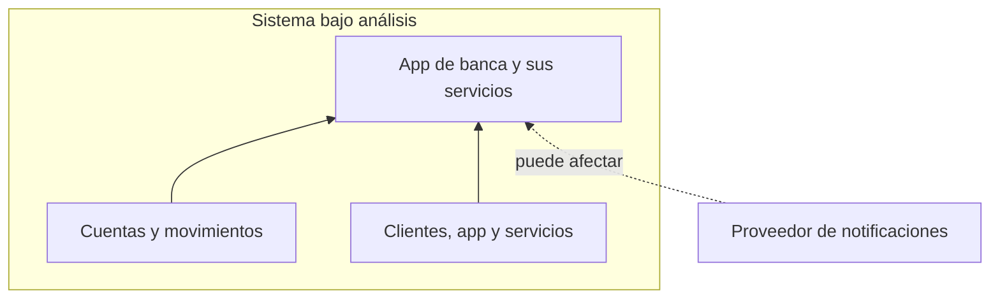
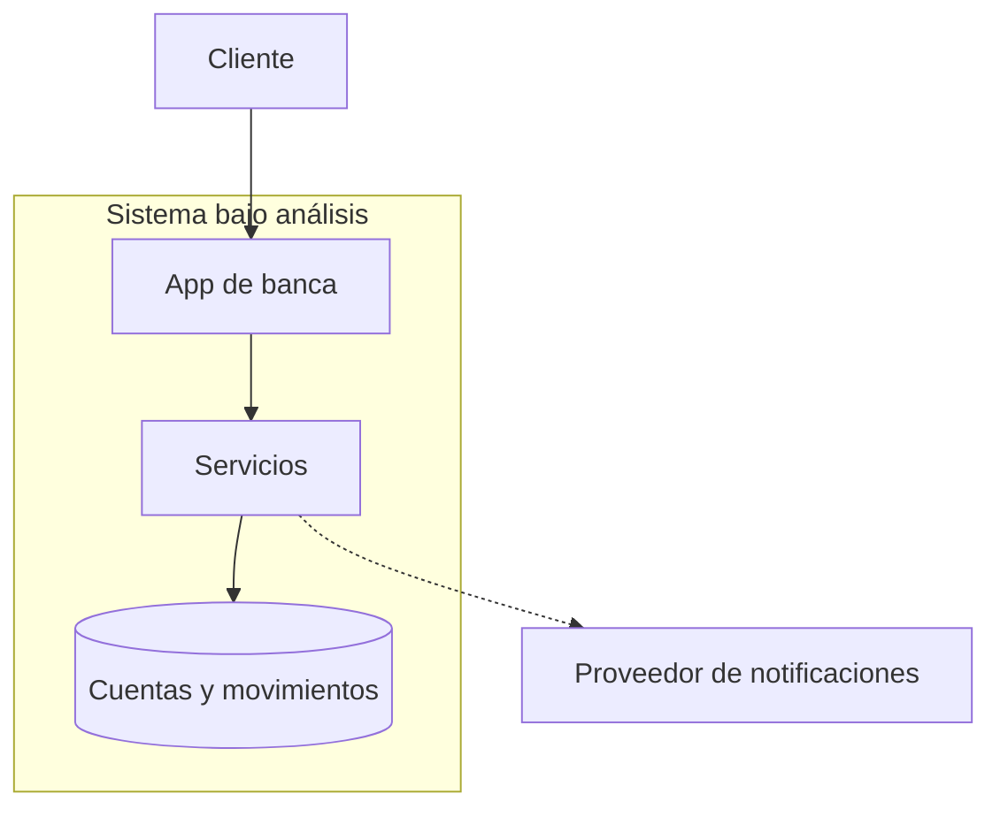
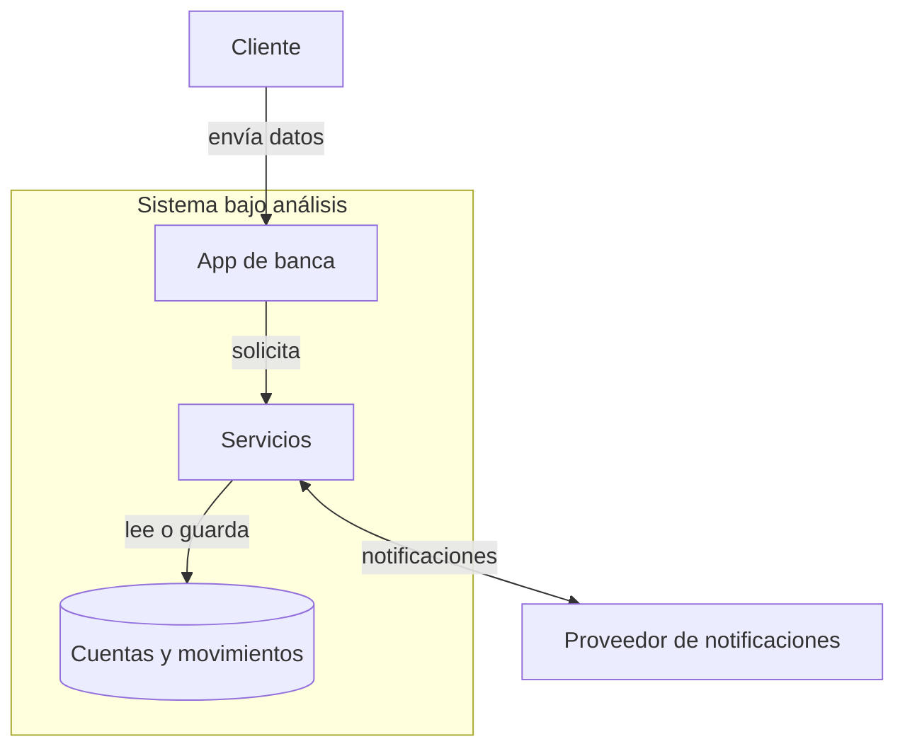
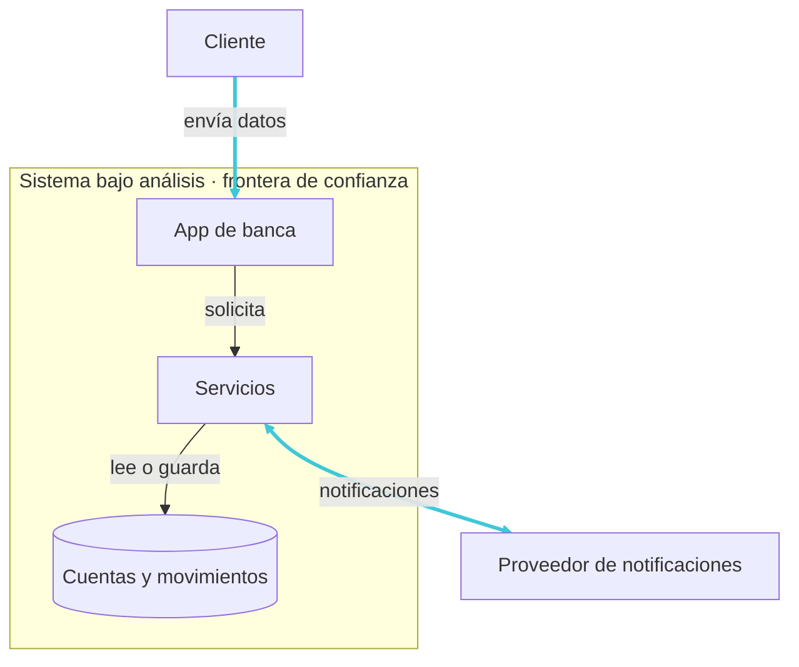
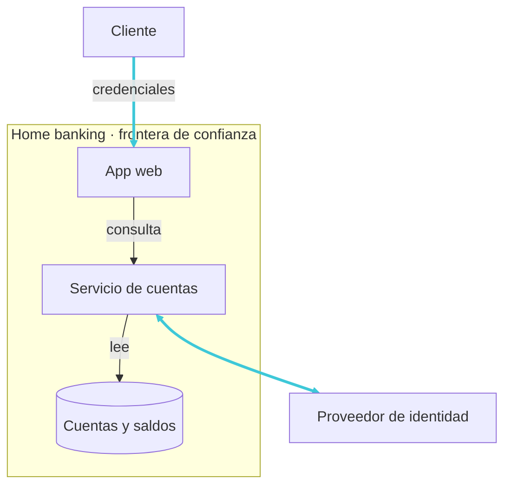

# Software seguro desde el diseño
## La seguridad se decide antes de escribir código.

<div class="mt-10 mx-auto max-w-5xl" role="img" aria-label="Ciclo de vida del software: requisitos, diseño, código y operación; diseño está resaltado">
  <div class="grid grid-cols-[1fr_auto_1fr_auto_1fr_auto_1fr] items-center gap-2 text-center text-sm">
    <div class="card px-2 py-3">Requisitos</div>
    <span aria-hidden="true" class="opacity-50">→</span>
    <div class="rounded-lg border-2 border-cyber-cyan bg-cyber-cyan px-2 py-3 font-semibold text-cyber-bg">Diseño</div>
    <span aria-hidden="true" class="opacity-50">→</span>
    <div class="card px-2 py-3">Código</div>
    <span aria-hidden="true" class="opacity-50">→</span>
    <div class="card px-2 py-3">Operación</div>
  </div>
  <p class="mt-4 text-center text-sm opacity-70">Las decisiones de diseño condicionan lo que podremos proteger después.</p>
</div>

<!--
Quiero empezar con una decisión muy concreta: ¿quién puede consultar los movimientos de una cuenta? Antes de elegir una biblioteca o escribir una función, necesito acordar esa regla. Si nunca la definimos, agregar una herramienta al final no va a inventarla por nosotros. Podemos tener una aplicación que funciona, responde rápido y muestra los datos correctos, pero se los muestra a la persona equivocada.

Por eso destaco el diseño en este recorrido. Ahí decidimos qué información vamos a manejar, quién puede acceder y cómo se conectan las partes. No quiero decir que la seguridad se resuelva solamente en esa etapa. Una regla bien pensada todavía necesita una implementación que la respete, pruebas que la comprueben y una operación que la sostenga. Lo que elegimos temprano condiciona lo que podremos proteger después.

Hoy les propongo recorrer ese razonamiento sin empezar por una lista de productos. Voy a tomar un sistema que podamos imaginar, dibujar sus componentes, seguir sus datos y preguntarme qué podría salir mal. Después vamos a convertir una de esas situaciones en una decisión de diseño y en una comprobación concreta. Me interesa que podamos explicar por qué necesitamos una protección, no solamente cómo se llama.

Esta idea de integrar seguridad durante todo el ciclo está en el marco de desarrollo seguro de NIST, el SSDF. Dejo las referencias completas en el guion para quien quiera profundizar. Para empezar, les hago una pregunta: si todavía no escribí código, ¿ya puedo haber tomado una decisión que deje una debilidad en el sistema?
-->

---

# ¿Qué es una vulnerabilidad?

Una debilidad en un sistema, sus procedimientos, controles o implementación que una amenaza puede explotar o activar.

<div class="mt-6 text-sm font-semibold">Puede estar en cualquier artefacto del SDLC:</div>

<div class="mt-3 grid grid-cols-3 gap-3 text-center text-sm" role="img" aria-label="Artefactos del ciclo de vida del software que pueden contener vulnerabilidades: requisitos, diseño, código y dependencias, build y release, configuración e infraestructura, software en operación">
  <div class="card flex flex-col items-center gap-2 px-3 py-4">
    <carbon-document class="text-2xl text-cyber-cyan" />
    <span>Requisitos e historias</span>
  </div>
  <div class="card flex flex-col items-center gap-2 px-3 py-4">
    <carbon-flow class="text-2xl text-cyber-cyan" />
    <span>Diseño y arquitectura</span>
  </div>
  <div class="card flex flex-col items-center gap-2 px-3 py-4">
    <carbon-code class="text-2xl text-cyber-cyan" />
    <span>Código y dependencias</span>
  </div>
  <div class="card flex flex-col items-center gap-2 px-3 py-4">
    <carbon-terminal class="text-2xl text-cyber-cyan" />
    <span>Scripts, pipeline y build</span>
  </div>
  <div class="card flex flex-col items-center gap-2 px-3 py-4">
    <carbon-settings class="text-2xl text-cyber-cyan" />
    <span>Configuración e infraestructura</span>
  </div>
  <div class="card flex flex-col items-center gap-2 px-3 py-4">
    <carbon-cloud class="text-2xl text-cyber-cyan" />
    <span>Software en operación</span>
  </div>
</div>

<p class="mt-4 text-center text-sm opacity-70">Una vulnerabilidad no está limitada al código fuente.</p>

<!--
Cuando hablo de vulnerabilidad, hablo de una debilidad que puede ser aprovechada o activada por una amenaza. No estoy diciendo que ya hubo un ataque. Quiero separar tres momentos: la debilidad existe, alguien la descubre y, eventualmente, alguien la explota. Pueden estar muy separados en el tiempo, y el tercero puede no ocurrir nunca.

Voy a recorrer las tarjetas con una misma regla: consultar solamente las cuentas autorizadas. En requisitos puedo olvidar definir quién tiene acceso. En diseño puedo decidir que alcanza con confiar en el identificador que llega desde la app. En código puedo omitir la comprobación del permiso. También puedo proteger bien ese código y dejar que alguien altere el artefacto durante su construcción. O puedo desplegarlo con una cuenta de servicio que tiene permisos excesivos. Ya en operación, puedo mantener una versión vulnerable sin actualizar. No necesito que la debilidad nazca en el código fuente para que sea relevante.

Les planteo algo: si hoy descubro una falla en una biblioteca que venía usando y que no cambió, ¿la debilidad nació hoy? Lo que cambió es mi conocimiento. Puedo haber tenido esa exposición durante meses sin saberlo. Y conocer una vulnerabilidad tampoco demuestra que haya sido explotada en mi sistema. El catálogo KEV de CISA, por ejemplo, reúne vulnerabilidades con explotación real confirmada; no es simplemente una lista de fallas posibles.

Tampoco voy a ordenar la gravedad por la tarjeta donde nació el problema. Un requisito incompleto no es necesariamente menos importante que un error de programación. Para decidir una prioridad necesito un escenario, su probabilidad y sus consecuencias. Estoy siguiendo las definiciones y el enfoque de ciclo de vida de NIST. Ahora quiero bajar estas relaciones a un sistema concreto que podamos reutilizar durante toda la clase.
-->

---

# Nuestro caso: una app de banca digital

<p class="mt-4 text-lg">Un mismo sistema nos acompañará toda la clase: autenticarse, consultar y transferir.</p>

<div class="mt-6 grid grid-cols-3 gap-4 text-center" role="img" aria-label="Tres viajes del cliente en la app de banca: autenticarse, consultar saldo y movimientos, iniciar una transferencia">
  <section class="card flex flex-col items-center px-4 py-5"><carbon-user-identification class="text-3xl text-cyber-cyan" /><strong class="mt-2">Autenticarse</strong><p class="mt-2 text-sm">El cliente ingresa con su cuenta y verifica su identidad.</p></section>
  <section class="card flex flex-col items-center px-4 py-5"><carbon-view class="text-3xl text-cyber-cyan" /><strong class="mt-2">Consultar</strong><p class="mt-2 text-sm">Mira el saldo y los movimientos de su cuenta.</p></section>
  <section class="card flex flex-col items-center px-4 py-5"><carbon-send-alt class="text-3xl text-cyber-cyan" /><strong class="mt-2">Transferir</strong><p class="mt-2 text-sm">Inicia una transferencia a otra cuenta.</p></section>
</div>

<p class="mt-5 text-center text-sm opacity-70">Detrás de la app hay servicios, una base de datos y un proveedor externo de notificaciones.</p>

<!--
Voy a usar una app de banca digital como caso de estudio. La elegí porque podemos imaginar sus funciones sin conocer su implementación. No vamos a estudiar regulación bancaria ni a diseñar un banco completo. La banca es el vehículo para hablar de decisiones que también aparecen en otros sistemas: personas que usan una aplicación, servicios que procesan solicitudes, datos que se guardan y terceros de los que dependemos.

Me voy a quedar, por ahora, con tres viajes del cliente. Primero ingreso y verifico mi identidad. Después consulto el saldo y los movimientos de mi cuenta. Finalmente inicio una transferencia a otra cuenta. Lo que veo en la pantalla es solo una parte: detrás hay servicios que resuelven esas operaciones, una base de datos y un proveedor que envía notificaciones.

¿Qué otro viaje harían ustedes con una app así? Podemos pensar en descargar un extracto o cambiar un alias. Me interesa conservar esas ideas porque más adelante vamos a ver que una función nueva también agrega lugares de interacción y reglas que hay que proteger. No voy a incorporar todas esas funciones al dibujo ahora; con estos tres viajes tenemos suficiente para seguir el razonamiento.

A lo largo de la clase voy a volver sobre las mismas cuentas, los mismos movimientos y las mismas transferencias. Así no necesitamos aprender un sistema distinto cada vez que aparece un concepto. Primero voy a identificar qué tiene valor; después voy a seguir los datos, discutir en quién confío y explorar intentos de abuso. Antes de conectar las piezas, quiero detenerme en las personas que usan el servicio: ¿qué perderían si algo funciona mal, aunque la aplicación siga mostrando una pantalla?
-->

---

# ¿Qué queremos proteger?

**Activo:** algo que tiene valor para una persona u organización.
**En la app de banca:** los datos de clientes, el registro de movimientos y la disponibilidad del servicio.

<div class="mt-4 grid grid-cols-[auto_1fr] items-center gap-6">
  <svg viewBox="0 0 460 350" class="mx-auto h-64" role="img" aria-label="Tríada CIA: confidencialidad, integridad y disponibilidad como propiedades que sostienen el valor de los activos">
    <polygon points="230,80 50,300 410,300" fill="none" stroke="#3EC8D8" stroke-width="2" opacity="0.7" />
    <circle cx="230" cy="80" r="15" fill="#3EC8D8" />
    <text x="230" y="86" text-anchor="middle" fill="#0B100E" style="font-size: 20px; font-weight: 700">C</text>
    <text x="230" y="52" text-anchor="middle" fill="#E7E9E6" style="font-size: 22px; font-weight: 600">Confidencialidad</text>
    <circle cx="50" cy="300" r="15" fill="#3EC8D8" />
    <text x="50" y="306" text-anchor="middle" fill="#0B100E" style="font-size: 20px; font-weight: 700">I</text>
    <text x="20" y="336" text-anchor="start" fill="#E7E9E6" style="font-size: 22px; font-weight: 600">Integridad</text>
    <circle cx="410" cy="300" r="15" fill="#3EC8D8" />
    <text x="410" y="306" text-anchor="middle" fill="#0B100E" style="font-size: 20px; font-weight: 700">A</text>
    <text x="440" y="336" text-anchor="end" fill="#E7E9E6" style="font-size: 22px; font-weight: 600">Disponibilidad</text>
  </svg>
  <div class="grid gap-3 text-sm">
    <section class="card px-4 py-3" aria-label="Confidencialidad">
      <strong>Confidencialidad</strong>
      <p class="mt-1">El saldo y los movimientos solo son visibles para el titular de la cuenta.</p>
    </section>
    <section class="card px-4 py-3" aria-label="Integridad">
      <strong>Integridad</strong>
      <p class="mt-1">El importe y el destinatario de una transferencia permanecen correctos.</p>
    </section>
    <section class="card px-4 py-3" aria-label="Disponibilidad">
      <strong>Disponibilidad</strong>
      <p class="mt-1">La app responde cuando el cliente necesita hacer una transferencia.</p>
    </section>
  </div>
</div>

<p class="mt-5 text-center text-sm opacity-70">Primero identificamos el valor y las propiedades que lo sostienen; después, qué podría ponerlo en riesgo.</p>

<!--

Antes de elegir controles, necesito entender qué tiene valor y para quién. No me alcanza con hacer una lista de servidores. Una base de datos importa por los movimientos que conserva y por las decisiones que una persona toma con esa información. También importan poder usar el servicio y confiar en que una transferencia se procesó como fue autorizada. A eso me refiero cuando hablo de activos.

Voy a mirar ese valor desde los tres vértices del triángulo. Si alguien ve movimientos que no tiene permiso para consultar, perdemos confidencialidad. Si una transferencia cambia de importe o de destinatario sin autorización, perdemos integridad. Si el cliente necesita operar y el servicio no responde, tenemos un problema de disponibilidad. No son tres sistemas distintos: son tres propiedades que quiero preservar sobre los datos y las operaciones de este mismo sistema.

Les hago una pregunta: si una transferencia llega, pero llega con un importe distinto del que autoricé, ¿qué propiedad se vio afectada? Estoy pensando en integridad. Que el servicio responda no demuestra que el resultado sea correcto. Y si además expone información privada, puedo tener más de una propiedad afectada en el mismo incidente. El triángulo ayuda a ordenar el análisis, no a meter cada caso en un único casillero.

Tampoco quiero prometer disponibilidad absoluta ni afirmar que estas tres propiedades cubren todo. Necesito disponibilidad oportuna y confiable según las necesidades del servicio; el contexto también puede exigir autenticidad o trazabilidad. Estoy usando las definiciones de NIST para activos y seguridad de la información. Con este criterio puedo justificar una protección por la pérdida que busca evitar. Ya sabemos qué queremos preservar; ahora voy a mirar qué situaciones podrían ponerlo en peligro.

-->

---

# Amenaza y atacante

<div class="mt-5 grid grid-cols-2 gap-4 text-sm">
  <section class="card px-4 py-4" aria-label="Definición de amenaza">
    <strong class="text-lg">Amenaza: qué podría ocurrir</strong>
    <p class="mt-2">Circunstancia o evento con potencial de dañar activos, personas u operaciones.</p>
  </section>
  <section class="card px-4 py-4" aria-label="Definición de atacante">
    <strong class="text-lg">Atacante: quién actúa con intención</strong>
    <p class="mt-2">Persona o grupo que intenta comprometer la seguridad del sistema, desde dentro o fuera de la organización.</p>
  </section>
</div>

<div class="mt-4 text-sm font-semibold">Ejemplos en la app de banca:</div>

<table class="mt-2 text-sm">
  <thead>
    <tr><th scope="col">Amenaza</th><th scope="col">Quién o qué la origina</th><th scope="col">¿Hay atacante?</th></tr>
  </thead>
  <tbody>
    <tr><td>Consulta no autorizada de movimientos</td><td>Persona que busca datos ajenos</td><td>Sí</td></tr>
    <tr><td>Exposición accidental de datos</td><td>Administrador que configura mal un permiso</td><td>No</td></tr>
    <tr><td>Interrupción de las transferencias</td><td>Falla de la base de datos</td><td>No</td></tr>
  </tbody>
</table>

<p class="mt-4 text-center text-lg"><strong>No toda amenaza requiere un atacante.</strong></p>

<!--
Quiero distinguir qué podría ocurrir de quién actúa con intención. La amenaza describe una circunstancia o un evento con potencial de dañar activos, personas u operaciones. Cuando digo potencial, no estoy afirmando que ya pasó ni que vaya a pasar inevitablemente. El atacante, en cambio, es alguien que intenta comprometer deliberadamente la seguridad.

Voy a mantener el ejemplo de los movimientos. Si falta una comprobación de autorización, tengo una vulnerabilidad. Si alguien intenta consultar los movimientos de otra cuenta, estoy describiendo un evento amenazante. Si esa persona lo intenta deliberadamente para obtener información ajena, actúa como atacante. La debilidad, el evento y la persona son piezas relacionadas, pero no son tres nombres para lo mismo.

Ahora miro los otros escenarios de la tabla. Un administrador puede configurar mal un permiso y dejar datos expuestos. Una base de datos puede fallar y detener las transferencias. En ambos casos hay una situación que puede producir daño, sin que necesite imaginar un atacante detrás. Si un empleado expone información por error, ¿ese error lo convierte en atacante? No: necesito distinguir una equivocación de una acción deliberada. Si usa sus permisos para alterar una transferencia a propósito, el análisis cambia.

Tener acceso legítimo tampoco demuestra buena intención. Puedo tener un atacante interno o externo; lo relevante es lo que intenta hacer y con qué intención. NIST distingue fuentes de amenaza adversarias, accidentales, estructurales y ambientales. Por eso uso fuente de amenaza como una expresión más amplia que atacante. Me interesa que no reduzcamos toda la seguridad a perseguir a una persona maliciosa: también tengo que diseñar para errores y fallas. Hasta aquí hablamos de posibilidades; ahora quiero mostrar consecuencias documentadas de ataques reales.
-->

---

# Consecuencias reales de ciberataques

<p class="mt-2 text-center text-sm">Patrones en brechas observadas globalmente (Verizon DBIR 2026): <strong>31%</strong> se inició explotando vulnerabilidades · <strong>48%</strong> incluyó ransomware · <strong>48%</strong> involucró a terceros.</p>

<div class="mt-5 grid grid-cols-2 gap-8">
  <section class="border-t border-gray-400/60 pt-3" aria-label="WannaCry en el sistema público de salud de Inglaterra, 2017">
    <p class="text-sm uppercase tracking-wide">Sector público · Inglaterra · 2017</p>
    <h2 class="mt-2 text-xl font-semibold">WannaCry y el NHS</h2>
    <strong class="mt-3 block text-3xl">Más de 19.000</strong>
    <p class="mt-1 text-sm">citas estimadas canceladas; en cinco zonas, hospitales derivaron pacientes a otros servicios de urgencias.</p>
  </section>
  <section class="border-t border-gray-400/60 pt-3" aria-label="Ataque a Colonial Pipeline, empresa privada de energía, 2021">
    <p class="text-sm uppercase tracking-wide">Sector privado · Estados Unidos · 2021</p>
    <h2 class="mt-2 text-xl font-semibold">Colonial Pipeline</h2>
    <strong class="mt-3 block text-3xl">Combustible interrumpido</strong>
    <p class="mt-1 text-sm">Un ataque a sistemas corporativos llevó a detener temporalmente el oleoducto por precaución.</p>
  </section>
</div>

<p class="mt-5 text-center text-sm">Las técnicas se repiten; el impacto alcanza a personas y servicios que dependen de los sistemas afectados.</p>

<!--

Quiero darle un significado concreto a la palabra impacto. No estoy hablando solamente de archivos perdidos: también puedo tener personas sin atención, operaciones detenidas y servicios que otros necesitan. Las cifras del DBIR 2026 de Verizon muestran patrones en brechas observadas globalmente durante el período del 1 de noviembre de 2024 al 31 de octubre de 2025. Cada porcentaje mide una dimensión distinta: explotación como acceso inicial, presencia de ransomware o participación de terceros. Pueden superponerse; no voy a sumarlos ni a usarlos como la probabilidad de un incidente en nuestra app.

En el NHS de Inglaterra, WannaCry afectó la atención en mayo de 2017. El informe de la National Audit Office identificó 6.912 citas canceladas en los datos disponibles y estimó más de 19.000 en total. Quiero remarcar esa diferencia: la cifra grande es una estimación, no un conteo completo. Hospitales de cinco zonas derivaron pacientes a otros servicios de urgencias. La exposición se vinculó a sistemas Windows sin actualizar o fuera de soporte. El efecto técnico terminó en atención postergada y dificultades para personas concretas.

En Colonial Pipeline, en Estados Unidos, el ransomware afectó sistemas corporativos en 2021. Según la GAO, la empresa desconectó preventivamente sistemas de monitoreo y control del oleoducto para evitar que el incidente llegara a ellos. Al 12 de mayo no había indicios de compromiso de esos sistemas, pero la desconexión interrumpió operaciones y entregas de combustible. Las operaciones se reanudaron el 13 de mayo.

¿Por qué se detuvo un servicio físico sin evidencia de ataque a sus controles? Me interesa la relación entre dependencias, incertidumbre y decisiones de continuidad. No todo el impacto nace de la acción directa sobre el componente final. Tampoco voy a trasladar estos casos o frecuencias a todos los sectores y países. Los uso para mostrar qué puede significar una consecuencia, como propone NIST al evaluar riesgos. Ahora voy a separar la debilidad, la amenaza y el daño posible para entender qué llamamos riesgo.

-->

---

# De la amenaza al riesgo

Una amenaza es un escenario con potencial de daño. El riesgo valora si ese escenario puede concretarse en **este** sistema y cuánto afectaría.

<div class="mt-4 grid grid-cols-3 gap-3 text-center text-sm" role="img" aria-label="Tres piezas: la amenaza define el escenario; la vulnerabilidad y la exposición deciden si puede concretarse; los controles reducen probabilidad e impacto">
  <section class="card px-3 py-3"><strong>Amenaza</strong><p style="margin: 0.5rem 0 0">El escenario: qué podría pasar y quién o qué podría provocarlo.</p></section>
  <section class="card px-3 py-3"><strong>Vulnerabilidad y exposición</strong><p style="margin: 0.5rem 0 0">Deciden si el escenario puede concretarse: una debilidad y un punto de contacto que la alcance.</p></section>
  <section class="card px-3 py-3"><strong>Controles</strong><p style="margin: 0.5rem 0 0">Reducen la probabilidad de que ocurra, el impacto si ocurre, o ambos.</p></section>
</div>

<div class="mt-4 card grid grid-cols-[auto_1fr] items-center gap-5 px-4 py-3">
  <svg viewBox="0 0 340 230" class="h-40" role="img" aria-label="Matriz de riesgo: el mismo escenario cae en probabilidad e impacto altos sin controles (A) y se desplaza a valores bajos con controles (B)">
    <rect x="50" y="16" width="76" height="53" fill="#B58A2B" opacity="0.45" />
    <rect x="126" y="16" width="76" height="53" fill="#C2622B" opacity="0.5" />
    <rect x="202" y="16" width="76" height="53" fill="#FF5A3A" opacity="0.55" />
    <rect x="50" y="69" width="76" height="53" fill="#1F7A4D" opacity="0.4" />
    <rect x="126" y="69" width="76" height="53" fill="#B58A2B" opacity="0.45" />
    <rect x="202" y="69" width="76" height="53" fill="#C2622B" opacity="0.5" />
    <rect x="50" y="122" width="76" height="53" fill="#1F7A4D" opacity="0.3" />
    <rect x="126" y="122" width="76" height="53" fill="#1F7A4D" opacity="0.4" />
    <rect x="202" y="122" width="76" height="53" fill="#B58A2B" opacity="0.45" />
    <g stroke="#E7E9E6" stroke-opacity="0.15" stroke-width="1">
      <line x1="126" y1="16" x2="126" y2="175" />
      <line x1="202" y1="16" x2="202" y2="175" />
      <line x1="50" y1="69" x2="278" y2="69" />
      <line x1="50" y1="122" x2="278" y2="122" />
    </g>
    <rect x="50" y="16" width="228" height="159" fill="none" stroke="#9AA39C" stroke-width="1.5" />
    <line x1="240" y1="43" x2="88" y2="149" stroke="#3EC8D8" stroke-width="2" stroke-dasharray="6 5" />
    <circle cx="240" cy="43" r="11" fill="#FF5A3A" />
    <text x="240" y="43" text-anchor="middle" dominant-baseline="central" fill="#0B100E" style="font-size: 18px; font-weight: 700">A</text>
    <circle cx="88" cy="149" r="11" fill="#5CFF8A" />
    <text x="88" y="149" text-anchor="middle" dominant-baseline="central" fill="#0B100E" style="font-size: 18px; font-weight: 700">B</text>
    <text x="164" y="205" text-anchor="middle" fill="#9AA39C" style="font-size: 20px">Impacto →</text>
    <text x="24" y="95" text-anchor="middle" fill="#9AA39C" style="font-size: 20px" transform="rotate(-90 24 95)">Probabilidad →</text>
  </svg>
  <div class="text-sm">
    <strong class="text-base">Riesgo ≈ probabilidad × impacto</strong>
    <p class="mt-1">¿Qué tan probable es aquí, y cuánto afectaría? Una aproximación para ordenar la conversación, no una fórmula.</p>
    <p class="mt-2"><span class="font-semibold text-cyber-alert">A</span> sin controles · <span class="font-semibold text-cyber-neon">B</span> con controles: el mismo escenario se desplaza.</p>
  </div>
</div>

<p class="mt-4 text-center text-sm">La misma amenaza puede dar riesgos distintos: cambian las vulnerabilidades, la exposición y los controles.</p>

<!--
Voy a mantener la misma amenaza: alguien intenta consultar los movimientos de otra cuenta. Para hablar de riesgo necesito preguntar qué tan posible es que lo logre en este sistema y qué consecuencias tendría. La amenaza describe el escenario; la vulnerabilidad y la exposición ayudan a entender si puede concretarse. Si el servidor confía en el identificador que manda el cliente y no comprueba permisos, el intento puede alcanzar información ajena. Si ese punto permite recorrer muchas cuentas, el daño potencial también crece.

Ahora miro los puntos A y B de la matriz. Representan un desplazamiento ilustrativo del mismo escenario, no dos amenazas diferentes ni una medición de nuestra app. Verificar autorización en cada consulta puede reducir la posibilidad del abuso. Acotar accesos y detectar consultas anómalas puede ayudar a limitar sus efectos. Pero no voy a declarar riesgo bajo solamente porque una lista diga que tenemos controles: necesito saber si funcionan y qué alcance tienen. La autenticación multifactor ayuda frente a credenciales robadas; por sí sola no corrige que un cliente autenticado consulte una cuenta ajena.

La expresión probabilidad por impacto me sirve como recordatorio de las dos preguntas. No quiero multiplicar números arbitrarios y presentar el resultado como una medida precisa. Un escenario poco probable puede requerir mucha atención si afecta un servicio esencial que no podemos recuperar. Otro, más frecuente, puede tener consecuencias acotadas y tolerables. Estoy usando el enfoque de evaluación de riesgos de NIST, no una fórmula universal.

¿Qué cambio del sistema podría aumentar el riesgo sin cambiar la amenaza? Puedo exponer una nueva ruta, ampliar permisos, perder un control o debilitar la recuperación. En todos esos casos alguien sigue intentando lo mismo, pero cambian sus posibilidades o las consecuencias. Para justificar esa valoración necesito algo más que nombres de amenazas: voy a mirar cómo se conectan las personas, los servicios y los datos.
-->

---

# El software moderno está conectado

```mermaid {theme: 'base', flowchart: {nodeSpacing: 12, rankSpacing: 40, padding: 20}}
flowchart LR
  U[Cliente] -->|usa| A[App de banca]
  A -->|invoca| S[Servicios]
  S -->|consulta o registra| D[(Cuentas y movimientos)]
  S -->|integra| X[Proveedor de notificaciones]
  S -->|se aloja en| C[Nube]
```

Cada vínculo requiere definir qué se intercambia, quién participa y qué permisos necesita. Proteger solo la entrada de la red no alcanza:

<div class="mt-4 grid grid-cols-3 gap-3 text-center text-sm">
  <div class="card px-3 py-3"><strong>Identidad</strong><br />Una cuenta legítima puede usarse mal o ser robada.</div>
  <div class="card px-3 py-3"><strong>Servicios</strong><br />Un componente conectado puede quedar comprometido.</div>
  <div class="card px-3 py-3"><strong>Comunicaciones</strong><br />Cada llamada requiere controles propios.</div>
</div>

<p class="mt-4 text-center text-sm opacity-70">El control perimetral filtra entradas; no vuelve confiables a los componentes internos ni sus interacciones.</p>

<!--

Voy a seguir una transferencia sobre este mapa, en lugar de leer todas las flechas. El cliente confirma desde la app; los servicios procesan la solicitud; pagos consulta o registra información en cuentas y movimientos; y el proveedor recibe lo necesario para enviar una notificación. La nube me dice dónde pueden alojarse los servicios. No representa una etapa adicional por la que obligatoriamente pasan los datos.

En cada conexión necesito definir qué información viaja, quién participa y qué permisos tiene. ¿El proveedor necesita todo el historial de movimientos para enviar una confirmación? En principio, no. Necesito precisar qué aviso debe enviar y con qué datos mínimos puede hacerlo. Si mando información que no requiere, agrego exposición sin mejorar esa tarea. Lo mismo vale para los servicios internos: que estén conectados no significa que todos necesiten conocer o modificar todo.

Ahora quiero mirar la idea de perímetro. Un control de entrada puede filtrar conexiones, pero no verifica por sí solo cada operación entre la app, los servicios y los datos. Una identidad válida puede estar robada; un servicio que está dentro de la red puede quedar comprometido. Si ya pasó la entrada, todavía necesito comprobar permisos y validar lo que llega. Estar del lado interno no transforma cualquier solicitud en confiable.

No estoy proponiendo quitar el firewall. Estoy separando su función de la autorización sobre una cuenta o una transferencia. La arquitectura Zero Trust de NIST plantea justamente que la ubicación de red no concede confianza implícita y que debemos proteger los recursos y sus interacciones. Con este mapa puedo ver por qué una única barrera no cubre todas las relaciones. Si recién descubro esas reglas cuando voy a lanzar, además puedo tener que volver sobre decisiones ya implementadas. Veamos ese límite de la seguridad reactiva.

-->

---
layout: default
---

# El límite de la seguridad reactiva

El modelo de **fortaleza y foso** concentra la defensa en la red y deja la seguridad de la aplicación para una revisión antes del lanzamiento.

```mermaid {theme: 'base', flowchart: {nodeSpacing: 16, rankSpacing: 24, padding: 12}}
flowchart LR
  R[Requisitos] --> D[Diseño] --> C[Código] --> B["Build y<br/>pruebas"] --> P["Pentest<br/>final"] --> L[Lanzamiento]
  P -.hallazgos para corregir.-> D
```

<div class="mt-4 grid grid-cols-2 items-center gap-6">
  <div class="text-base">
    <p style="margin: 0 0 1rem">Una revisión tardía puede sumar retrabajo y tensionar la fecha de liberación.</p>
    <p style="margin: 0">La seguridad no depende de una herramienta aislada: es una <strong>propiedad del sistema</strong>, sostenida por decisiones coordinadas en <strong>diseño, implementación, configuración y operación</strong>.</p>
  </div>
  
</div>

<!--

Con fortaleza y foso describo la idea de defender el borde y confiar en lo que queda adentro. Otra decisión, que puede coexistir con esa, es reservar la revisión de la aplicación para el final. No son la misma limitación: puedo mejorar el perímetro y seguir revisando tarde, o revisar temprano y seguir confiando demasiado en la red interna.

Voy a mirar la flecha que vuelve desde el pentest. Si ahí descubro que cualquier cliente puede consultar movimientos ajenos, quizá necesite revisar el modelo de permisos, cambiar código y repetir pruebas cuando ya tengo una fecha de lanzamiento comprometida. No voy a afirmar que siempre cuesta una cantidad fija de veces más ni que todo pentest frena una entrega. El problema no es hacer pentests: es depender de esa revisión como primera oportunidad para discutir una regla básica.

Quiero seguir una misma regla en las cuatro dimensiones. En diseño decido quién puede consultar una cuenta. En implementación compruebo ese permiso en cada solicitud. En configuración evito que la cuenta de servicio tenga acceso indiscriminado. En operación mantengo esos controles y observo actividad que pueda revelar un problema. Una buena decisión en una dimensión no compensa automáticamente lo que falta en otra. La viñeta del muro sirve para recordar que no puedo proteger una aplicación simplemente agregando una barrera alrededor.

¿Qué quedaría sin resolver si solo agregáramos una herramienta? Me interesan las reglas de negocio, los permisos y la capacidad de recuperar el servicio, más que un nombre de producto. Este enfoque de decisiones coordinadas está en NIST SSDF, en su trabajo sobre sistemas confiables y en las guías de OWASP. El material original también planteaba esta limitación en su diapositiva 8. Para avanzar, voy a empezar por algo anterior a cualquier herramienta: delimitar qué incluye nuestro sistema y de qué depende.

-->

---

# El alcance del sistema define el análisis



**Fuera de nuestro control no significa fuera del análisis.**

<!--
Para analizar seguridad necesito elegir un objeto de estudio. En este caso voy a mirar la app de banca y los servicios que permiten consultar y transferir. El recuadro me ayuda a decir qué estoy analizando, pero no alcanza con nombrar la aplicación. También necesito los datos que usa, las personas que participan y las dependencias que sostienen esas funciones.

Quiero distinguir alcance de control. El proveedor de notificaciones puede estar fuera de mi administración: no configuro sus servidores ni decido cómo opera. Eso no impide que lo incluya en el análisis de dependencias. Si recibe datos o su disponibilidad afecta una función, tengo que entender esa relación. El borde del dibujo no borra lo que puede pasar del otro lado.

Les propongo un caso: el proveedor no responde cuando termino una transferencia. ¿Debería detenerse la transferencia también? Para nuestra app quiero separar la operación del aviso, de manera que podamos procesar una transferencia y recuperar después una notificación pendiente. Pero no voy a dar esa independencia por hecha. Necesito diseñarla y comprobarla; de lo contrario, una dependencia aparentemente secundaria puede terminar interrumpiendo el servicio principal.

Antes de enumerar amenazas voy a dejar claros esos supuestos: qué función queremos sostener, qué información maneja, quién la utiliza y de quién depende. Sin ese contexto, puedo escribir una lista muy larga que no explique qué necesito proteger en este sistema. NIST recomienda caracterizar el sistema y su contexto antes de evaluar riesgos; OWASP parte de entender la aplicación para modelar amenazas. Voy a usar esa lógica para dibujar las piezas y tener un mapa compartido sobre el que podamos discutir.
-->

---
layout: two-cols-header
---

# Dibujemos el sistema

::left::



<p class="mt-2 text-center text-sm opacity-70">El recuadro marca el alcance; la línea punteada, una dependencia externa.</p>

::right::

### Componentes, en nuestro caso

<div class="mt-4 grid grid-cols-[7rem_1fr] gap-x-3 gap-y-3 text-sm">
  <strong>Cliente</strong><span>persona con una cuenta</span>
  <strong>App de banca</strong><span>app móvil o web</span>
  <strong>Servicios</strong><span>autenticación, extractos, pagos</span>
  <strong>Cuentas y movimientos</strong><span>saldos e historial</span>
  <strong>Proveedor de notificaciones</strong><span>confirmaciones por SMS o correo</span>
</div>

<!--
Voy a leer este dibujo desde el cliente hacia los datos. Una persona con una cuenta usa la app, que puede ser móvil o web. La app envía una solicitud a los servicios, y esos servicios consultan o registran información en cuentas y movimientos. Cuando necesitan avisar algo, se relacionan con el proveedor de notificaciones, que puede enviar un SMS o un correo.

Uso la palabra servicios para resumir autenticación, extractos y pagos. No estoy afirmando que sean un único proceso ni que deban compartir permisos. Por ahora me alcanza con esa caja para conversar; la voy a separar cuando una pregunta de seguridad necesite más detalle. Este modelo no es una arquitectura completa ni un inventario de máquinas. Es una representación que me permite reconocer actores, componentes, datos e interacciones.

El recuadro marca el alcance elegido y la línea punteada muestra la dependencia externa. El cliente interactúa desde fuera de ese alcance. No voy a interpretar el interior del recuadro como un espacio automáticamente confiable: después vamos a distinguir contextos y permisos dentro del propio sistema. Tampoco necesito resolver hoy cada detalle de infraestructura para identificar una regla importante.

¿Dónde se decide si el cliente puede consultar esa cuenta? Necesito que los servicios lo comprueben del lado servidor. La pantalla puede ayudar a presentar las opciones correctas, pero no puede ser la única barrera: una solicitud puede llegar sin pasar por esa pantalla. Ese es el tipo de relación que quiero volver visible. Estoy usando el enfoque de diagramas de OWASP para modelado de amenazas. Ahora que tenemos las piezas, voy a poner información y permisos sobre las conexiones: qué se envía, quién lo recibe y quién puede leerlo o cambiarlo.
-->

---
layout: two-cols-header
---

# La información se mueve

::left::



<p class="mt-2 text-center text-sm opacity-70">El intercambio con el proveedor externo se dibuja aparte del recorrido interno.</p>

::right::

### Qué identificar

<div class="mt-4 grid grid-cols-1 gap-3 text-sm">
  <section class="card px-3 py-3"><strong>Origen</strong><br />Persona o sistema que genera la información.</section>
  <section class="card px-3 py-3"><strong>Destino</strong><br />Servicio, almacén o sistema que la recibe.</section>
  <section class="card px-3 py-3"><strong>Acceso</strong><br />Quién puede leerla o modificarla.</section>
</div>

<!--
Ahora voy a seguir un dato, no solamente una conexión. Tomo el importe y el destinatario de una transferencia: salen de la app, llegan al servicio de pagos y se registran como parte de la operación. En cada tramo puedo preguntar quién los originó, dónde llegan y qué identidades tienen acceso. ¿Quién podría leerlos o alterarlos durante ese recorrido?

Quiero separar dos cosas que a veces mezclamos: poder hacerlo técnicamente y tener permiso para hacerlo. Una cuenta de servicio puede tener acceso amplio a la base, pero eso no significa que necesite modificar cualquier movimiento para su tarea. Si no hago explícita esa diferencia, el diagrama me muestra una ruta sin decir qué está permitido sobre ella.

Una flecha tampoco demuestra que el intercambio sea seguro. Todavía necesito precisar qué campos viajan, con qué identidad se realiza la llamada y qué comprobaciones se hacen antes de usar esos datos. Si el importe viene desde el cliente, no se vuelve correcto solamente porque llegó al servicio esperado. Voy a volver sobre esas comprobaciones al hablar de confianza.

El ramal del proveedor representa otro intercambio, no una secuencia temporal completa. No estoy diciendo que todos los datos pasan primero por la base y después por el proveedor. Para notificar, necesito identificar qué información mínima debe recibir y evitar enviar datos que no le hacen falta. Esa reducción de exposición complementa los controles de acceso; no los reemplaza. Tanto el modelado de amenazas como la revisión de flujos de OWASP proponen mirar orígenes, destinos y controles. Ya seguimos el dato: ahora quiero discutir qué confianza merece su origen y qué evidencia necesito antes de aceptarlo.
-->

---

# ¿En quién confiamos?

**Confianza:** expectativa de que una persona o componente se comporte como esperamos, para una tarea y en un contexto concretos.

<p class="mt-3 text-sm">No basta con asumirla: necesitamos evidencia y límites. Tres comprobaciones complementarias:</p>

<div class="mt-5 grid grid-cols-3 gap-4 text-sm">
  <section class="card px-4 py-4" aria-label="Autenticación: verificar identidad">
    <strong class="text-lg text-cyber-cyan">Autenticación</strong>
    <p class="mt-2">Verificar la identidad declarada.</p>
    <p class="mt-3 border-t border-gray-400/40 pt-3">El cliente inicia sesión con sus credenciales y un segundo factor.</p>
  </section>
  <section class="card px-4 py-4" aria-label="Autorización: comprobar permisos">
    <strong class="text-lg text-cyber-cyan">Autorización</strong>
    <p class="mt-2">Comprobar el permiso para una acción sobre un recurso.</p>
    <p class="mt-3 border-t border-gray-400/40 pt-3">Puede consultar su cuenta, no la de otro cliente.</p>
  </section>
  <section class="card px-4 py-4" aria-label="Validación de datos: comprobar contenido">
    <strong class="text-lg text-cyber-cyan">Validación de datos</strong>
    <p class="mt-2">Comprobar formato, valores y reglas de la operación.</p>
    <p class="mt-3 border-t border-gray-400/40 pt-3">El importe de una transferencia debe ser válido, aunque el cliente ya ingresó.</p>
  </section>
</div>

<p class="mt-5 text-center text-base"><strong>Autenticarse no da permiso para todo ni vuelve confiable cualquier dato enviado.</strong></p>

<!--
Cuando digo que confío en una persona o un componente, necesito completar la frase: confío para qué tarea, en qué contexto y con qué límites. Puedo confiar en el proveedor para enviar avisos sin darle permiso para modificar saldos. No estoy describiendo una cualidad absoluta ni garantizando que nunca va a fallar. Estoy formulando una expectativa que tengo que justificar con evidencia y revisar si cambia el contexto.

Voy a separar tres comprobaciones sobre una misma solicitud. Primero, la autenticación me aporta evidencia sobre la identidad declarada: por ejemplo, credenciales y un segundo factor. Eso no demuestra buena intención ni elimina la posibilidad de una cuenta comprometida. Segundo, la autorización verifica si esa identidad puede realizar esa acción sobre esa cuenta. Haber ingresado no me habilita a consultar todas las cuentas. Tercero, la validación de datos comprueba formato, valores y reglas de la operación. Un importe bien formado todavía puede formar parte de una operación que no está permitida.

Les planteo un cliente que inició sesión correctamente y envía un identificador válido, pero de una cuenta ajena. ¿Qué lo tiene que frenar? La autorización sobre esa cuenta, del lado servidor. Si solo compruebo que hay una sesión y que el identificador tiene el formato esperado, las dos comprobaciones pueden pasar y aun así faltar la regla principal. Tampoco voy a confiar en que la app nunca enviará ese identificador.

La misma lógica aplica a llamadas entre servicios. Estar dentro de nuestra red no reemplaza evidencia, permisos ni validación. Estas distinciones aparecen en Zero Trust de NIST y en las guías de autenticación, autorización y validación de OWASP. No agotan la seguridad, pero me permiten sostener decisiones de confianza sin mezclarlas. Ahora voy a marcar dónde cambian esos supuestos y dónde necesito comprobarlos: ahí aparecen las fronteras de confianza.
-->

---
layout: two-cols-header
---

# Fronteras de confianza

::left::



<p class="mt-2 text-center text-sm opacity-70">Cada flecha que cruza el recuadro atraviesa la frontera: ahí va una validación.</p>

::right::

Una frontera de confianza marca el paso entre contextos con distintos niveles de confianza. Su nombre técnico es **trust boundary**.

### Al cruzarla, validamos

<div class="mt-4 grid grid-cols-[7rem_1fr] gap-x-3 gap-y-3 text-sm">
  <strong>Identidad</strong><span>quién envía: autenticación</span>
  <strong>Permisos</strong><span>qué puede hacer: autorización</span>
  <strong>Datos</strong><span>que sean válidos: validación de entrada</span>
</div>

<!--
Voy a volver al mismo dibujo, pero ahora quiero mirar las dos flechas cian. Una representa información que llega desde el cliente; la otra, el intercambio con el proveedor externo. En esos cruces cambian los supuestos sobre lo que podemos esperar del origen. A ese paso entre contextos con distintos niveles de confianza lo llamamos frontera de confianza, o trust boundary.

En este modelo simplificado el recuadro de alcance coincide con una frontera. No quiero que esa coincidencia nos haga pensar que todo lo interno es confiable. La app corre en un dispositivo que no controlamos plenamente, los servicios pueden tener permisos distintos y la base puede requerir otro contexto de acceso. Cuando necesite más detalle, puedo dibujar fronteras dentro del propio alcance. Tampoco todo lo externo es malicioso: lo que necesito es no dar sus garantías por supuestas.

Si la pantalla valida un dato, todavía tengo que comprobarlo antes de usarlo del lado servidor. El cliente puede modificar una solicitud o invocar una API directamente. Y si recibo una respuesta del proveedor, necesito verificar lo que corresponde a ese intercambio; no se vuelve confiable solamente porque viene de una integración conocida.

Retomo el ejemplo: un cliente autenticado cambia el identificador de la cuenta. ¿Qué comprobación falta si la solicitud tiene un formato válido? Necesito autorización sobre esa cuenta. La identidad válida y el formato correcto no me dan ese permiso. Las tres comprobaciones de la tabla responden preguntas complementarias, no intercambiables. OWASP incluye estas fronteras en el modelado de amenazas para hacer explícitos los supuestos y los controles. Los cruces que acabamos de ver son algunos de los lugares donde alguien puede influir en el sistema; ahora quiero ampliar la mirada a toda su superficie de ataque.
-->

---

# Superficie de ataque

Son los lugares donde alguien puede interactuar con el sistema o influir en él.

<div class="mt-6 grid grid-cols-3 gap-3 text-center text-sm" role="img" aria-label="Superficie de ataque: entradas, cuentas, APIs, archivos, interfaces y servicios externos">
  <section class="card flex flex-col items-center gap-1 px-3 py-3"><carbon-edit class="text-2xl text-cyber-cyan" /><strong>Entradas</strong><span class="opacity-80">formulario de transferencia</span></section>
  <section class="card flex flex-col items-center gap-1 px-3 py-3"><carbon-user class="text-2xl text-cyber-cyan" /><strong>Cuentas</strong><span class="opacity-80">credenciales de clientes</span></section>
  <section class="card flex flex-col items-center gap-1 px-3 py-3"><carbon-api class="text-2xl text-cyber-cyan" /><strong>APIs</strong><span class="opacity-80">endpoints de saldo y pagos</span></section>
  <section class="card flex flex-col items-center gap-1 px-3 py-3"><carbon-document class="text-2xl text-cyber-cyan" /><strong>Archivos</strong><span class="opacity-80">extractos descargables</span></section>
  <section class="card flex flex-col items-center gap-1 px-3 py-3"><carbon-mobile class="text-2xl text-cyber-cyan" /><strong>Interfaces</strong><span class="opacity-80">pantallas de la app</span></section>
  <section class="card flex flex-col items-center gap-1 px-3 py-3"><carbon-cloud-services class="text-2xl text-cyber-cyan" /><strong>Servicios externos</strong><span class="opacity-80">proveedor de notificaciones</span></section>
</div>

<p class="mt-6">Reducir entradas innecesarias reduce oportunidades de abuso.</p>

<!--
Quiero ampliar la mirada más allá de lo que se ve en la pantalla. La superficie de ataque reúne lugares donde alguien puede interactuar con el sistema o influir en él. Tengo formularios, pero también APIs que se pueden invocar directamente, credenciales de clientes, cuentas de servicio, archivos que se descargan e intercambios con proveedores. Los cruces de confianza son una parte de esa superficie, no todo el inventario.

Que un punto esté expuesto no demuestra que sea vulnerable. Me indica dónde necesito analizar entradas, salidas, permisos y controles. La app tiene que permitir interacciones para cumplir su función; no voy a confundir reducir exposición con impedir cualquier uso. Lo que busco es distinguir lo necesario de lo que quedó disponible sin una razón clara.

Si agregamos la descarga de un extracto, no incorporamos solamente un botón. También aparece una ruta que genera o recupera un archivo, datos que ese archivo contiene y reglas sobre quién puede obtenerlo. Cada función nueva puede sumar puntos que necesito revisar. Por eso una decisión funcional también puede cambiar el análisis de seguridad, aunque no parezca una función especialmente sensible.

¿Qué acceso podríamos restringir sin quitar la función legítima? Puedo limitar la consulta a cuentas para las que la identidad tenga permiso, retirar una ruta que ya no se usa o reducir lo que una integración recibe. Ocultar un botón no protege una API que sigue disponible. Necesito que la restricción se sostenga donde se accede al recurso. La guía de análisis de superficie de ataque de OWASP propone justamente revisar qué partes son necesarias. Ahora voy a mostrar cómo estos puntos y otras debilidades pueden combinarse en incidentes; no suelen aparecer como problemas completamente aislados.
-->

---
layout: default
---

# ¿De dónde vienen las brechas?

<div class="mt-8 grid grid-cols-2 gap-6">
  <section class="card min-h-80 flex flex-col px-5 py-5" aria-labelledby="brechas-causas">
    <h3 id="brechas-causas" style="margin: 0 0 1rem">Causas frecuentes</h3>
    <div class="grid flex-1 grid-rows-3 text-base">
      <div class="flex items-center gap-3 border-b border-cyber-cyan/15 py-4">
        <carbon-user class="shrink-0 text-2xl text-cyber-cyan" aria-hidden="true" />
        <div><strong class="block">Phishing y amenazas internas</strong><span class="mt-1 block text-sm opacity-80">Intencionadas o accidentales.</span></div>
      </div>
      <div class="flex items-center gap-3 border-b border-cyber-cyan/15 py-4">
        <carbon-code class="shrink-0 text-2xl text-cyber-cyan" aria-hidden="true" />
        <div><strong class="block">Software de terceros</strong><span class="mt-1 block text-sm opacity-80">Vulnerable o sin parches.</span></div>
      </div>
      <div class="flex items-center gap-3 py-4">
        <carbon-settings class="shrink-0 text-2xl text-cyber-cyan" aria-hidden="true" />
        <div><strong class="block">Configuración incorrecta</strong><span class="mt-1 block text-sm opacity-80">Especialmente en la nube.</span></div>
      </div>
    </div>
  </section>
  <section class="card min-h-80 flex flex-col px-5 py-5" aria-labelledby="brechas-superficie">
    <h3 id="brechas-superficie" style="margin: 0 0 1rem">La superficie se expande</h3>
    <div class="grid flex-1 grid-rows-2 text-base">
      <div class="flex items-center gap-3 border-b border-cyber-cyan/15 py-4">
        <carbon-mobile class="shrink-0 text-2xl text-cyber-cyan" aria-hidden="true" />
        <div><strong class="block">Nuevos servicios digitales</strong><span class="mt-1 block text-sm opacity-80">En banca, por ejemplo: home banking, onboarding digital, pagos instantáneos.</span></div>
      </div>
      <div class="flex items-center gap-3 py-4">
        <carbon-cloud-services class="shrink-0 text-2xl text-cyber-cyan" aria-hidden="true" />
        <div><strong class="block">Arquitecturas modernas</strong><span class="mt-1 block text-sm opacity-80">Microservicios, contenedores y nube suman dependencias.</span></div>
      </div>
    </div>
  </section>
</div>

<!--
No voy a leer estas tarjetas como un ranking ni como una predicción para cualquier organización. En la columna izquierda aparecen eventos, fuentes de amenaza y debilidades que pueden encadenarse. Una credencial robada puede abrir una cuenta; los permisos de esa cuenta pueden ampliar el acceso; una configuración puede dejar información más expuesta. Me interesa esa combinación, no afirmar que todas estas expresiones pertenecen a una única clasificación.

Como apoyo, tomo el análisis que publicó Cloud Security Alliance en 2025 sobre las cuentas de clientes de Snowflake afectadas en 2024. Allí se describe una combinación de credenciales robadas, cuentas sin autenticación multifactor y exposición a través de un tercero. No uso ese caso como prueba de una vulnerabilidad en la plataforma ni como explicación de todas las brechas. Me sirve para mostrar que una misma situación puede depender de varios factores que se refuerzan.

En la derecha quiero separar crecimiento funcional de inseguridad inevitable. Home banking, incorporación digital de clientes y pagos instantáneos son ejemplos financieros de funciones que agregan interacciones. Microservicios, contenedores y nube también agregan relaciones, identidades y configuración que gestionar. No vuelven inseguro al sistema por su nombre. Lo que cambia es el trabajo necesario para entender y sostener sus garantías.

¿Qué condición concreta haría más probable uno de estos escenarios en una organización que conozcan? Me interesa escuchar una evidencia o un supuesto: por ejemplo, cómo se administran los accesos o qué actualización está pendiente. Si solo digo que algo me parece frecuente, todavía no expliqué el riesgo de ese sistema. Ya vimos que no alcanza con enumerar incidentes o productos. Para responder con decisiones justificadas, voy a introducir preguntas de diseño que nos ayuden a acotar permisos, combinar defensas y limitar el daño.
-->

---
class: flex flex-col justify-center
---

# Principios de diseño seguro

No hace falta memorizar una lista extensa. Empecemos con preguntas útiles:

<div class="mt-10 grid grid-cols-3 gap-5 text-center" role="img" aria-label="Tres preguntas de diseño seguro: quién necesita este acceso, qué pasa si una defensa falla y cómo limitamos el daño">
  <section class="card-strong flex flex-col items-center px-5 py-8"><carbon-user-access class="text-4xl text-cyber-cyan" /><strong class="mt-3 text-xl">¿Quién necesita este acceso?</strong><p class="mt-3 text-sm opacity-80">Confiar lo mínimo necesario.</p></section>
  <section class="card-strong flex flex-col items-center px-5 py-8"><carbon-warning-alt class="text-4xl text-cyber-cyan" /><strong class="mt-3 text-xl">¿Qué pasa si una defensa falla?</strong><p class="mt-3 text-sm opacity-80">Varias defensas; fallar de forma segura.</p></section>
  <section class="card-strong flex flex-col items-center px-5 py-8"><carbon-security class="text-4xl text-cyber-cyan" /><strong class="mt-3 text-xl">¿Cómo limitamos el daño?</strong><p class="mt-3 text-sm opacity-80">Separar y contener.</p></section>
</div>

<!--
No les voy a pedir que memoricen una lista extensa de principios. Quiero usarlos como preguntas que me obligan a tomar decisiones mientras diseño. Si pregunto quién necesita este acceso, tengo que justificar los permisos del servicio de extractos. Si pregunto qué pasa cuando una defensa falla, tengo que decidir cómo responde la app cuando no puede verificar autorización. Si pregunto cómo limito el daño, tengo que pensar qué impediría que un compromiso de extractos alcanzara también a pagos.

¿Cuál de esas preguntas aplicarían primero a nuestra app, y por qué? Podemos empezar por caminos distintos. Me interesa que cada elección venga acompañada del activo que quieren proteger y del escenario que les preocupa. Empezar por una pregunta no significa que las otras dejen de importar; muchas veces una misma decisión responde a más de una.

Estas preguntas orientan el diseño, pero no garantizan seguridad ni reemplazan el análisis del contexto. Tampoco son una receta que se aplica igual en cualquier sistema. Puedo necesitar equilibrar protección y continuidad: no toda falla justifica apagar todo, pero seguir operando sin una garantía esencial tampoco es una solución. Voy a explicitar qué comportamiento necesito y qué consecuencias estoy tratando de evitar.

En las próximas diapositivas voy a ponerles nombres técnicos a esas ideas: mínimo privilegio, defensa en profundidad, fallo seguro y contención del impacto. Son principios que también reúne OWASP en sus guías de diseño seguro. El nombre me ayuda a comunicar una decisión, pero lo importante es poder justificarla en el caso. Empecemos por algo muy concreto: qué permisos necesita cada identidad para cumplir su tarea y cuánto tiempo necesita conservarlos.
-->

---
class: flex flex-col justify-center
---

# Confiar lo mínimo necesario

<p class="mt-6 text-xl">¿Qué permisos necesita cada identidad para su tarea, y por cuánto tiempo?</p>

<div class="mt-8 grid grid-cols-2 gap-5 text-center">
  <section class="card-strong flex flex-col items-center px-6 py-7"><carbon-locked class="text-4xl text-cyber-cyan" /><strong class="mt-3 text-xl">Alcance</strong><p class="mt-3 text-base">El servicio de extractos consulta saldos y movimientos, pero no puede iniciar transferencias.</p></section>
  <section class="card-strong flex flex-col items-center px-6 py-7"><carbon-time class="text-4xl text-cyber-cyan" /><strong class="mt-3 text-xl">Duración</strong><p class="mt-3 text-base">El acceso de mantenimiento a la base de datos se habilita por ventana y se revoca al terminar.</p></section>
</div>

<p class="mt-8 text-center">Limitar permisos reduce lo que una cuenta comprometida puede hacer.</p>

<!--
Voy a separar dos dimensiones del mínimo privilegio: alcance y duración. En alcance necesito decidir qué acciones permite una identidad y sobre qué recursos. En duración necesito decidir cuándo empieza y termina ese permiso. No se trata de quitar accesos porque sí; quiero que cada permiso tenga una tarea que lo justifique. Esto aplica tanto a personas como a cuentas de servicio.

El servicio de extractos necesita consultar saldos y movimientos, pero no iniciar transferencias. Si le doy una cuenta con permisos de pagos por comodidad, estoy ampliando lo que podría hacer una identidad comprometida sin que su función lo requiera. Y si varios servicios comparten la misma cuenta, me cuesta separar sus capacidades y atribuir lo que hicieron. Necesito que la limitación exista en los permisos efectivos, no solamente en la descripción del servicio.

Les hago una pregunta: si comprometen extractos, ¿qué daño todavía podría haber aunque no pueda transferir? Puede exponer los datos que tiene permiso para leer. Solo lectura no significa inocuo. También necesito revisar a qué cuentas puede acceder y con qué alcance. Limitar una acción reduce una parte del daño posible; no elimina todas las consecuencias.

Para duración, tomo el acceso de mantenimiento a la base. Puedo habilitarlo durante una ventana y revocarlo al terminar. Pero una ventana escrita en un procedimiento no alcanza si la credencial sigue funcionando después. Quiero comprobar la revocación, no solo acordar una hora. Este principio aparece en el control AC-6 de NIST y en las guías de OWASP. Ya acoté qué puede hacer cada identidad; ahora voy a preguntarme qué otra defensa queda si una primera barrera no logra detener el problema.
-->

---
class: flex flex-col justify-center
---

# No depender de una única defensa

<p class="mt-4 text-center text-2xl font-semibold">¿Qué pasa si una barrera falla?</p>
<p class="mt-2 text-center opacity-80">La defensa en profundidad combina controles complementarios.</p>

<div class="mt-8 grid grid-cols-3 gap-5 text-center" role="img" aria-label="Defensa en profundidad: prevenir, detectar y contener">
  <section class="card-strong flex flex-col items-center px-5 py-7"><carbon-security class="text-4xl text-cyber-cyan" /><strong class="mt-3 text-xl">Prevenir</strong><p class="mt-3 text-base">Validar entradas y limitar accesos.</p></section>
  <section class="card-strong flex flex-col items-center px-5 py-7"><carbon-view class="text-4xl text-cyber-cyan" /><strong class="mt-3 text-xl">Detectar</strong><p class="mt-3 text-base">Registrar actividad y alertar ante anomalías.</p></section>
  <section class="card-strong flex flex-col items-center px-5 py-7"><carbon-locked class="text-4xl text-cyber-cyan" /><strong class="mt-3 text-xl">Contener</strong><p class="mt-3 text-base">Aislar componentes y acotar permisos.</p></section>
</div>

<p class="mt-8 text-center">Si un control se supera, otros todavía pueden detectar el incidente o limitar su impacto.</p>

<!--
Voy a seguir el escenario de una cuenta robada. Si alguien consigue usar esa identidad, puede superar la autenticación y realizar acciones con permisos válidos. No puedo esperar que esa primera barrera detecte todas las formas de abuso. Necesito pensar qué otras funciones me ayudarían a prevenir, detectar o contener actividad que logró pasar.

Para prevenir, puedo validar solicitudes y comprobar permisos sobre la operación. Para detectar, puedo registrar actividad y revisar patrones inusuales, como transferencias a destinos nuevos en un horario atípico. Para contener, necesito la posibilidad de aislar un acceso o un componente y mantener permisos acotados. Son funciones diferentes: una alerta no reemplaza autorización, y autorización no me dice por sí sola qué está haciendo una identidad robada que tiene permisos legítimos.

¿Qué capa podría detectar o limitar esa actividad si la primera no la frenó? Si me proponen un registro, quiero completar la idea: quién puede analizarlo, qué condición genera una alerta y qué respuesta está prevista. Tener datos que nadie revisa no equivale a tener una capacidad efectiva de detección. Y un patrón inusual tampoco demuestra automáticamente un ataque: puede necesitar evaluación antes de tomar una medida.

No voy a contar como defensa en profundidad varias copias de la misma comprobación defectuosa. Busco controles complementarios para que un solo fallo no anule todo a la vez. Ninguna combinación garantiza evitar todos los incidentes, pero puede reducir posibilidades y consecuencias. OWASP incluye esta idea entre sus principios de diseño seguro. Además de combinar defensas, necesito decidir cómo se comporta el sistema cuando falla un control o una dependencia. Ese comportamiento también se diseña.
-->

---
class: flex flex-col justify-center
---

# Diseñar también para cuando algo falle

<p class="mt-4 text-center text-2xl font-semibold">Si un control o una dependencia falla, ¿cómo debería responder el sistema?</p>

<div class="mt-8 grid grid-cols-3 gap-5 text-center" role="img" aria-label="Respuestas ante un fallo: proteger, degradar y recuperar">
  <section class="card-strong flex flex-col items-center px-5 py-7"><carbon-locked class="text-4xl text-cyber-cyan" /><strong class="mt-3 text-xl">Proteger</strong><p class="mt-3 text-base">Sin poder verificar autorización, no ejecutar transferencias.</p></section>
  <section class="card-strong flex flex-col items-center px-5 py-7"><carbon-warning-alt class="text-4xl text-cyber-cyan" /><strong class="mt-3 text-xl">Degradar</strong><p class="mt-3 text-base">Sin notificaciones, seguir consultando y transfiriendo.</p></section>
  <section class="card-strong flex flex-col items-center px-5 py-7"><carbon-restart class="text-4xl text-cyber-cyan" /><strong class="mt-3 text-xl">Recuperar</strong><p class="mt-3 text-base">Registrar el fallo y restablecer el servicio de forma controlada.</p></section>
</div>

<p class="mt-7 text-center">Fallar seguro no es apagar todo: es limitar las acciones sensibles y conservar, cuando sea posible, las funciones independientes del componente fallido.</p>

<!--
Para diseñar un fallo seguro, primero necesito saber qué garantía perdí. Si no puedo comprobar autorización, no debo ejecutar una transferencia como si nada hubiera pasado. Pero tampoco quiero reducir la regla a las operaciones que modifican datos. ¿Consultar movimientos sería seguro solo porque es de lectura? No: si no sé si la identidad tiene permiso, puedo exponer información privada. En ese caso también está en juego la confidencialidad.

Eso no significa que deba apagar toda la aplicación ante cualquier error. Una función independiente puede seguir si conserva las garantías que necesita. Si el componente que falla es solamente el proveedor de notificaciones, en nuestro caso quiero que consultas y transferencias puedan continuar y que los avisos pendientes se recuperen después. Para lograrlo, la operación y la notificación deben estar separadas de manera efectiva. No voy a asumir esa independencia solo porque las dibujé en cajas distintas.

También quiero diseñar la recuperación. Si el cliente pierde la respuesta a una transferencia, no sabe todavía si la operación falló o si se registró y se perdió el aviso. Antes de repetir, necesito poder verificar qué ocurrió. Un reintento no debería duplicar el pago. Recuperar no es solamente volver a encender un componente: es restablecer el servicio sin introducir una consecuencia nueva.

Estoy combinando protección, degradación controlada y recuperación según las necesidades del sistema. El control SC-24 de NIST habla de fallar en un estado conocido, y OWASP incluye el fallo seguro entre sus principios. Mi decisión depende de confidencialidad, integridad y disponibilidad, no de una consigna de denegar todo. Ya vimos cómo responder a una falla; ahora voy a pensar qué alcance podría tener un compromiso y cómo acotarlo desde el diseño.
-->

---
class: flex flex-col justify-center
---

# Limitar el impacto de un compromiso

<p class="mt-4 text-center text-2xl font-semibold">Si se compromete una cuenta, ¿hasta dónde puede llegar?</p>

<div class="mt-8 grid grid-cols-2 gap-5 text-center">
  <section class="card-strong flex flex-col items-center px-6 py-7"><carbon-warning-alt class="text-4xl text-cyber-alert" /><strong class="mt-3 text-xl">Alcance amplio</strong><p class="mt-3 text-base">Una cuenta con permisos amplios puede leer movimientos, iniciar transferencias y administrar usuarios.</p></section>
  <section class="card-strong flex flex-col items-center px-6 py-7"><carbon-checkmark class="text-4xl text-cyber-neon" /><strong class="mt-3 text-xl">Acceso acotado</strong><p class="mt-3 text-base">El servicio de extractos solo lee; el de pagos escribe transferencias; administración usa permisos separados.</p></section>
</div>

<p class="mt-8 text-center">Separar permisos y componentes reduce el radio de impacto (<em>blast radius</em>).</p>

<!--
Ahora quiero comparar dos diseños posibles. Si una identidad puede consultar movimientos, iniciar transferencias y administrar usuarios, su compromiso puede alcanzar muchas funciones. Si separo esas capacidades según las tareas, tengo la oportunidad de limitar hasta dónde llega. No estoy diciendo que todo compromiso se propague inevitablemente; estoy preguntando qué recursos y operaciones quedan al alcance de la identidad afectada.

A ese alcance lo llamamos radio de impacto, o blast radius. Me sirve para hablar del daño potencial más allá del primer componente comprometido. Vuelvo a extractos: quiero que pueda consultar lo que necesita, pero no escribir transferencias ni administrar cuentas. Pagos y administración requieren permisos propios que no deberían quedar disponibles por compartir una credencial general.

¿Qué separación impediría que una cuenta de extractos iniciara pagos? Necesito identidades distintas y restricciones efectivas sobre acciones y recursos. Si dibujo dos servicios pero ambos usan la misma cuenta con permisos amplios, no resolví esa separación. Lo mismo pasa si el servicio puede invocar otro componente sin una comprobación adecuada: la relación entre las cajas también forma parte del límite que quiero sostener.

El acceso acotado no elimina todos los daños. Extractos todavía puede exponer movimientos que sí tiene permitido leer. Por eso la contención complementa prevención y detección; no las sustituye. Estoy usando ideas de mínimo privilegio y protección de límites que aparecen en los controles AC-6 y SC-7 de NIST y en los principios de OWASP. Hasta aquí miramos qué permisos dar y cómo reducir consecuencias. Ahora quiero cambiar la perspectiva: en vez de describir solamente lo que el cliente necesita hacer, voy a preguntar qué intentaría alguien para abusar de estas interfaces.
-->

---
class: flex flex-col justify-center
---

# ¿Cómo se podría abusar del sistema?

<div class="mt-8 grid grid-cols-[1fr_auto_1fr] items-center gap-4 text-center" role="img" aria-label="Contraste entre el uso esperado y un intento de abuso">
  <section class="card-strong px-6 py-10"><strong class="text-xl">Uso esperado</strong><p class="mt-3 text-base">Consultar el saldo y los movimientos de la propia cuenta.</p></section>
  <span class="text-3xl opacity-60" aria-hidden="true">→</span>
  <section class="card-strong px-6 py-10"><strong class="text-xl">Intento de abuso</strong><p class="mt-3 text-base">Modificar el identificador de la cuenta para intentar consultar movimientos ajenos.</p></section>
</div>

<p class="mt-8 text-center text-lg">Mirar más allá del uso esperado revela requisitos que el camino feliz no muestra.</p>

<!--
Voy a cambiar la intención, no el sistema. En el uso esperado, como cliente consulto el saldo y los movimientos de mi cuenta. En el intento de abuso, cambio el identificador de la solicitud para pedir movimientos de otra cuenta. Puedo hacer ese intento con una cuenta propia y una sesión válida: no necesito empezar robando credenciales.

Quiero ser preciso con la palabra intento. Modificar el identificador no demuestra que haya una vulnerabilidad ni que vaya a obtener los datos. Si el servidor comprueba autorización sobre la cuenta solicitada, debería rechazar la consulta. Estoy formulando una posibilidad que me sirve para preguntar qué regla tiene que existir, no afirmando que nuestra app ya permite el acceso.

¿Qué condición permitiría que ese intento tuviera éxito? Si el servidor confía en el identificador enviado y solo comprueba que inicié sesión, le falta verificar mi permiso sobre esa cuenta. Ahí aparece la diferencia entre lograr que una consulta funcione y proteger lo que esa consulta puede revelar. Una prueba que usa siempre la cuenta correcta puede pasar sin advertir esa omisión.

Pensar desde el abuso no implica acusar a cada cliente ni asumir que todas las personas se comportan mal. Me permite hacer visibles condiciones que el camino esperado no obliga a comprobar. Si quiero diseñar una consulta segura, también tengo que imaginar qué pasa con una identidad válida que solicita un recurso para el que no tiene permiso. OWASP usa este tipo de escenarios en el modelado de amenazas. Ahora voy a ordenar esa búsqueda: primero entiendo el sistema, después exploro lo que podría salir mal y finalmente decido cómo responder y cómo comprobar esa respuesta.
-->

---
class: flex flex-col justify-center
---

# Threat Modeling

<p class="mt-4 text-center text-2xl font-semibold">¿Qué protegemos, qué podría salir mal y cómo respondemos?</p>

<div class="mt-8 grid grid-cols-[1fr_auto_1fr_auto_1fr] gap-3 text-center" role="img" aria-label="Threat Modeling: entender el sistema, analizar abusos posibles y responder con requisitos, controles y pruebas">
  <section class="card-strong flex flex-col items-center px-4 py-7"><carbon-view class="text-4xl text-cyber-cyan" /><strong class="mt-3 text-xl">Entender</strong><p class="mt-3 text-base">Actores, datos, componentes y flujos.</p></section>
  <span class="self-center text-3xl opacity-60" aria-hidden="true">→</span>
  <section class="card-strong flex flex-col items-center px-4 py-7"><carbon-search class="text-4xl text-cyber-cyan" /><strong class="mt-3 text-xl">Analizar</strong><p class="mt-3 text-base">Posibles abusos y fallos.</p></section>
  <span class="self-center text-3xl opacity-60" aria-hidden="true">→</span>
  <section class="card-strong flex flex-col items-center px-4 py-7"><carbon-tools class="text-4xl text-cyber-cyan" /><strong class="mt-3 text-xl">Responder</strong><p class="mt-3 text-base">Requisitos, controles y pruebas.</p></section>
</div>

<p class="mt-8 text-center">Threat Modeling ordena esta conversación; no requiere una herramienta específica.</p>

<!--
A esta conversación estructurada la llamamos Threat Modeling, o modelado de amenazas. No voy a presentarla como una tarea que empieza de cero ahora: ya construimos parte de sus insumos. Delimitamos el alcance, identificamos qué tiene valor, dibujamos componentes, seguimos información y discutimos fronteras de confianza. Eso nos da un sistema concreto sobre el que formular escenarios.

Voy a organizar el recorrido en tres acciones. Entender me evita hablar de una aplicación abstracta. Analizar me lleva a explorar abusos y fallas posibles sobre los actores, flujos y componentes que conozco. Responder me obliga a decidir qué garantía necesito, qué cambio o control la sostiene y qué comprobación me permite saber si funciona. Si termino solamente con una lista de amenazas, todavía no completé el trabajo.

¿Qué parte ya construimos y cuál nos falta completar? Tenemos un contexto inicial y algunas ideas, como consultar movimientos ajenos. Ahora quiero ampliar esos escenarios y elegir una respuesta concreta. No necesito una herramienta especial para empezar; un dibujo y una conversación bien enfocada pueden ser suficientes. Sí necesito revisar lo que decidí si cambian datos, componentes o dependencias, porque los supuestos también pueden cambiar.

Este enfoque aparece en las guías de OWASP y es consistente con integrar seguridad en el desarrollo, como propone NIST SSDF. Antes de mostrar una técnica con categorías, quiero que hagamos nosotros el análisis por intuición. Después voy a usar STRIDE para revisar qué preguntas nos faltaron, no para que todas las respuestas nazcan condicionadas por una lista. Les propongo volver al sistema y mirar las mismas interacciones desde la intención de alguien que quiere obtener algo que no le corresponde.
-->

---
layout: two-cols-header
---

# ¿Qué podría salir mal?

::left::



<p class="mt-2 text-center text-sm opacity-70">Cada flecha que cruza el recuadro atraviesa la frontera: ahí empieza a preguntar un atacante.</p>

::right::

### Preguntar como atacante

<div class="mt-4 grid grid-cols-[7rem_1fr] gap-x-3 gap-y-3 text-sm">
  <strong>Actor</strong><span>¿quién intenta algo?</span>
  <strong>Acción</strong><span>¿qué intenta hacer?</span>
  <strong>Objetivo</strong><span>¿qué gana si logra?</span>
</div>

<div class="mt-4 card px-3 py-3 text-sm"><strong>En juego</strong><br />Credenciales, saldos y movimientos, disponibilidad del servicio.</div>

<p class="mt-3 text-sm">El sistema es el mismo: cambia quién lo mira y con qué intención.</p>

<!--
Les propongo una actividad de cinco a siete minutos. Primero voy a enfocar una parte del caso: el cliente ingresa credenciales en la app web, el servicio de cuentas consulta cuentas y saldos y se relaciona con un proveedor de identidad para verificar el ingreso. Ese proveedor no es el de notificaciones que vimos antes: en este zoom estoy haciendo explícita otra dependencia, relacionada con autenticación. Las flechas cian muestran los cruces de confianza. Lo que quiero proteger incluye credenciales, saldos y movimientos, y la disponibilidad del servicio.

Ahora les doy dos minutos para conversar de a dos o de a tres. La consigna es: como atacante, ¿qué intentarías con este sistema? Necesito que nombren un actor, una acción y un objetivo. No hace falta escribir; alcanza con preparar una respuesta oral que podamos compartir. No busco nombres de técnicas sueltos, sino un escenario que podamos ubicar en el dibujo.

Voy a reunir entre cuatro y ocho propuestas en el pizarrón durante los próximos dos o tres minutos. Podemos agrupar las repetidas y dejar la lista visible para seguir trabajando. Si la respuesta es phishing o hackear, todavía me falta algo: ¿qué identidad quieren conseguir, qué dato quieren alcanzar o qué función quieren impedir? Podemos empezar por imaginar credenciales robadas, un identificador de cuenta cambiado, un servicio saturado o alguien que se hace pasar por el proveedor. Son puntos de partida, no un listado completo ni una afirmación de que esos intentos tendrían éxito.

Si necesitamos una versión breve, les propongo resolverlo a viva voz con tres o cuatro escenarios de toda la clase. Lo importante es conservar una lista propia para revisarla después. En cada caso puedo agregar una pregunta: ¿qué condición del sistema permitiría que ese intento funcionara? Así separo la acción del atacante de la debilidad que podría aprovechar. Estoy siguiendo el enfoque de análisis de OWASP: partir de actores, activos e interacciones. Nuestra lista salió de la intuición; ahora voy a mostrar unos lentes que nos ayuden a buscar lo que pudo faltarnos.
-->

---
layout: default
---

# STRIDE: seis tipos de amenaza

<p class="mt-3 text-center text-lg">Seis lentes para explorar posibles abusos en actores, flujos y componentes.</p>

<StrideGrid />

<!--
Voy a dejar nuestra lista a la vista y presentar STRIDE como seis lentes para buscar amenazas. No necesito que memoricen las letras ni que acomoden cada escenario en un único casillero. Las categorías pueden solaparse y no ordenan gravedad. Me sirven para formular preguntas sobre los actores, los flujos y los componentes que ya conocemos.

Con la S puedo pensar en alguien que usa la identidad de un cliente. Con la T, en alguien que altera el importe o el destinatario de una transferencia. Con la I, en la lectura de movimientos ajenos. Con la D, en impedir que clientes legítimos consulten o transfieran. Son formas distintas de mirar posibles abusos del mismo sistema, no nuevos casos que tengamos que aprender.

Quiero detenerme en las dos ideas que pueden resultar menos intuitivas. Repudio no es simplemente que alguien diga que no hizo algo. El problema de seguridad aparece cuando no tengo evidencia suficiente para atribuir una acción. Si alguien niega una transferencia, necesito poder relacionar identidad y operación con evidencia adecuada. Un registro sin contexto o que puede alterarse puede no ser suficiente. Elevación de privilegios, por su parte, implica obtener capacidades superiores a las asignadas: por ejemplo, que extractos consiga permisos de escritura que no tenía. No es solamente usar mal un permiso que ya estaba concedido.

¿Qué amenaza de nuestra lista podría afectar más de una propiedad de seguridad? No voy a forzar una relación uno a uno entre estas letras y confidencialidad, integridad o disponibilidad. Una alteración puede terminar afectando varias propiedades o funciones. OWASP incluye STRIDE como una técnica de identificación de amenazas, no como prueba de que el análisis está completo. Ahora voy a comparar las seis preguntas con lo que pensamos para ver si aparece algún escenario nuevo.
-->

---
layout: default
---

# ¿Qué lente nos faltó?

<p class="mt-3 text-center text-lg">Cada letra es una pregunta para revisar la lista de amenazas, no un orden de gravedad.</p>

<StrideGrid mode="questions" />

<p class="mt-4 text-center text-sm">La letra que no aparece en la lista señala una amenaza que nadie vio.</p>

<!--
Les propongo usar uno o dos minutos para revisar nuestra lista. Voy a recorrer las letras y marcar junto a cada escenario las que nos ayudan a describirlo. Un mismo escenario puede recibir más de una marca. No me interesa clasificar por clasificar: quiero ver qué pregunta no nos habíamos hecho y qué posibilidad concreta aparece al hacerla.

Para suplantación, ¿ya pensamos en alguien que usa una identidad ajena? Para manipulación, ¿en una solicitud o un registro alterado? Sigamos con evidencia, exposición de información, interrupción del servicio y permisos superiores a los asignados. Si falta una letra, no necesito inventar una palabra para completar la fila. Necesito volver al sistema y preguntar si puedo formular un escenario pertinente.

Por ejemplo, con repudio puedo pensar en una transferencia que después se niega y que no puedo atribuir con evidencia suficiente. Con elevación puedo pensar en extractos obteniendo permisos de escritura. No supongo que esas letras tengan que faltar: quizá ya las incluyeron. Si cubrimos las seis, tenemos una buena amplitud de preguntas, pero no puedo concluir que encontramos todas las amenazas. Todavía puede haber escenarios distintos dentro de una misma categoría.

La frase de la diapositiva me sirve como invitación a revisar vacíos, no como demostración de que cada letra ausente corresponde necesariamente a una amenaza aplicable. Si consideramos que una pregunta no aplica a este alcance, quiero conservar la razón de esa decisión. Y si necesitamos hacerlo más breve, me quedo con esta pregunta: ¿qué letra no apareció y qué escenario nos hace pensar? OWASP propone usar estas técnicas para ampliar la búsqueda. La prioridad no la determina la letra; ahora voy a pasar de encontrar escenarios a decidir qué hacemos con ellos.
-->

---
class: flex flex-col justify-center
---

# Encontrar una amenaza no alcanza

<p class="mt-4 text-center text-2xl font-semibold">¿Qué hacemos con lo que encontramos?</p>
<p class="mt-2 text-center text-lg">La respuesta depende del escenario y de lo que está en juego.</p>

<div class="mt-8 grid grid-cols-3 gap-5 text-center">
  <section class="card-strong flex flex-col items-center px-5 py-7"><carbon-edit class="text-4xl text-cyber-cyan" /><strong class="mt-3 text-xl">Cambiar el diseño</strong><p class="mt-3 text-base">Eliminar o reducir el escenario de abuso.</p></section>
  <section class="card-strong flex flex-col items-center px-5 py-7"><carbon-add-alt class="text-4xl text-cyber-cyan" /><strong class="mt-3 text-xl">Agregar un control</strong><p class="mt-3 text-base">Prevenir, detectar o limitar el impacto.</p></section>
  <section class="card-strong flex flex-col items-center px-5 py-7"><carbon-document class="text-4xl text-cyber-cyan" /><strong class="mt-3 text-xl">Aceptar conscientemente</strong><p class="mt-3 text-base">Documentar por qué el riesgo es tolerable.</p></section>
</div>

<p class="mt-8 text-center">La categoría de amenaza, por sí sola, no determina la prioridad.</p>

<!--
Ya tenemos escenarios, pero encontrarlos no me dice todavía qué respuesta conviene. Si tomo uno del pizarrón, necesito ubicar qué activo afecta, qué condiciones permitirían el abuso, qué controles existen y qué consecuencias podría tener. Una etiqueta de STRIDE no alcanza para priorizar. Dos escenarios con la misma letra pueden requerir decisiones muy diferentes según su exposición y su impacto.

Puedo cambiar el diseño para eliminar o reducir una posibilidad. Puedo agregar una comprobación, una capacidad de detección o una limitación de alcance. Esas respuestas no son excluyentes: puedo separar permisos y, al mismo tiempo, verificar autorización en cada consulta. Tampoco las tarjetas representan un orden que deba seguir siempre. La decisión depende del problema que necesito resolver.

También puedo aceptar un riesgo, pero quiero ser muy preciso: aceptar no significa olvidarlo ni dejar que nadie se haga cargo. Necesito una decisión de quien tiene autoridad, una justificación documentada y condiciones que indiquen cuándo revisarla. Después de una mitigación puede quedar riesgo residual; no puedo dar por hecho que el control eliminó toda posibilidad o consecuencia.

¿Qué dato nos falta para decidir qué hacer con uno de nuestros escenarios? Si lo primero que aparece es una herramienta, voy a volver un paso atrás: ¿qué garantía necesitamos y por qué? Después puedo elegir un mecanismo que la sostenga. Así conecto el análisis de amenazas con una evaluación situada del riesgo, siguiendo NIST y OWASP. No necesito resolver toda la lista ahora para aprender el razonamiento. Voy a elegir una amenaza concreta y seguirla hasta una prueba que nos permita comprobar la respuesta.
-->

---
class: flex flex-col justify-center
---

# Elijamos una amenaza

<p class="mt-3 text-center text-lg">Una sola amenaza de la lista, seguida hasta su comprobación.</p>

<div class="mt-7 grid grid-cols-4 gap-3 text-center text-sm" role="img" aria-label="Cadena guía: amenaza, requisito, control y prueba, con una pregunta cada una">
  <section class="card-strong px-3 py-6"><strong class="text-lg">Amenaza</strong><p class="mt-3">¿Quién hace qué y para qué?</p></section>
  <section class="card-strong px-3 py-6"><strong class="text-lg">Requisito</strong><p class="mt-3">¿Qué debe garantizar siempre el sistema?</p></section>
  <section class="card-strong px-3 py-6"><strong class="text-lg">Control</strong><p class="mt-3">¿Dónde y quién lo verifica?</p></section>
  <section class="card-strong px-3 py-6"><strong class="text-lg">Prueba</strong><p class="mt-3">¿Qué resultado demuestra que funciona?</p></section>
</div>

<p class="mt-7 text-center">Cada paso se responde con una sola oración.</p>

<!--
Les propongo trabajar dos minutos con una sola amenaza de la lista y escribir una oración por paso. Para mantener el hilo, puedo tomar el intento de consultar el saldo de otra cuenta. Si prefieren otra, necesito que sea igual de concreta: quién intenta qué y con qué objetivo. Una expresión como atacar la app no me alcanza para derivar una garantía.

Primero escribo el escenario: como atacante, quiero consultar el saldo de otra cuenta para obtener información privada. Ahora les pregunto qué debe garantizar el sistema frente a ese intento. No busco poner seguridad ni elegir una biblioteca. Busco una condición: en cada consulta, la identidad autenticada debe estar autorizada para la cuenta solicitada. Esa oración ya me permite distinguir una consulta permitida de una que debe rechazarse.

Para el control, necesito decir dónde y quién hace efectiva esa condición. En este caso, el servidor verifica el permiso sobre la cuenta en cada solicitud. Para la prueba, necesito un resultado observable: una identidad autenticada solicita una cuenta sin permiso, recibe rechazo y no obtiene saldo ni movimientos. Hacer un test todavía no describe qué quiero comprobar. Quiero que podamos vincular el resultado con la garantía que acabamos de formular.

¿Cómo sabemos que el rechazo salió del servidor y no solamente de la pantalla? Puedo invocar directamente la API con una identidad válida y una cuenta ajena, y revisar su respuesta. Si la pantalla oculta los datos pero el servidor los envía, no cumplí la garantía. Voy a dejar esta cadena visible para compararla después con su versión formal. Si necesitamos una versión de un minuto, les propongo que completemos solamente el requisito a partir de esta amenaza. La conexión entre escenario, decisión y verificación sigue el enfoque de OWASP y NIST SSDF. Ahora voy a escribir el intento como una historia de abuso, con actor, acción y objetivo, para que la condición que queremos impedir quede explícita.
-->

---
class: flex flex-col justify-center
---

# Del uso esperado al abuso

<p class="mt-4 text-center text-2xl font-semibold">¿Quién hace qué y con qué objetivo?</p>

<div class="mt-8 grid grid-cols-2 gap-5 text-center">
  <section class="card-strong px-6 py-8"><strong class="text-xl">Uso esperado</strong><p class="mt-4 text-base">Como <strong>cliente</strong>, quiero <strong>consultar el saldo y los movimientos de mi cuenta</strong> para <strong>administrar mi dinero</strong>.</p></section>
  <section class="card-strong px-6 py-8"><strong class="text-xl">Historia de abuso<br /><span class="text-sm font-normal">Evil User Story</span></strong><p class="mt-4 text-base">Como <strong>atacante</strong>, quiero <strong>consultar el saldo y los movimientos de otra cuenta</strong> para <strong>obtener información privada</strong>.</p></section>
</div>

<p class="mt-8 text-center">Escribir el abuso revela requisitos que el camino esperado no muestra.</p>

<!--
Voy a usar la misma estructura para describir dos intenciones: como alguien, quiero hacer algo para lograr un objetivo. En la historia de usuario, el cliente consulta sus movimientos para administrar su dinero. En la historia de abuso, alguien busca movimientos ajenos para obtener información privada. La estructura se parece, pero cambia la relación con el recurso y cambia el beneficio que busca quien actúa.

A esta segunda formulación también se la llama Evil User Story. El nombre no significa que tenga que imaginar una persona completamente distinta de nuestros clientes. Atacante describe su rol en este escenario: puede tener una cuenta propia y usar una sesión válida para intentar consultar otra. Tampoco estoy afirmando que la app permita el abuso. Estoy haciendo explícita una condición que quiero impedir.

¿Qué regla faltaría en una historia que solamente dice consultar movimientos? Necesito precisar qué cuentas puede consultar esa identidad. Exigir que haya iniciado sesión resuelve parte de la identidad, pero no la autorización sobre el recurso. Si la acción es demasiado vaga, puedo implementar el camino esperado y dejar sin definir el límite que protege a otros clientes.

El objetivo también importa porque me muestra qué valor busca alcanzar el intento: en este caso, información privada. Así puedo relacionarlo con el activo y la propiedad afectada, no solo con un cambio de identificador. Estoy usando la lógica de actores, objetivos y amenazas de OWASP. La historia abre la conversación; todavía no reemplaza requisitos detallados ni casos de prueba. Ahora voy a convertir la condición que queremos impedir en una garantía que podamos comprobar.
-->

---
class: flex flex-col justify-center
---

# Del abuso al requisito

<div class="mt-8 grid grid-cols-[1fr_auto_1fr] gap-4 text-center" role="img" aria-label="De la amenaza al requisito de seguridad">
  <section class="card-strong px-6 py-8"><strong class="text-xl">Amenaza</strong><p class="mt-3 text-base">Una persona intenta consultar el saldo y los movimientos de otra cuenta.</p></section>
  <span class="self-center text-3xl opacity-60" aria-hidden="true">→</span>
  <section class="card-strong px-6 py-8"><strong class="text-xl">Requisito de seguridad</strong><p class="mt-3 text-base">En cada consulta, el sistema verifica que la identidad autenticada esté autorizada para esa cuenta.</p></section>
</div>

<p class="mt-8 text-center">El requisito define qué debe garantizarse, no cómo implementarlo.</p>

<!--
Voy a detenerme en dos partes del requisito: cada consulta y para esa cuenta. No alcanza con comprobar permisos una vez y suponer que toda solicitud posterior pide lo mismo. Tampoco alcanza con saber que hay una sesión. El identificador enviado por el cliente me dice qué recurso solicita; no demuestra que tenga permiso para consultarlo.

Quiero distinguir requisito y control. El requisito expresa qué garantía necesita el sistema: ninguna consulta debe revelar saldo o movimientos a una identidad que no está autorizada sobre esa cuenta. El control describe cómo y dónde hago efectiva esa regla. Todavía no necesito elegir una biblioteca para acordar la garantía. Y un botón oculto en la pantalla no me permite asegurar lo que responde el servidor.

¿Qué prueba nos ayudaría a distinguir autenticación de autorización? Voy a usar una identidad válida, que ya inició sesión, y pedir una cuenta para la que no tiene permiso. Espero un rechazo sin saldo ni movimientos. Si uso solamente una solicitud sin sesión, puedo estar comprobando autenticación sin llegar a ejercitar la regla de acceso sobre la cuenta.

También necesito el caso permitido: una identidad autorizada obtiene los datos que corresponde consultar. Si rechazo todo, puedo evitar una exposición y al mismo tiempo dejar de cumplir la función del servicio. Por eso quiero pruebas que distingan acciones permitidas y denegadas, no simplemente una pantalla de error. OWASP recomienda verificar autorización en cada solicitud y no confiar en controles del cliente. Esta garantía tiene que entrar en la planificación de la función; no quiero descubrirla como una condición nueva cuando ya terminamos de construirla.
-->

---
class: flex flex-col justify-center
---

# Integración temprana

<p class="mt-3 text-center text-lg">La seguridad se considera junto con las necesidades funcionales, no al final.</p>

<div class="mt-5" role="img" aria-label="Tres tipos de historia que conviven en la planificación: historia de usuario, historia de abuso e historia de seguridad">
  
</div>

<p class="mt-3 text-center text-sm opacity-80">Historia de usuario · Historia de abuso · Historia de seguridad: las tres se discuten en la misma planificación.</p>

<p class="mt-7 text-center">Requisitos, arquitectura y controles se deciden antes de implementar.</p>

<!--
Quiero que función, abuso y protección se discutan en la misma planificación. La imagen muestra tres maneras de formular esa conversación: qué necesita hacer el cliente, qué intento queremos impedir y qué garantía debe ofrecer el sistema. No estoy imponiendo tres documentos obligatorios ni diciendo que una historia corta sustituya criterios de aceptación y pruebas. Me interesa que la necesidad de seguridad llegue cuando todavía estamos decidiendo la función.

Si digo queremos verificar permisos, expresé una intención del equipo. Para convertirla en una condición de entrega, necesito precisar que toda consulta compruebe autorización sobre la cuenta solicitada y que una identidad sin permiso no reciba sus datos. Así puedo revisar la implementación contra algo acordado, en lugar de discutir al final qué significaba que fuera segura.

¿Qué necesitamos acordar antes de elegir una biblioteca de acceso? Primero, quién puede consultar qué, sobre qué recursos y en qué condiciones. También cómo vamos a reconocer un rechazo correcto. La tecnología puede ayudarnos a implementar esa regla, pero no debería ser la que decide por nosotros la política de acceso.

En arquitectura también voy a definir modelos de confianza y ubicación de controles. Integrar temprano no significa congelar esas decisiones ni avanzar por una secuencia que nunca vuelve atrás. Si cambian requisitos, dependencias o entorno, tengo que revisar supuestos y controles. NIST SSDF propone integrar las prácticas de desarrollo seguro en el ciclo que usemos. Con esa idea, ahora voy a unir el escenario, el requisito, el control y la prueba para conservar la razón de cada decisión.
-->

---
class: flex flex-col justify-center
---

# De la amenaza a la prueba

<div class="mt-8 grid grid-cols-4 gap-3 text-center text-sm" role="img" aria-label="Trazabilidad: de la amenaza al requisito, el control y la prueba">
  <section class="card-strong px-3 py-6"><strong class="text-lg">Amenaza</strong><p class="mt-3">Consultar el saldo y movimientos de otra cuenta.</p></section>
  <section class="card-strong px-3 py-6"><strong class="text-lg">Requisito</strong><p class="mt-3">Verificar autorización en cada consulta.</p></section>
  <section class="card-strong px-3 py-6"><strong class="text-lg">Control</strong><p class="mt-3">El servidor valida el permiso sobre la cuenta solicitada.</p></section>
  <section class="card-strong px-3 py-6"><strong class="text-lg">Prueba</strong><p class="mt-3">Otra identidad recibe rechazo y no obtiene los datos.</p></section>
</div>

<p class="mt-8 text-center">La trazabilidad conecta el escenario con una garantía y una comprobación.</p>

<!--
Voy a comparar esta cadena con la que dejamos en el pizarrón. Quiero poder seguir una misma razón de izquierda a derecha: alguien intenta consultar movimientos ajenos; necesito autorización en cada consulta; el servidor hace efectiva la verificación sobre la cuenta; y una prueba comprueba el rechazo sin datos para quien no tiene permiso. Si salto directamente del escenario al nombre de una herramienta, puedo perder la garantía que debía sostener.

A esa conexión la llamamos trazabilidad. Me permite detectar huecos: si tengo un requisito pero ninguna comprobación, no sé qué evidencia lo respalda. Si tengo una prueba, necesito poder explicar qué condición verifica. La implementación puede cambiar; quiero conservar el motivo por el que existe el control y saber qué pruebas debo revisar cuando lo modifico.

¿Alcanza con ver un mensaje de rechazo en la app? No. Necesito revisar la respuesta del servidor y comprobar que no incluya saldo ni movimientos. El dato puede haber viajado y quedar oculto por la pantalla. En ese caso el cliente ve un error, pero la garantía de confidencialidad no se cumplió. También agrego el caso de una identidad autorizada que obtiene sus datos: no quiero validar un servicio que simplemente rechaza todo.

Una sola prueba negativa tampoco demuestra por sí sola cada consulta. Tengo que revisar otras rutas y métodos que acceden al mismo recurso para que la regla no quede aplicada solamente en un punto. Este vínculo entre decisiones y verificación es consistente con NIST SSDF y con las recomendaciones de autorización de OWASP. Ya llegamos desde una amenaza hasta una prueba concreta. Ahora necesito que esa garantía se sostenga en el resto del ciclo, porque un diseño correcto y un test que pasa hoy no conservan por sí solos la protección.
-->

---
class: flex flex-col justify-center
---

# Esas propiedades no se conservan solas

<p class="mt-3 text-center text-lg">El diseño define las reglas; el resto del ciclo debe sostenerlas.</p>

<div class="mt-8 grid grid-cols-6 gap-2 text-center" role="img" aria-label="Etapas del ciclo de vida: requisitos, diseño, código y construcción, pruebas, despliegue y operación">
  <section class="card-strong px-2 py-6"><span class="text-xs opacity-70">01</span><strong class="mt-2 block text-sm">Requisitos</strong><span class="text-xs opacity-70">Requirements</span></section>
  <section class="card-strong px-2 py-6"><span class="text-xs opacity-70">02</span><strong class="mt-2 block text-sm">Diseño</strong><span class="text-xs opacity-70">Design</span></section>
  <section class="card-strong px-2 py-6"><span class="text-xs opacity-70">03</span><strong class="mt-2 block text-sm">Código y construcción</strong><span class="text-xs opacity-70">Code · Build</span></section>
  <section class="card-strong px-2 py-6"><span class="text-xs opacity-70">04</span><strong class="mt-2 block text-sm">Pruebas</strong><span class="text-xs opacity-70">Test</span></section>
  <section class="card-strong px-2 py-6"><span class="text-xs opacity-70">05</span><strong class="mt-2 block text-sm">Despliegue</strong><span class="text-xs opacity-70">Deploy</span></section>
  <section class="card-strong px-2 py-6"><span class="text-xs opacity-70">06</span><strong class="mt-2 block text-sm">Operación</strong><span class="text-xs opacity-70">Operate</span></section>
</div>

<p class="mt-8 text-center">A este enfoque se lo llama SSDLC: la seguridad acompaña todo el ciclo de vida.</p>

<!--
Voy a mantener una sola garantía para recorrer el ciclo: cada consulta verifica autorización sobre la cuenta. Puedo haberla acordado bien en requisitos y diseño, pero omitirla al agregar una ruta de código. Puedo probar la versión correcta y terminar desplegando otro artefacto. Puedo implementar permisos acotados y después ampliar la cuenta de servicio en la configuración. El requisito sigue escrito, pero el sistema puede dejar de sostenerlo.

¿En qué etapa podría romperse esa decisión sin cambiar el requisito? Me interesa el mecanismo, no solamente el nombre de una tarjeta. En pruebas puedo dejar una ruta fuera de cobertura; en despliegue puedo cambiar permisos; en operación puedo conservar una versión que ya no debería estar disponible. No hay una única etapa culpable ni una respuesta universal. Cada una puede reforzar o debilitar la propiedad que queremos mantener.

A este enfoque lo llamamos SSDLC, Secure Software Development Lifecycle: seguridad integrada al ciclo de vida del desarrollo. No es una herramienta y no es una lista que completo una vez para dar por seguro el sistema. Quiero que las decisiones de requisitos y diseño lleguen a construcción, pruebas, despliegue y operación con comprobaciones y responsabilidades coherentes.

No voy a entrar todavía en cómo automatizamos esas comprobaciones. Hoy me interesa conservar el hilo: identifiqué un valor, formulé un abuso, derivé una garantía y decidí cómo verificarla. El SSDF de NIST propone sostener ese enfoque en todo el ciclo. Lo que vuelve necesario ese trabajo continuo es que el sistema sobre el que verificamos la regla tampoco se queda quieto. Ahora voy a mirar qué puede cambiar aunque la idea original siga siendo la misma.
-->

---
class: flex flex-col justify-center
---

# Pero el software cambia

<p class="mt-6 text-center text-2xl font-semibold">Cambian el código, las dependencias, la configuración y la infraestructura.</p>

<div class="mt-8 grid grid-cols-4 gap-3 text-center text-sm">
  <section class="card-strong px-3 py-5">Código</section>
  <section class="card-strong px-3 py-5">Dependencias</section>
  <section class="card-strong px-3 py-5">Configuración</section>
  <section class="card-strong px-3 py-5">Infraestructura</section>
</div>

<p class="mt-8 text-center">Cada cambio puede alterar lo que el sistema permite hacer.</p>

<!--
Vuelvo al servicio de extractos. Si cambio su permiso de despliegue y le doy escritura sobre movimientos, amplié lo que puede hacer sin tocar su lógica. Si actualizo una dependencia, modifico una variable de configuración o muevo un servicio a otra infraestructura, también puedo alterar supuestos que usé para evaluar seguridad. El código propio es una parte del sistema, no su única fuente de cambios.

No quiero decir que todo cambio rompe una protección. Muchos cambios la mejoran y otros no afectan la garantía que estamos mirando. Lo que quiero evitar es asumir que una verificación anterior demuestra automáticamente el estado actual. Esa prueba aportaba evidencia sobre una versión y un contexto concretos. Necesito saber qué cambió para decidir qué evidencia sigue siendo válida y qué tengo que volver a comprobar.

Incluso sin cambios propios puede cambiar lo que sabemos. Si se descubre una vulnerabilidad en una biblioteca que usamos, necesito revisar la evaluación aunque no haya actualizado mi aplicación. Retomo la distinción del comienzo: el hallazgo puede ser nuevo sin que la debilidad haya nacido ese día. Mantener seguridad también implica responder a ese conocimiento.

¿Qué cambio reciente podría haber alterado una regla de acceso en un sistema que conocen? Les propongo conectar tres cosas: el cambio, la garantía afectada y la comprobación que necesitaríamos ahora. Eso me ayuda más que afirmar que las actualizaciones son buenas o malas en general. NIST SSDF plantea sostener el desarrollo seguro a lo largo del ciclo. Con un sistema que evoluciona, la pregunta ya no es solamente cómo diseño una protección, sino cómo verifico que sigue funcionando.
-->

---
class: flex flex-col justify-center
---

# Una pregunta para la próxima clase

<p class="mt-6 text-center text-2xl font-semibold">¿Cómo verificamos continuamente que esas propiedades se mantienen mientras el software evoluciona?</p>

<section class="mt-8 card-strong px-6 py-5 text-center"><strong>En la próxima clase</strong><br />Shift Left or get hacked: verificar la seguridad a medida que cambian el código, las dependencias, la infraestructura y la configuración.</section>

<!--
Quiero cerrar volviendo al caso. Empezamos preguntando qué tiene valor para quien usa la app. Reconocimos que sus movimientos son información privada, dibujamos dónde viajan y discutimos qué identidades pueden acceder. Después imaginamos una consulta de una cuenta ajena y la transformamos en una regla: comprobar autorización sobre esa cuenta en cada solicitud. Finalmente definimos una prueba que espera rechazo sin datos para quien no tiene permiso.

Ese recorrido es lo que me interesa que nos llevemos. No necesito que hayamos memorizado STRIDE ni elegido un producto. Necesito que podamos justificar una decisión de seguridad y describir una comprobación que tenga relación con ella. El diseño aporta esa estructura, pero todavía tengo que sostenerla mientras construyo, despliego y opero el sistema, como propone NIST SSDF.

Ahora sé que el código, las dependencias, los permisos y la infraestructura pueden cambiar. Una prueba que pasó una vez no responde por sí sola qué ocurre después de esos cambios. Por eso voy a dejar abierta la pregunta de la pantalla: ¿cómo verificamos continuamente que esas propiedades se mantienen mientras el software evoluciona?

No voy a responderla hoy con una lista de herramientas. En la próxima clase, Shift Left or get hacked, vamos a retomar justamente esa tensión: cómo conservar evidencia sobre nuestras garantías a medida que el sistema cambia. Hoy llegamos hasta una decisión justificada y comprobable; ese va a ser nuestro punto de partida.
-->
