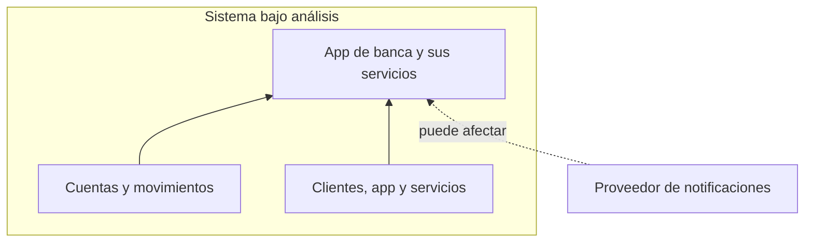
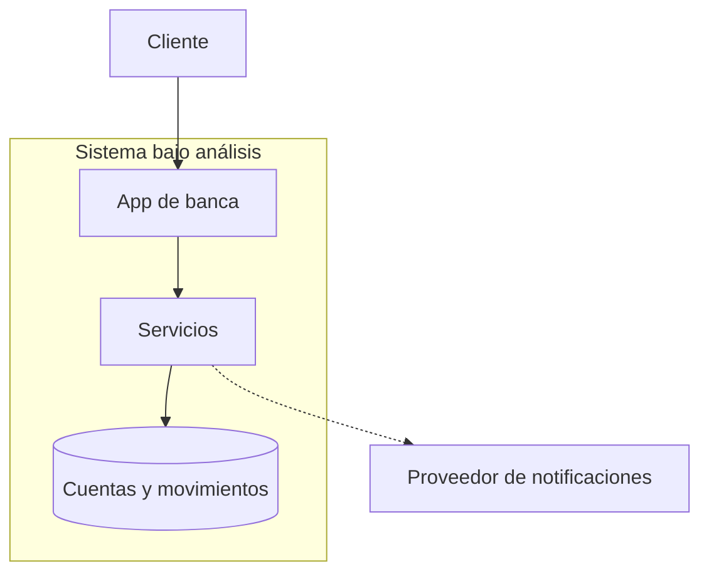
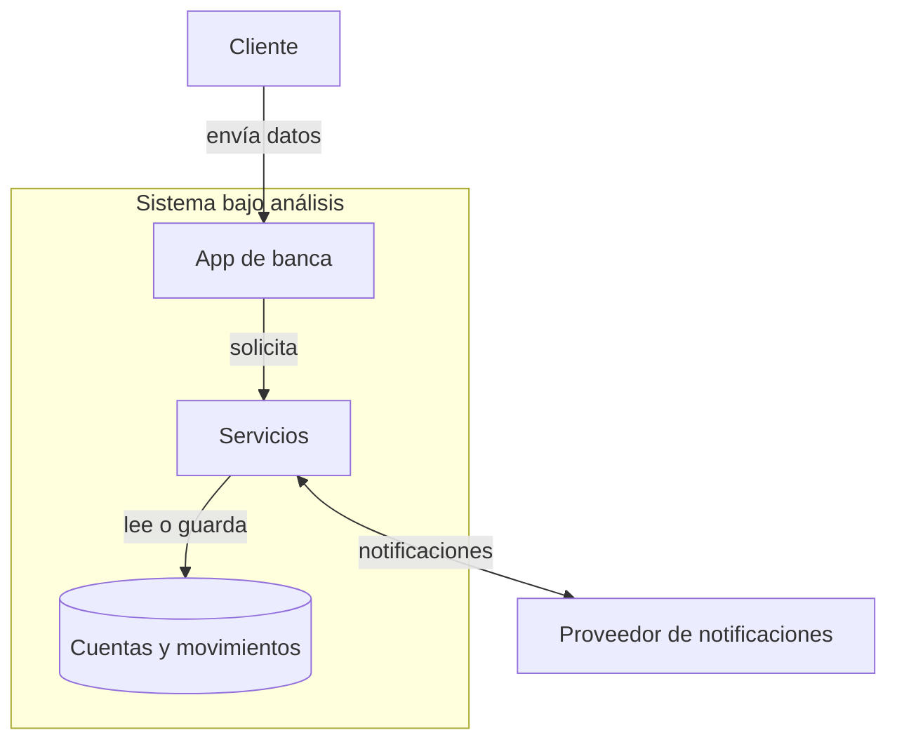
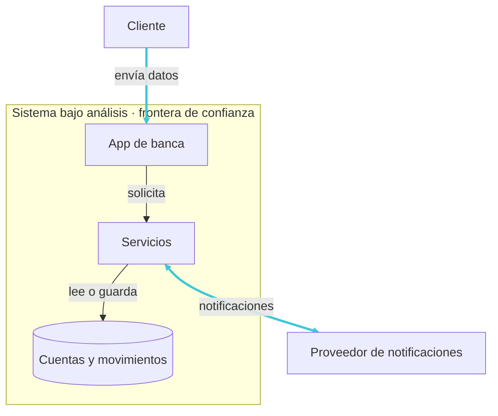
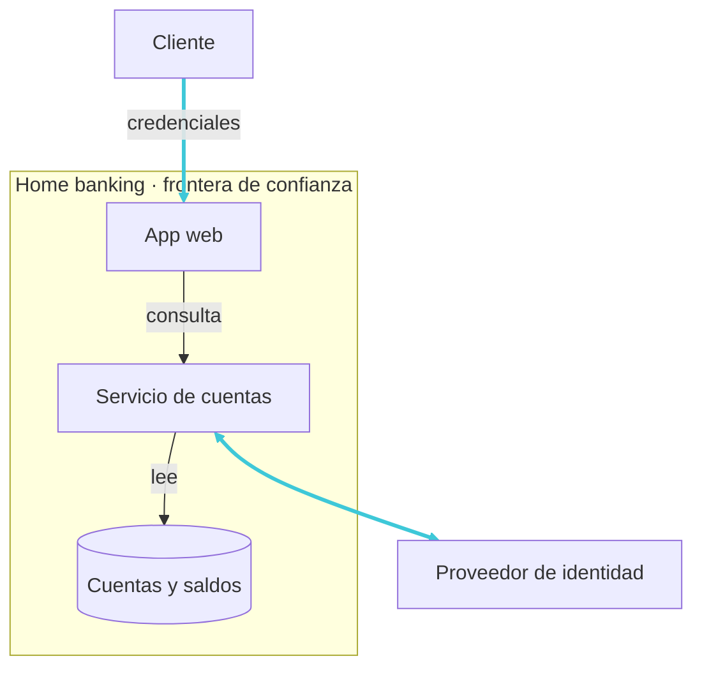

# Software seguro desde el diseño
## La seguridad se decide antes de escribir código.

<div class="mt-10 mx-auto max-w-5xl" role="img" aria-label="Ciclo de vida del software: requisitos, diseño, código y operación; diseño está resaltado">
  <div class="grid grid-cols-[1fr_auto_1fr_auto_1fr_auto_1fr] items-center gap-2 text-center text-sm">
    <div class="card px-2 py-3">Requisitos</div>
    <span aria-hidden="true" class="opacity-50">→</span>
    <div class="rounded-lg border-2 border-cyber-cyan bg-cyber-cyan px-2 py-3 font-semibold text-cyber-bg">Diseño</div>
    <span aria-hidden="true" class="opacity-50">→</span>
    <div class="card px-2 py-3">Código</div>
    <span aria-hidden="true" class="opacity-50">→</span>
    <div class="card px-2 py-3">Operación</div>
  </div>
  <p class="mt-4 text-center text-sm opacity-70">Las decisiones de diseño condicionan lo que podremos proteger después.</p>
</div>

<!--
- Abrí con una decisión concreta: quién puede consultar una cuenta se acuerda antes de elegir una biblioteca o escribir un endpoint. Agregar una herramienta al final no resuelve una regla de acceso que nunca definimos.
- Señalá diseño, sin presentarlo como la única etapa importante: las reglas elegidas ahí deben implementarse, probarse y sostenerse en operación.
- Anticipá el recorrido: entender un sistema, modelar sus partes, explorar amenazas y convertirlas en decisiones comprobables. No hace falta empezar por herramientas.
- Enlace: «¿Dónde puede nacer una debilidad, incluso antes de escribir código?»

Respaldo: NIST SSDF, SP 800-218. Enlaces completos en el guion.
-->

---

# ¿Qué es una vulnerabilidad?

Una debilidad en un sistema, sus procedimientos, controles o implementación que una amenaza puede explotar o activar.

<div class="mt-6 text-sm font-semibold">Puede estar en cualquier artefacto del SDLC:</div>

<div class="mt-3 grid grid-cols-3 gap-3 text-center text-sm" role="img" aria-label="Artefactos del ciclo de vida del software que pueden contener vulnerabilidades: requisitos, diseño, código y dependencias, build y release, configuración e infraestructura, software en operación">
  <div class="card flex flex-col items-center gap-2 px-3 py-4">
    <carbon-document class="text-2xl text-cyber-cyan" />
    <span>Requisitos e historias</span>
  </div>
  <div class="card flex flex-col items-center gap-2 px-3 py-4">
    <carbon-flow class="text-2xl text-cyber-cyan" />
    <span>Diseño y arquitectura</span>
  </div>
  <div class="card flex flex-col items-center gap-2 px-3 py-4">
    <carbon-code class="text-2xl text-cyber-cyan" />
    <span>Código y dependencias</span>
  </div>
  <div class="card flex flex-col items-center gap-2 px-3 py-4">
    <carbon-terminal class="text-2xl text-cyber-cyan" />
    <span>Scripts, pipeline y build</span>
  </div>
  <div class="card flex flex-col items-center gap-2 px-3 py-4">
    <carbon-settings class="text-2xl text-cyber-cyan" />
    <span>Configuración e infraestructura</span>
  </div>
  <div class="card flex flex-col items-center gap-2 px-3 py-4">
    <carbon-cloud class="text-2xl text-cyber-cyan" />
    <span>Software en operación</span>
  </div>
</div>

<p class="mt-4 text-center text-sm opacity-70">Una vulnerabilidad no está limitada al código fuente.</p>

<!--
- Separá existencia, descubrimiento y explotación: una debilidad puede estar ahí sin que nadie la conozca ni la use. Un hallazgo cambia lo que sabemos aunque el código propio no cambie; CISA KEV reúne vulnerabilidades con explotación real confirmada.
- Elegí ejemplos, sin leer las seis tarjetas: un requisito omite quién puede ver movimientos; el diseño confía en el identificador del cliente; el código no verifica autorización; el pipeline permite alterar un artefacto; la configuración da permisos excesivos; en operación queda una versión sin actualizar.
- No deduzcas el riesgo del origen: un requisito incompleto no es necesariamente menos grave que un bug. La prioridad depende del escenario, su probabilidad y sus consecuencias.
- Preguntá: «Si descubrimos hoy una falla en una biblioteca que no cambió, ¿la debilidad nació hoy?» Esperado: cambió nuestro conocimiento, no necesariamente el software.
- Enlace: «Usemos un sistema concreto para seguir estas relaciones».

Respaldo: NIST (vulnerabilidad, SSDF y DevSecOps); CISA KEV.
-->

---

# Nuestro caso: una app de banca digital

<p class="mt-4 text-lg">Un mismo sistema nos acompañará toda la clase: autenticarse, consultar y transferir.</p>

<div class="mt-6 grid grid-cols-3 gap-4 text-center" role="img" aria-label="Tres viajes del cliente en la app de banca: autenticarse, consultar saldo y movimientos, iniciar una transferencia">
  <section class="card flex flex-col items-center px-4 py-5"><carbon-user-identification class="text-3xl text-cyber-cyan" /><strong class="mt-2">Autenticarse</strong><p class="mt-2 text-sm">El cliente ingresa con su cuenta y verifica su identidad.</p></section>
  <section class="card flex flex-col items-center px-4 py-5"><carbon-view class="text-3xl text-cyber-cyan" /><strong class="mt-2">Consultar</strong><p class="mt-2 text-sm">Mira el saldo y los movimientos de su cuenta.</p></section>
  <section class="card flex flex-col items-center px-4 py-5"><carbon-send-alt class="text-3xl text-cyber-cyan" /><strong class="mt-2">Transferir</strong><p class="mt-2 text-sm">Inicia una transferencia a otra cuenta.</p></section>
</div>

<p class="mt-5 text-center text-sm opacity-70">Detrás de la app hay servicios, una base de datos y un proveedor externo de notificaciones.</p>

<!--
- Aclará que la banca es el vehículo, no el tema: vamos a reutilizar el caso para evitar aprender un sistema nuevo con cada concepto. Personas, servicios, datos y terceros aparecen también en otros dominios.
- Preguntá: «¿Qué otro viaje harían con una app así?» Guardá respuestas como descargar un extracto o cambiar el alias: después servirán para mostrar cómo una función agrega puntos de interacción.
- No profundices todavía en controles ni agregues componentes al modelo. Los tres viajes nos alcanzan para hablar de activos, flujos, confianza, abusos y requisitos.
- Enlace: «Antes de conectar las piezas, ¿qué perderían las personas si algo funciona mal?»
-->

---

# ¿Qué queremos proteger?

**Activo:** algo que tiene valor para una persona u organización.
**En la app de banca:** los datos de clientes, el registro de movimientos y la disponibilidad del servicio.

<div class="mt-4 grid grid-cols-[auto_1fr] items-center gap-6">
  <svg viewBox="0 0 460 350" class="mx-auto h-64" role="img" aria-label="Tríada CIA: confidencialidad, integridad y disponibilidad como propiedades que sostienen el valor de los activos">
    <polygon points="230,80 50,300 410,300" fill="none" stroke="#3EC8D8" stroke-width="2" opacity="0.7" />
    <circle cx="230" cy="80" r="15" fill="#3EC8D8" />
    <text x="230" y="86" text-anchor="middle" fill="#0B100E" style="font-size: 20px; font-weight: 700">C</text>
    <text x="230" y="52" text-anchor="middle" fill="#E7E9E6" style="font-size: 22px; font-weight: 600">Confidencialidad</text>
    <circle cx="50" cy="300" r="15" fill="#3EC8D8" />
    <text x="50" y="306" text-anchor="middle" fill="#0B100E" style="font-size: 20px; font-weight: 700">I</text>
    <text x="20" y="336" text-anchor="start" fill="#E7E9E6" style="font-size: 22px; font-weight: 600">Integridad</text>
    <circle cx="410" cy="300" r="15" fill="#3EC8D8" />
    <text x="410" y="306" text-anchor="middle" fill="#0B100E" style="font-size: 20px; font-weight: 700">A</text>
    <text x="440" y="336" text-anchor="end" fill="#E7E9E6" style="font-size: 22px; font-weight: 600">Disponibilidad</text>
  </svg>
  <div class="grid gap-3 text-sm">
    <section class="card px-4 py-3" aria-label="Confidencialidad">
      <strong>Confidencialidad</strong>
      <p class="mt-1">El saldo y los movimientos solo son visibles para el titular de la cuenta.</p>
    </section>
    <section class="card px-4 py-3" aria-label="Integridad">
      <strong>Integridad</strong>
      <p class="mt-1">El importe y el destinatario de una transferencia permanecen correctos.</p>
    </section>
    <section class="card px-4 py-3" aria-label="Disponibilidad">
      <strong>Disponibilidad</strong>
      <p class="mt-1">La app responde cuando el cliente necesita hacer una transferencia.</p>
    </section>
  </div>
</div>

<p class="mt-5 text-center text-sm opacity-70">Primero identificamos el valor y las propiedades que lo sostienen; después, qué podría ponerlo en riesgo.</p>

<!--

- Llevá el valor más allá del inventario técnico: una base importa por los datos que conserva y las decisiones que permite tomar; también importan la continuidad del servicio y la confianza de sus clientes. Identificar pérdidas posibles orienta la elección de controles.
- Preguntá: «Si una transferencia llega, pero con un importe distinto del autorizado, ¿qué propiedad se vio afectada?» Esperado: integridad; que el servicio responda no garantiza que el resultado sea correcto.
- Las tres propiedades no son compartimentos excluyentes: un incidente puede afectar varias. Tampoco agotan todo lo necesario; el contexto puede exigir autenticidad o trazabilidad.
- Evitá prometer disponibilidad absoluta: interesa poder usar el servicio de manera oportuna y confiable según sus necesidades.
- Enlace: «Ya sabemos qué preservar; veamos qué situaciones podrían afectarlo».

Respaldo: NIST, Asset e Information Security (FIPS 200).

-->

---

# Amenaza y atacante

<div class="mt-5 grid grid-cols-2 gap-4 text-sm">
  <section class="card px-4 py-4" aria-label="Definición de amenaza">
    <strong class="text-lg">Amenaza: qué podría ocurrir</strong>
    <p class="mt-2">Circunstancia o evento con potencial de dañar activos, personas u operaciones.</p>
  </section>
  <section class="card px-4 py-4" aria-label="Definición de atacante">
    <strong class="text-lg">Atacante: quién actúa con intención</strong>
    <p class="mt-2">Persona o grupo que intenta comprometer la seguridad del sistema, desde dentro o fuera de la organización.</p>
  </section>
</div>

<div class="mt-4 text-sm font-semibold">Ejemplos en la app de banca:</div>

<table class="mt-2 text-sm">
  <thead>
    <tr><th scope="col">Amenaza</th><th scope="col">Quién o qué la origina</th><th scope="col">¿Hay atacante?</th></tr>
  </thead>
  <tbody>
    <tr><td>Consulta no autorizada de movimientos</td><td>Persona que busca datos ajenos</td><td>Sí</td></tr>
    <tr><td>Exposición accidental de datos</td><td>Administrador que configura mal un permiso</td><td>No</td></tr>
    <tr><td>Interrupción de las transferencias</td><td>Falla de la base de datos</td><td>No</td></tr>
  </tbody>
</table>

<p class="mt-4 text-center text-lg"><strong>No toda amenaza requiere un atacante.</strong></p>

<!--
- Subrayá el carácter potencial: describir una amenaza no significa que ya ocurrió ni que el daño sea inevitable.
- Usá un solo escenario para separar términos: falta una comprobación de autorización (vulnerabilidad); alguien intenta consultar movimientos ajenos (evento amenazante); quien lo intenta deliberadamente es el atacante.
- Preguntá: «Si un empleado expone datos por error, ¿es un atacante?» No por ese error: puede originar una amenaza accidental sin intención de comprometer el sistema. En cambio, un empleado que abusa deliberadamente de sus permisos sí puede actuar como atacante.
- El acceso legítimo y la ubicación interna no prueban buena intención. NIST distingue fuentes adversarias, accidentales, estructurales y ambientales: “fuente de amenaza” es más amplio que “atacante”.
- Enlace: «Pasemos de escenarios posibles a consecuencias documentadas de ataques reales».

Respaldo: NIST, Threat y Adversary; SP 800-30 Rev. 1.
-->

---

# Consecuencias reales de ciberataques

<p class="mt-2 text-center text-sm">Patrones en brechas observadas globalmente (Verizon DBIR 2026): <strong>31%</strong> se inició explotando vulnerabilidades · <strong>48%</strong> incluyó ransomware · <strong>48%</strong> involucró a terceros.</p>

<div class="mt-5 grid grid-cols-2 gap-8">
  <section class="border-t border-gray-400/60 pt-3" aria-label="WannaCry en el sistema público de salud de Inglaterra, 2017">
    <p class="text-sm uppercase tracking-wide">Sector público · Inglaterra · 2017</p>
    <h2 class="mt-2 text-xl font-semibold">WannaCry y el NHS</h2>
    <strong class="mt-3 block text-3xl">Más de 19.000</strong>
    <p class="mt-1 text-sm">citas estimadas canceladas; en cinco zonas, hospitales derivaron pacientes a otros servicios de urgencias.</p>
  </section>
  <section class="border-t border-gray-400/60 pt-3" aria-label="Ataque a Colonial Pipeline, empresa privada de energía, 2021">
    <p class="text-sm uppercase tracking-wide">Sector privado · Estados Unidos · 2021</p>
    <h2 class="mt-2 text-xl font-semibold">Colonial Pipeline</h2>
    <strong class="mt-3 block text-3xl">Combustible interrumpido</strong>
    <p class="mt-1 text-sm">Un ataque a sistemas corporativos llevó a detener temporalmente el oleoducto por precaución.</p>
  </section>
</div>

<p class="mt-5 text-center text-sm">Las técnicas se repiten; el impacto alcanza a personas y servicios que dependen de los sistemas afectados.</p>

<!--

- DBIR 2026 analiza del 1/11/2024 al 31/10/2025. Los porcentajes miden dimensiones distintas de brechas observadas y pueden superponerse: no se suman ni estiman el riesgo de cada organización. No traslades frecuencias entre sectores o países.
- NHS: se identificaron 6.912 citas canceladas en los datos recogidos; más de 19.000 es la estimación total, no un conteo completo. La exposición se vinculó a Windows sin actualizar o fuera de soporte. Conectá la debilidad técnica con atención postergada y pacientes derivados.
- Colonial: el ransomware afectó TI corporativa. Se desconectaron preventivamente sistemas de control del oleoducto; al 12 de mayo de 2021 no había indicios de compromiso de esos sistemas. La decisión interrumpió operaciones; se reanudaron el 13 de mayo.
- Preguntá: «¿Por qué se detuvo un servicio físico sin evidencia de ataque a sus controles?» Guiá hacia dependencias y continuidad ante incertidumbre.
- Impacto incluye daños a personas, activos y operaciones, no solo datos perdidos. Enlace: «Separemos debilidad, amenaza e impacto; después valoremos el riesgo».

Fuentes: Verizon DBIR 2026; NAO (NHS); GAO (Colonial); NIST SP 800-30. Enlaces en el guion.

-->

---

# De la amenaza al riesgo

Una amenaza es un escenario con potencial de daño. El riesgo valora si ese escenario puede concretarse en **este** sistema y cuánto afectaría.

<div class="mt-4 grid grid-cols-3 gap-3 text-center text-sm" role="img" aria-label="Tres piezas: la amenaza define el escenario; la vulnerabilidad y la exposición deciden si puede concretarse; los controles reducen probabilidad e impacto">
  <section class="card px-3 py-3"><strong>Amenaza</strong><p style="margin: 0.5rem 0 0">El escenario: qué podría pasar y quién o qué podría provocarlo.</p></section>
  <section class="card px-3 py-3"><strong>Vulnerabilidad y exposición</strong><p style="margin: 0.5rem 0 0">Deciden si el escenario puede concretarse: una debilidad y un punto de contacto que la alcance.</p></section>
  <section class="card px-3 py-3"><strong>Controles</strong><p style="margin: 0.5rem 0 0">Reducen la probabilidad de que ocurra, el impacto si ocurre, o ambos.</p></section>
</div>

<div class="mt-4 card grid grid-cols-[auto_1fr] items-center gap-5 px-4 py-3">
  <svg viewBox="0 0 340 230" class="h-40" role="img" aria-label="Matriz de riesgo: el mismo escenario cae en probabilidad e impacto altos sin controles (A) y se desplaza a valores bajos con controles (B)">
    <rect x="50" y="16" width="76" height="53" fill="#B58A2B" opacity="0.45" />
    <rect x="126" y="16" width="76" height="53" fill="#C2622B" opacity="0.5" />
    <rect x="202" y="16" width="76" height="53" fill="#FF5A3A" opacity="0.55" />
    <rect x="50" y="69" width="76" height="53" fill="#1F7A4D" opacity="0.4" />
    <rect x="126" y="69" width="76" height="53" fill="#B58A2B" opacity="0.45" />
    <rect x="202" y="69" width="76" height="53" fill="#C2622B" opacity="0.5" />
    <rect x="50" y="122" width="76" height="53" fill="#1F7A4D" opacity="0.3" />
    <rect x="126" y="122" width="76" height="53" fill="#1F7A4D" opacity="0.4" />
    <rect x="202" y="122" width="76" height="53" fill="#B58A2B" opacity="0.45" />
    <g stroke="#E7E9E6" stroke-opacity="0.15" stroke-width="1">
      <line x1="126" y1="16" x2="126" y2="175" />
      <line x1="202" y1="16" x2="202" y2="175" />
      <line x1="50" y1="69" x2="278" y2="69" />
      <line x1="50" y1="122" x2="278" y2="122" />
    </g>
    <rect x="50" y="16" width="228" height="159" fill="none" stroke="#9AA39C" stroke-width="1.5" />
    <line x1="240" y1="43" x2="88" y2="149" stroke="#3EC8D8" stroke-width="2" stroke-dasharray="6 5" />
    <circle cx="240" cy="43" r="11" fill="#FF5A3A" />
    <text x="240" y="43" text-anchor="middle" dominant-baseline="central" fill="#0B100E" style="font-size: 18px; font-weight: 700">A</text>
    <circle cx="88" cy="149" r="11" fill="#5CFF8A" />
    <text x="88" y="149" text-anchor="middle" dominant-baseline="central" fill="#0B100E" style="font-size: 18px; font-weight: 700">B</text>
    <text x="164" y="205" text-anchor="middle" fill="#9AA39C" style="font-size: 20px">Impacto →</text>
    <text x="24" y="95" text-anchor="middle" fill="#9AA39C" style="font-size: 20px" transform="rotate(-90 24 95)">Probabilidad →</text>
  </svg>
  <div class="text-sm">
    <strong class="text-base">Riesgo ≈ probabilidad × impacto</strong>
    <p class="mt-1">¿Qué tan probable es aquí, y cuánto afectaría? Una aproximación para ordenar la conversación, no una fórmula.</p>
    <p class="mt-2"><span class="font-semibold text-cyber-alert">A</span> sin controles · <span class="font-semibold text-cyber-neon">B</span> con controles: el mismo escenario se desplaza.</p>
  </div>
</div>

<p class="mt-4 text-center text-sm">La misma amenaza puede dar riesgos distintos: cambian las vulnerabilidades, la exposición y los controles.</p>

<!--
- Usá la misma amenaza: consultar movimientos ajenos. Si el servidor confía en el identificador del cliente sin verificar permisos, el abuso puede concretarse y alcanzar muchas cuentas. Verificar autorización en cada consulta reduce esa posibilidad; acotar accesos y detectar consultas anómalas puede limitar el daño.
- No asignes “riesgo bajo” solo por tener controles: importa su efectividad y el contexto. La autenticación multifactor ayuda contra cuentas robadas, pero no corrige por sí sola una falla de autorización sobre otra cuenta.
- La multiplicación es un recordatorio, no un cálculo con escalas arbitrarias. Un escenario improbable puede exigir atención si afecta un servicio esencial sin recuperación; uno frecuente puede ser tolerable si sus consecuencias son acotadas.
- Preguntá: «¿Qué cambio del sistema aumentaría el riesgo sin cambiar la amenaza?» Buscá exposición, permisos, controles o capacidad de recuperación.
- Enlace: «Para valorar eso, necesitamos ver cómo se conectan personas, servicios y datos».

Respaldo: NIST, Risk, Threat y Vulnerability; SP 800-30 Rev. 1.
-->

---

# El software moderno está conectado

```mermaid {theme: 'base', flowchart: {nodeSpacing: 12, rankSpacing: 40, padding: 20}}
flowchart LR
  U[Cliente] -->|usa| A[App de banca]
  A -->|invoca| S[Servicios]
  S -->|consulta o registra| D[(Cuentas y movimientos)]
  S -->|integra| X[Proveedor de notificaciones]
  S -->|se aloja en| C[Nube]
```

Cada vínculo requiere definir qué se intercambia, quién participa y qué permisos necesita. Proteger solo la entrada de la red no alcanza:

<div class="mt-4 grid grid-cols-3 gap-3 text-center text-sm">
  <div class="card px-3 py-3"><strong>Identidad</strong><br />Una cuenta legítima puede usarse mal o ser robada.</div>
  <div class="card px-3 py-3"><strong>Servicios</strong><br />Un componente conectado puede quedar comprometido.</div>
  <div class="card px-3 py-3"><strong>Comunicaciones</strong><br />Cada llamada requiere controles propios.</div>
</div>

<p class="mt-4 text-center text-sm opacity-70">El control perimetral filtra entradas; no vuelve confiables a los componentes internos ni sus interacciones.</p>

<!--

- Seguí una transferencia, no todas las flechas: el cliente confirma; pagos registra la operación; el proveedor recibe lo necesario para notificar. La nube indica alojamiento, no una etapa por la que pasan los datos.
- Preguntá: «¿El proveedor necesita todo el historial de movimientos para enviar una confirmación?» Usá la respuesta para discutir datos mínimos y permisos por vínculo.
- Estar dentro de la red no vuelve confiable a una cuenta o servicio. Una identidad válida puede estar robada y un componente interno, comprometido; las llamadas siguen necesitando autorización y validación.
- No descartes el firewall: filtra conexiones, pero no reemplaza los controles sobre recursos y operaciones.
- Enlace: «El perímetro y una revisión final no resuelven todas estas relaciones; veamos el costo de descubrirlas tarde».

Respaldo: NIST SP 800-207, Zero Trust Architecture.

-->

---
layout: default
---

# El límite de la seguridad reactiva

El modelo de **fortaleza y foso** concentra la defensa en la red y deja la seguridad de la aplicación para una revisión antes del lanzamiento.

```mermaid {theme: 'base', flowchart: {nodeSpacing: 16, rankSpacing: 24, padding: 12}}
flowchart LR
  R[Requisitos] --> D[Diseño] --> C[Código] --> B["Build y<br/>pruebas"] --> P["Pentest<br/>final"] --> L[Lanzamiento]
  P -.hallazgos para corregir.-> D
```

<div class="mt-4 grid grid-cols-2 items-center gap-6">
  <div class="text-base">
    <p style="margin: 0 0 1rem">Una revisión tardía puede sumar retrabajo y tensionar la fecha de liberación.</p>
    <p style="margin: 0">La seguridad no depende de una herramienta aislada: es una <strong>propiedad del sistema</strong>, sostenida por decisiones coordinadas en <strong>diseño, implementación, configuración y operación</strong>.</p>
  </div>
  
</div>

<!--

- Señalá la flecha de regreso: un hallazgo de autorización puede exigir rediseñar permisos, cambiar código y repetir pruebas cuando ya hay una fecha comprometida. No afirmes un costo fijo ni que todo pentest frene una entrega.
- El problema es depender de la revisión final, no hacer pentests. El enfoque perimetral y la verificación tardía son limitaciones distintas que pueden coexistir; una no obliga a la otra.
- Conectá las cuatro dimensiones con una misma regla: diseño decide quién puede consultar; implementación verifica cada solicitud; configuración acota la cuenta de servicio; operación mantiene controles y detecta anomalías. Si una falla, las otras no garantizan la protección.
- Preguntá: «¿Qué quedaría sin resolver si solo agregáramos una herramienta?» Buscá reglas de negocio, permisos y recuperación, no nombres de productos.
- Enlace: «Empecemos por delimitar qué incluye nuestro sistema y de qué depende».

Respaldo: NIST SSDF y SP 800-160; guías OWASP. PPT original: diapositiva 8.

-->

---

# El alcance del sistema define el análisis



**Fuera de nuestro control no significa fuera del análisis.**

<!--
- Distinguí alcance de control: podemos analizar una dependencia sin administrar sus servidores. El recuadro delimita el objeto de estudio; no borra lo que puede afectarlo desde fuera.
- Preguntá: «Si el proveedor de notificaciones no responde, ¿debería detenerse la transferencia?» En este caso buscamos separar la operación del aviso; no supongas que esa independencia existe sin diseñarla.
- Registrá supuestos: qué servicio queremos sostener, qué datos usa, quién participa y de quién depende. Sin ese contexto, una lista de amenazas queda demasiado abstracta.
- Enlace: «Dibujemos esas piezas y dependencias para discutirlas sobre el mismo mapa».

Respaldo: NIST SP 800-30 Rev. 1; OWASP Threat Modeling.
-->

---
layout: two-cols-header
---

# Dibujemos el sistema

::left::



<p class="mt-2 text-center text-sm opacity-70">El recuadro marca el alcance; la línea punteada, una dependencia externa.</p>

::right::

### Componentes, en nuestro caso

<div class="mt-4 grid grid-cols-[7rem_1fr] gap-x-3 gap-y-3 text-sm">
  <strong>Cliente</strong><span>persona con una cuenta</span>
  <strong>App de banca</strong><span>app móvil o web</span>
  <strong>Servicios</strong><span>autenticación, extractos, pagos</span>
  <strong>Cuentas y movimientos</strong><span>saldos e historial</span>
  <strong>Proveedor de notificaciones</strong><span>confirmaciones por SMS o correo</span>
</div>

<!--
- Este es un modelo inicial para conversar, no una arquitectura completa ni un inventario de servidores. “Servicios” resume autenticación, extractos y pagos; podremos separarlos cuando la pregunta lo requiera.
- Señalá el recuadro y la línea punteada: alcance elegido y dependencia externa. Estar dentro del alcance no implica confianza automática; más adelante analizaremos fronteras internas.
- Preguntá: «¿Dónde se decide si el cliente puede consultar esa cuenta?» Esperado: en los servicios, con verificación del lado servidor; la pantalla no debe ser la única barrera.
- Si aparecen detalles de infraestructura, anotá lo pendiente sin perder el propósito: hacer visibles las relaciones que importan para la seguridad.
- Enlace: «Ahora pongamos datos y permisos sobre esas conexiones».

Respaldo: OWASP Threat Modeling.
-->

---
layout: two-cols-header
---

# La información se mueve

::left::



<p class="mt-2 text-center text-sm opacity-70">El intercambio con el proveedor externo se dibuja aparte del recorrido interno.</p>

::right::

### Qué identificar

<div class="mt-4 grid grid-cols-1 gap-3 text-sm">
  <section class="card px-3 py-3"><strong>Origen</strong><br />Persona o sistema que genera la información.</section>
  <section class="card px-3 py-3"><strong>Destino</strong><br />Servicio, almacén o sistema que la recibe.</section>
  <section class="card px-3 py-3"><strong>Acceso</strong><br />Quién puede leerla o modificarla.</section>
</div>

<!--
- Seguí un dato concreto: importe y destinatario salen de la app, llegan a pagos y se registran. Preguntá: «¿Quién podría leerlos o alterarlos durante ese recorrido?» Separá capacidad técnica de permiso legítimo.
- Una flecha no demuestra que el intercambio sea seguro: falta precisar qué viaja, con qué identidad y qué validación se aplica antes de usarlo.
- Señalá el ramal externo: notificar no exige que todos los datos recorran primero la base y después el proveedor. No interpretes el dibujo como una secuencia temporal completa.
- Buscá datos innecesarios en cada destino: enviar solo lo requerido reduce exposición, aunque no reemplaza controles de acceso.
- Enlace: «Ya seguimos el dato; ahora discutamos qué confianza merece su origen».

Respaldo: OWASP Threat Modeling y Secure Code Review.
-->

---

# ¿En quién confiamos?

**Confianza:** expectativa de que una persona o componente se comporte como esperamos, para una tarea y en un contexto concretos.

<p class="mt-3 text-sm">No basta con asumirla: necesitamos evidencia y límites. Tres comprobaciones complementarias:</p>

<div class="mt-5 grid grid-cols-3 gap-4 text-sm">
  <section class="card px-4 py-4" aria-label="Autenticación: verificar identidad">
    <strong class="text-lg text-cyber-cyan">Autenticación</strong>
    <p class="mt-2">Verificar la identidad declarada.</p>
    <p class="mt-3 border-t border-gray-400/40 pt-3">El cliente inicia sesión con sus credenciales y un segundo factor.</p>
  </section>
  <section class="card px-4 py-4" aria-label="Autorización: comprobar permisos">
    <strong class="text-lg text-cyber-cyan">Autorización</strong>
    <p class="mt-2">Comprobar el permiso para una acción sobre un recurso.</p>
    <p class="mt-3 border-t border-gray-400/40 pt-3">Puede consultar su cuenta, no la de otro cliente.</p>
  </section>
  <section class="card px-4 py-4" aria-label="Validación de datos: comprobar contenido">
    <strong class="text-lg text-cyber-cyan">Validación de datos</strong>
    <p class="mt-2">Comprobar formato, valores y reglas de la operación.</p>
    <p class="mt-3 border-t border-gray-400/40 pt-3">El importe de una transferencia debe ser válido, aunque el cliente ya ingresó.</p>
  </section>
</div>

<p class="mt-5 text-center text-base"><strong>Autenticarse no da permiso para todo ni vuelve confiable cualquier dato enviado.</strong></p>

<!--
- La confianza no es una cualidad absoluta ni una garantía: delimitamos qué comportamiento esperamos, de quién y para qué. La evidencia permite justificar esa expectativa; hay que revisarla si cambia el contexto.
- Autenticación aporta evidencia de identidad, no de buena intención: una cuenta robada puede superar el ingreso. Autorización comprueba el permiso sobre la acción y el recurso; validar datos no reemplaza ninguna de las dos.
- Preguntá: «Un cliente ingresa correctamente y envía un identificador válido de una cuenta ajena: ¿qué lo debe frenar?» Esperado: autorización en el servidor. El formato correcto y la sesión válida no conceden acceso.
- Aplica también a servicios: confiar en el proveedor para enviar avisos no lo autoriza a modificar saldos. Estar dentro de nuestra red tampoco basta. Estas comprobaciones ayudan a sostener la confianza, pero no prueban que un componente nunca fallará.
- Enlace: «Marquemos dónde cambian esos supuestos y dónde debemos comprobarlos: las fronteras de confianza».

Respaldo: NIST SP 800-207; OWASP Authentication, Authorization e Input Validation. Enlaces en el guion.
-->

---
layout: two-cols-header
---

# Fronteras de confianza

::left::



<p class="mt-2 text-center text-sm opacity-70">Cada flecha que cruza el recuadro atraviesa la frontera: ahí va una validación.</p>

::right::

Una frontera de confianza marca el paso entre contextos con distintos niveles de confianza. Su nombre técnico es **trust boundary**.

### Al cruzarla, validamos

<div class="mt-4 grid grid-cols-[7rem_1fr] gap-x-3 gap-y-3 text-sm">
  <strong>Identidad</strong><span>quién envía: autenticación</span>
  <strong>Permisos</strong><span>qué puede hacer: autorización</span>
  <strong>Datos</strong><span>que sean válidos: validación de entrada</span>
</div>

<!--
- Señalá las dos flechas cian, sin volver a narrar todos los componentes. En el modelo simplificado, alcance y frontera coinciden; en un sistema real puede haber varias fronteras dentro del mismo alcance.
- La app corre en un dispositivo que no controlamos plenamente: una validación de pantalla no reemplaza la comprobación en el servidor. También hay que verificar respuestas del proveedor externo.
- Preguntá: «Un cliente autenticado cambia el identificador de cuenta: ¿qué comprobación falta?» Esperado: autorización sobre esa cuenta; una identidad válida y un dato bien formado no bastan.
- Evitá sugerir que el interior es automáticamente confiable: app, servicios y base pueden requerir contextos y permisos diferentes.
- Enlace: «Esos cruces son algunos de los lugares donde se puede influir en el sistema; veamos la superficie completa».

Respaldo: OWASP Threat Modeling.
-->

---

# Superficie de ataque

Son los lugares donde alguien puede interactuar con el sistema o influir en él.

<div class="mt-6 grid grid-cols-3 gap-3 text-center text-sm" role="img" aria-label="Superficie de ataque: entradas, cuentas, APIs, archivos, interfaces y servicios externos">
  <section class="card flex flex-col items-center gap-1 px-3 py-3"><carbon-edit class="text-2xl text-cyber-cyan" /><strong>Entradas</strong><span class="opacity-80">formulario de transferencia</span></section>
  <section class="card flex flex-col items-center gap-1 px-3 py-3"><carbon-user class="text-2xl text-cyber-cyan" /><strong>Cuentas</strong><span class="opacity-80">credenciales de clientes</span></section>
  <section class="card flex flex-col items-center gap-1 px-3 py-3"><carbon-api class="text-2xl text-cyber-cyan" /><strong>APIs</strong><span class="opacity-80">endpoints de saldo y pagos</span></section>
  <section class="card flex flex-col items-center gap-1 px-3 py-3"><carbon-document class="text-2xl text-cyber-cyan" /><strong>Archivos</strong><span class="opacity-80">extractos descargables</span></section>
  <section class="card flex flex-col items-center gap-1 px-3 py-3"><carbon-mobile class="text-2xl text-cyber-cyan" /><strong>Interfaces</strong><span class="opacity-80">pantallas de la app</span></section>
  <section class="card flex flex-col items-center gap-1 px-3 py-3"><carbon-cloud-services class="text-2xl text-cyber-cyan" /><strong>Servicios externos</strong><span class="opacity-80">proveedor de notificaciones</span></section>
</div>

<p class="mt-6">Reducir entradas innecesarias reduce oportunidades de abuso.</p>

<!--
- La superficie no termina en las pantallas: una API puede invocarse directamente y una cuenta de servicio también puede usarse indebidamente. Los cruces de confianza son una parte, no el inventario completo.
- Tener un punto expuesto no prueba que tenga una vulnerabilidad; indica dónde necesitamos analizar interacciones y controles.
- Recuperá una función propuesta al presentar el caso, como descargar extractos: agrega rutas, archivos y permisos que revisar.
- Preguntá: «¿Qué acceso podríamos restringir sin quitar la función legítima?» Consultar solo cuentas autorizadas reduce el abuso; ocultar un botón no protege el endpoint.
- Enlace: «Veamos cómo estos puntos y otras debilidades se combinan en incidentes».

Respaldo: OWASP Attack Surface Analysis.
-->

---
layout: default
---

# ¿De dónde vienen las brechas?

<div class="mt-8 grid grid-cols-2 gap-6">
  <section class="card min-h-80 flex flex-col px-5 py-5" aria-labelledby="brechas-causas">
    <h3 id="brechas-causas" style="margin: 0 0 1rem">Causas frecuentes</h3>
    <div class="grid flex-1 grid-rows-3 text-base">
      <div class="flex items-center gap-3 border-b border-cyber-cyan/15 py-4">
        <carbon-user class="shrink-0 text-2xl text-cyber-cyan" aria-hidden="true" />
        <div><strong class="block">Phishing y amenazas internas</strong><span class="mt-1 block text-sm opacity-80">Intencionadas o accidentales.</span></div>
      </div>
      <div class="flex items-center gap-3 border-b border-cyber-cyan/15 py-4">
        <carbon-code class="shrink-0 text-2xl text-cyber-cyan" aria-hidden="true" />
        <div><strong class="block">Software de terceros</strong><span class="mt-1 block text-sm opacity-80">Vulnerable o sin parches.</span></div>
      </div>
      <div class="flex items-center gap-3 py-4">
        <carbon-settings class="shrink-0 text-2xl text-cyber-cyan" aria-hidden="true" />
        <div><strong class="block">Configuración incorrecta</strong><span class="mt-1 block text-sm opacity-80">Especialmente en la nube.</span></div>
      </div>
    </div>
  </section>
  <section class="card min-h-80 flex flex-col px-5 py-5" aria-labelledby="brechas-superficie">
    <h3 id="brechas-superficie" style="margin: 0 0 1rem">La superficie se expande</h3>
    <div class="grid flex-1 grid-rows-2 text-base">
      <div class="flex items-center gap-3 border-b border-cyber-cyan/15 py-4">
        <carbon-mobile class="shrink-0 text-2xl text-cyber-cyan" aria-hidden="true" />
        <div><strong class="block">Nuevos servicios digitales</strong><span class="mt-1 block text-sm opacity-80">En banca, por ejemplo: home banking, onboarding digital, pagos instantáneos.</span></div>
      </div>
      <div class="flex items-center gap-3 py-4">
        <carbon-cloud-services class="shrink-0 text-2xl text-cyber-cyan" aria-hidden="true" />
        <div><strong class="block">Arquitecturas modernas</strong><span class="mt-1 block text-sm opacity-80">Microservicios, contenedores y nube suman dependencias.</span></div>
      </div>
    </div>
  </section>
</div>

<!--
- No presentes las tarjetas como un ranking ni traslades frecuencias a una organización concreta. La columna izquierda mezcla eventos, fuentes y debilidades: interesa cómo se encadenan, no una taxonomía única.
- Caso de apoyo: en 2024, cuentas de clientes de Snowflake fueron afectadas por credenciales robadas y ausencia de multifactor, según el análisis de CSA de 2025. Usalo como combinación de factores, no como prueba de una vulnerabilidad en la plataforma.
- Microservicios, contenedores o nube no vuelven inseguro un sistema por sí mismos: agregan relaciones, identidades y configuración que gestionar. Los ejemplos financieros ilustran expansión funcional, no todos los sectores.
- Preguntá: «¿Qué condición concreta haría más probable una de estas causas en una organización que conozcan?» Pedí evidencia o supuestos, no solo intuición.
- Enlace: «Para responder a esos escenarios, diseñemos con principios».

Respaldo: Cloud Security Alliance, análisis de Snowflake (2025).
-->

---
class: flex flex-col justify-center
---

# Principios de diseño seguro

No hace falta memorizar una lista extensa. Empecemos con preguntas útiles:

<div class="mt-10 grid grid-cols-3 gap-5 text-center" role="img" aria-label="Tres preguntas de diseño seguro: quién necesita este acceso, qué pasa si una defensa falla y cómo limitamos el daño">
  <section class="card-strong flex flex-col items-center px-5 py-8"><carbon-user-access class="text-4xl text-cyber-cyan" /><strong class="mt-3 text-xl">¿Quién necesita este acceso?</strong><p class="mt-3 text-sm opacity-80">Confiar lo mínimo necesario.</p></section>
  <section class="card-strong flex flex-col items-center px-5 py-8"><carbon-warning-alt class="text-4xl text-cyber-cyan" /><strong class="mt-3 text-xl">¿Qué pasa si una defensa falla?</strong><p class="mt-3 text-sm opacity-80">Varias defensas; fallar de forma segura.</p></section>
  <section class="card-strong flex flex-col items-center px-5 py-8"><carbon-security class="text-4xl text-cyber-cyan" /><strong class="mt-3 text-xl">¿Cómo limitamos el daño?</strong><p class="mt-3 text-sm opacity-80">Separar y contener.</p></section>
</div>

<!--
- Pedí elegir una decisión del caso, no repetir las preguntas: qué permisos dar a extractos, cómo responder si falla autorización o cómo evitar que un compromiso alcance pagos.
- Los principios orientan decisiones, no garantizan seguridad ni reemplazan el análisis del contexto. Pueden requerir equilibrar protección y continuidad del servicio.
- Preguntá: «¿Por cuál empezarían en nuestra app, y por qué?» Aceptá caminos distintos si justifican el activo y el escenario que quieren proteger.
- Anticipá el vocabulario sin desarrollarlo: mínimo privilegio; defensa en profundidad y fallo seguro; contención del impacto.
- Enlace: «Empecemos por los permisos que necesita cada tarea».

Respaldo: OWASP Security by Design Principles.
-->

---
class: flex flex-col justify-center
---

# Confiar lo mínimo necesario

<p class="mt-6 text-xl">¿Qué permisos necesita cada identidad para su tarea, y por cuánto tiempo?</p>

<div class="mt-8 grid grid-cols-2 gap-5 text-center">
  <section class="card-strong flex flex-col items-center px-6 py-7"><carbon-locked class="text-4xl text-cyber-cyan" /><strong class="mt-3 text-xl">Alcance</strong><p class="mt-3 text-base">El servicio de extractos consulta saldos y movimientos, pero no puede iniciar transferencias.</p></section>
  <section class="card-strong flex flex-col items-center px-6 py-7"><carbon-time class="text-4xl text-cyber-cyan" /><strong class="mt-3 text-xl">Duración</strong><p class="mt-3 text-base">El acceso de mantenimiento a la base de datos se habilita por ventana y se revoca al terminar.</p></section>
</div>

<p class="mt-8 text-center">Limitar permisos reduce lo que una cuenta comprometida puede hacer.</p>

<!--
- Aplicá el principio a personas y cuentas de servicio. No es quitar permisos porque sí: cada acción, recurso y duración deben justificarse por una tarea.
- Preguntá: «Si comprometen extractos, ¿qué daño todavía podría haber aunque no pueda transferir?» Esperado: exposición de los datos que sí puede leer. Solo lectura no significa inocuo; también importa a qué cuentas accede.
- El permiso temporal de mantenimiento necesita revocación efectiva al terminar. Tener una ventana acordada no basta si la credencial sigue funcionando después.
- Evitá cuentas compartidas con permisos de varios servicios: dificultan acotar acciones y atribuirlas.
- Enlace: «Acotamos permisos; ahora pensemos qué otra barrera queda si una falla».

Respaldo: NIST SP 800-53, AC-6; OWASP Security by Design.
-->

---
class: flex flex-col justify-center
---

# No depender de una única defensa

<p class="mt-4 text-center text-2xl font-semibold">¿Qué pasa si una barrera falla?</p>
<p class="mt-2 text-center opacity-80">La defensa en profundidad combina controles complementarios.</p>

<div class="mt-8 grid grid-cols-3 gap-5 text-center" role="img" aria-label="Defensa en profundidad: prevenir, detectar y contener">
  <section class="card-strong flex flex-col items-center px-5 py-7"><carbon-security class="text-4xl text-cyber-cyan" /><strong class="mt-3 text-xl">Prevenir</strong><p class="mt-3 text-base">Validar entradas y limitar accesos.</p></section>
  <section class="card-strong flex flex-col items-center px-5 py-7"><carbon-view class="text-4xl text-cyber-cyan" /><strong class="mt-3 text-xl">Detectar</strong><p class="mt-3 text-base">Registrar actividad y alertar ante anomalías.</p></section>
  <section class="card-strong flex flex-col items-center px-5 py-7"><carbon-locked class="text-4xl text-cyber-cyan" /><strong class="mt-3 text-xl">Contener</strong><p class="mt-3 text-base">Aislar componentes y acotar permisos.</p></section>
</div>

<p class="mt-8 text-center">Si un control se supera, otros todavía pueden detectar el incidente o limitar su impacto.</p>

<!--
- Seguí una cuenta robada: puede superar la autenticación y operar con permisos válidos. Una alerta por transferencias inusuales y la posibilidad de aislar el acceso aportan funciones distintas.
- Preguntá: «¿Qué capa detectaría o limitaría esa actividad si la primera barrera no la frenó?» Separá prevenir de detectar: un registro sirve solo si puede analizarse y hay una respuesta prevista.
- Varias copias de una misma comprobación defectuosa no equivalen a defensas complementarias. Buscá que un fallo no anule todas las capas a la vez.
- Una anomalía no prueba un ataque; puede requerir revisión. Ninguna combinación garantiza evitar todos los incidentes.
- Enlace: «También hay que diseñar la respuesta cuando un control o una dependencia falla».

Respaldo: OWASP Security by Design Principles.
-->

---
class: flex flex-col justify-center
---

# Diseñar también para cuando algo falle

<p class="mt-4 text-center text-2xl font-semibold">Si un control o una dependencia falla, ¿cómo debería responder el sistema?</p>

<div class="mt-8 grid grid-cols-3 gap-5 text-center" role="img" aria-label="Respuestas ante un fallo: proteger, degradar y recuperar">
  <section class="card-strong flex flex-col items-center px-5 py-7"><carbon-locked class="text-4xl text-cyber-cyan" /><strong class="mt-3 text-xl">Proteger</strong><p class="mt-3 text-base">Sin poder verificar autorización, no ejecutar transferencias.</p></section>
  <section class="card-strong flex flex-col items-center px-5 py-7"><carbon-warning-alt class="text-4xl text-cyber-cyan" /><strong class="mt-3 text-xl">Degradar</strong><p class="mt-3 text-base">Sin notificaciones, seguir consultando y transfiriendo.</p></section>
  <section class="card-strong flex flex-col items-center px-5 py-7"><carbon-restart class="text-4xl text-cyber-cyan" /><strong class="mt-3 text-xl">Recuperar</strong><p class="mt-3 text-base">Registrar el fallo y restablecer el servicio de forma controlada.</p></section>
</div>

<p class="mt-7 text-center">Fallar seguro no es apagar todo: es limitar las acciones sensibles y conservar, cuando sea posible, las funciones independientes del componente fallido.</p>

<!--
- Fallar seguro depende de qué garantía se perdió, no de apagar todo. Si no podemos comprobar permisos, también deben bloquearse consultas privadas, aunque sean de solo lectura; una función independiente puede continuar si conserva sus controles.
- Preguntá: «Si falla autorización, ¿consultar movimientos sería seguro solo porque no modifica datos?» Esperado: no; está en juego la confidencialidad.
- Si solo falla notificaciones, queremos mantener operaciones independientes y recuperar avisos pendientes. Esa independencia debe estar diseñada; no supongas que se obtiene automáticamente.
- Recuperar exige saber qué ocurrió: ante una respuesta perdida, verificá si la transferencia se registró antes de repetirla. Un reintento no debe duplicar el pago.
- Enlace: «Además de responder al fallo, limitemos el alcance de un compromiso».

Respaldo: NIST SP 800-53, SC-24; OWASP Security by Design.
-->

---
class: flex flex-col justify-center
---

# Limitar el impacto de un compromiso

<p class="mt-4 text-center text-2xl font-semibold">Si se compromete una cuenta, ¿hasta dónde puede llegar?</p>

<div class="mt-8 grid grid-cols-2 gap-5 text-center">
  <section class="card-strong flex flex-col items-center px-6 py-7"><carbon-warning-alt class="text-4xl text-cyber-alert" /><strong class="mt-3 text-xl">Alcance amplio</strong><p class="mt-3 text-base">Una cuenta con permisos amplios puede leer movimientos, iniciar transferencias y administrar usuarios.</p></section>
  <section class="card-strong flex flex-col items-center px-6 py-7"><carbon-checkmark class="text-4xl text-cyber-neon" /><strong class="mt-3 text-xl">Acceso acotado</strong><p class="mt-3 text-base">El servicio de extractos solo lee; el de pagos escribe transferencias; administración usa permisos separados.</p></section>
</div>

<p class="mt-8 text-center">Separar permisos y componentes reduce el radio de impacto (<em>blast radius</em>).</p>

<!--
- Contrastá diseños posibles, sin afirmar que todo compromiso se propaga. El radio de impacto describe qué recursos y funciones podría alcanzar la identidad o el componente comprometido.
- Separar extractos y pagos en dos procesos no alcanza si comparten una credencial con permisos amplios. La separación debe sostenerse en permisos y comunicaciones, no solo en nombres o cajas del diagrama.
- Preguntá: «¿Qué separación impediría que una cuenta de extractos iniciara pagos?» Buscá identidades distintas y restricciones efectivas sobre acciones y recursos.
- Acotar acceso no elimina el daño: extractos todavía podría exponer los movimientos que tiene permitidos. Contener complementa prevenir y detectar.
- Enlace: «Cambiemos de perspectiva: ¿qué intentaría alguien con estas interfaces?»

Respaldo: NIST SP 800-53, AC-6 y SC-7; OWASP Security by Design.
-->

---
class: flex flex-col justify-center
---

# ¿Cómo se podría abusar del sistema?

<div class="mt-8 grid grid-cols-[1fr_auto_1fr] items-center gap-4 text-center" role="img" aria-label="Contraste entre el uso esperado y un intento de abuso">
  <section class="card-strong px-6 py-10"><strong class="text-xl">Uso esperado</strong><p class="mt-3 text-base">Consultar el saldo y los movimientos de la propia cuenta.</p></section>
  <span class="text-3xl opacity-60" aria-hidden="true">→</span>
  <section class="card-strong px-6 py-10"><strong class="text-xl">Intento de abuso</strong><p class="mt-3 text-base">Modificar el identificador de la cuenta para intentar consultar movimientos ajenos.</p></section>
</div>

<p class="mt-8 text-center text-lg">Mirar más allá del uso esperado revela requisitos que el camino feliz no muestra.</p>

<!--
- El intento no demuestra que haya una vulnerabilidad: cambiar el identificador debería producir rechazo si la identidad no tiene permiso. No describas el abuso como un acceso ya logrado.
- El atacante puede usar una cuenta propia legítima; no hace falta robar credenciales para probar una autorización defectuosa.
- Preguntá: «¿Qué condición permitiría que ese intento tuviera éxito?» Esperado: confiar en el identificador sin verificar autorización sobre la cuenta en el servidor.
- Pensar el abuso no es acusar a todos los clientes: revela reglas que una prueba del camino feliz, consultando solo la cuenta propia, no comprueba.
- Enlace: «Ordenemos esa búsqueda con Threat Modeling».

Respaldo: OWASP Threat Modeling.
-->

---
class: flex flex-col justify-center
---

# Threat Modeling

<p class="mt-4 text-center text-2xl font-semibold">¿Qué protegemos, qué podría salir mal y cómo respondemos?</p>

<div class="mt-8 grid grid-cols-[1fr_auto_1fr_auto_1fr] gap-3 text-center" role="img" aria-label="Threat Modeling: entender el sistema, analizar abusos posibles y responder con requisitos, controles y pruebas">
  <section class="card-strong flex flex-col items-center px-4 py-7"><carbon-view class="text-4xl text-cyber-cyan" /><strong class="mt-3 text-xl">Entender</strong><p class="mt-3 text-base">Actores, datos, componentes y flujos.</p></section>
  <span class="self-center text-3xl opacity-60" aria-hidden="true">→</span>
  <section class="card-strong flex flex-col items-center px-4 py-7"><carbon-search class="text-4xl text-cyber-cyan" /><strong class="mt-3 text-xl">Analizar</strong><p class="mt-3 text-base">Posibles abusos y fallos.</p></section>
  <span class="self-center text-3xl opacity-60" aria-hidden="true">→</span>
  <section class="card-strong flex flex-col items-center px-4 py-7"><carbon-tools class="text-4xl text-cyber-cyan" /><strong class="mt-3 text-xl">Responder</strong><p class="mt-3 text-base">Requisitos, controles y pruebas.</p></section>
</div>

<p class="mt-8 text-center">Threat Modeling ordena esta conversación; no requiere una herramienta específica.</p>

<!--
- Hacé visible que ya empezamos: el alcance, los activos, el mapa y las fronteras son insumos del modelado, no una tarea previa desconectada.
- No se termina en enumerar amenazas: necesitamos una respuesta y una comprobación. Si cambian datos, componentes o dependencias, hay que revisar supuestos y decisiones.
- Preguntá: «¿Qué parte ya construimos y cuál nos falta completar?» Esperado: tenemos contexto; ahora exploraremos escenarios y respuestas.
- Antes de enseñar STRIDE, dejá que el grupo produzca amenazas por intuición. Después usaremos las categorías para buscar vacíos, no para condicionar todas las respuestas desde el inicio.
- Enlace: «Volvamos al sistema y hagamos nosotros la etapa de análisis».

Respaldo: OWASP Threat Modeling; NIST SSDF.
-->

---
layout: two-cols-header
---

# ¿Qué podría salir mal?

::left::



<p class="mt-2 text-center text-sm opacity-70">Cada flecha que cruza el recuadro atraviesa la frontera: ahí empieza a preguntar un atacante.</p>

::right::

### Preguntar como atacante

<div class="mt-4 grid grid-cols-[7rem_1fr] gap-x-3 gap-y-3 text-sm">
  <strong>Actor</strong><span>¿quién intenta algo?</span>
  <strong>Acción</strong><span>¿qué intenta hacer?</span>
  <strong>Objetivo</strong><span>¿qué gana si logra?</span>
</div>

<div class="mt-4 card px-3 py-3 text-sm"><strong>En juego</strong><br />Credenciales, saldos y movimientos, disponibilidad del servicio.</div>

<p class="mt-3 text-sm">El sistema es el mismo: cambia quién lo mira y con qué intención.</p>

<!--
- Actividad (5–7 min). Contexto, 1 min: señalá cruces cian y activos. Este zoom incorpora un proveedor de identidad para analizar el ingreso; no es el proveedor de notificaciones del mapa anterior. Explicitá el cambio de dependencia.
- Parejas o tríos, 2 min: «Como atacante, ¿qué intentarías? Nombrá actor, acción y objetivo». Preparan una respuesta oral, sin necesidad de escribir.
- Pizarrón, 2–3 min: reuní 4–8 escenarios sin descartar de entrada; agrupá repetidos y conservá la lista para las próximas diapositivas. Si alguien nombra solo “phishing” o “hackear”, pedí concretar qué identidad o dato busca alcanzar.
- Apoyos si no arrancan: credenciales robadas, identificador de cuenta cambiado, servicio saturado, proveedor suplantado. No adelantes repudio ni elevación: reservá esos lentes para revisar vacíos con STRIDE.
- Versión corta: contexto en 30 s y 3–4 amenazas a viva voz. Si hay tiempo, pedí una condición que permita un escenario, sin confundir intento con éxito.
- Enlace: «La lista salió de la intuición; busquemos ahora lo que pudo faltarnos».

Respaldo: OWASP Threat Modeling.
-->

---
layout: default
---

# STRIDE: seis tipos de amenaza

<p class="mt-3 text-center text-lg">Seis lentes para explorar posibles abusos en actores, flujos y componentes.</p>

<StrideGrid />

<!--
- Mantené la lista del pizarrón visible: las categorías son lentes de búsqueda, pueden solaparse y no ordenan gravedad.
- Aclaraciones que no están en las tarjetas: repudio no es simplemente negar algo, sino no contar con evidencia suficiente para atribuir la acción; elevación implica obtener capacidades superiores a las asignadas, no solo usar un permiso que ya se tenía.
- Para repudio, pedí pensar cómo vincular una transferencia con la identidad y la operación; un log sin protección o sin contexto puede ser evidencia insuficiente.
- Preguntá: «¿Qué amenaza de nuestra lista afecta más de una propiedad?» Buscá que no fuercen una relación uno a uno entre STRIDE y confidencialidad, integridad o disponibilidad.
- Enlace: «Usemos estas letras para revisar qué escenarios todavía no pensamos».

Respaldo: OWASP Threat Modeling.
-->

---
layout: default
---

# ¿Qué lente nos faltó?

<p class="mt-3 text-center text-lg">Cada letra es una pregunta para revisar la lista de amenazas, no un orden de gravedad.</p>

<StrideGrid mode="questions" />

<p class="mt-4 text-center text-sm">La letra que no aparece en la lista señala una amenaza que nadie vio.</p>

<!--
- Actividad (1–2 min): recorré las letras y anotá cada una junto a los escenarios del pizarrón que la cubren. Un mismo escenario puede recibir más de una letra.
- Si falta un lente, pedí un escenario concreto: para R, negar una transferencia sin evidencia atribuible; para E, obtener permisos de escritura desde extractos. No impongas que esas dos letras deban faltar.
- Si aparecen las seis, reconocé la cobertura, pero no declares el análisis completo: cubrir categorías no prueba que encontramos todas las amenazas.
- La ausencia de una letra invita a revisar; no demuestra por sí sola que exista una amenaza aplicable. Documentá la razón si el grupo concluye que no aplica al escenario.
- Versión corta: «¿Qué letra no apareció y qué escenario nos hace pensar?» La prioridad se decide después, no por la letra.
- Enlace: «Ahora decidamos qué hacemos con lo encontrado».

Respaldo: OWASP Threat Modeling.
-->

---
class: flex flex-col justify-center
---

# Encontrar una amenaza no alcanza

<p class="mt-4 text-center text-2xl font-semibold">¿Qué hacemos con lo que encontramos?</p>
<p class="mt-2 text-center text-lg">La respuesta depende del escenario y de lo que está en juego.</p>

<div class="mt-8 grid grid-cols-3 gap-5 text-center">
  <section class="card-strong flex flex-col items-center px-5 py-7"><carbon-edit class="text-4xl text-cyber-cyan" /><strong class="mt-3 text-xl">Cambiar el diseño</strong><p class="mt-3 text-base">Eliminar o reducir el escenario de abuso.</p></section>
  <section class="card-strong flex flex-col items-center px-5 py-7"><carbon-add-alt class="text-4xl text-cyber-cyan" /><strong class="mt-3 text-xl">Agregar un control</strong><p class="mt-3 text-base">Prevenir, detectar o limitar el impacto.</p></section>
  <section class="card-strong flex flex-col items-center px-5 py-7"><carbon-document class="text-4xl text-cyber-cyan" /><strong class="mt-3 text-xl">Aceptar conscientemente</strong><p class="mt-3 text-base">Documentar por qué el riesgo es tolerable.</p></section>
</div>

<p class="mt-8 text-center">La categoría de amenaza, por sí sola, no determina la prioridad.</p>

<!--
- Tomá un escenario del pizarrón y pedí contexto antes de elegir respuesta: activos afectados, condiciones del abuso, controles actuales y consecuencias. Una etiqueta STRIDE no alcanza para priorizar.
- Cambiar diseño y agregar controles pueden combinarse; las tarjetas no son opciones excluyentes ni un orden fijo.
- Aceptar no significa ignorar: hace falta una decisión de quien tiene autoridad, una justificación documentada y condiciones para revisarla. Después de mitigar también puede quedar riesgo residual.
- Preguntá: «¿Qué dato nos falta para decidir qué hacer con este escenario?» Si responden con una herramienta, volvé a la garantía que necesitan.
- Enlace: «Elijamos una amenaza y llevémosla hasta una comprobación concreta».

Respaldo: NIST SP 800-30 Rev. 1; OWASP Threat Modeling.
-->

---
class: flex flex-col justify-center
---

# Elijamos una amenaza

<p class="mt-3 text-center text-lg">Una sola amenaza de la lista, seguida hasta su comprobación.</p>

<div class="mt-7 grid grid-cols-4 gap-3 text-center text-sm" role="img" aria-label="Cadena guía: amenaza, requisito, control y prueba, con una pregunta cada una">
  <section class="card-strong px-3 py-6"><strong class="text-lg">Amenaza</strong><p class="mt-3">¿Quién hace qué y para qué?</p></section>
  <section class="card-strong px-3 py-6"><strong class="text-lg">Requisito</strong><p class="mt-3">¿Qué debe garantizar siempre el sistema?</p></section>
  <section class="card-strong px-3 py-6"><strong class="text-lg">Control</strong><p class="mt-3">¿Dónde y quién lo verifica?</p></section>
  <section class="card-strong px-3 py-6"><strong class="text-lg">Prueba</strong><p class="mt-3">¿Qué resultado demuestra que funciona?</p></section>
</div>

<p class="mt-7 text-center">Cada paso se responde con una sola oración.</p>

<!--
- Actividad (2 min): elegí con la clase una amenaza concreta del pizarrón y escribí una oración por paso. Preferí consulta de saldo ajeno para mantener el hilo de las próximas diapositivas.
- Si no avanza, usá esta cadena: atacante busca el saldo ajeno → cada consulta exige autorización sobre esa cuenta → el servidor comprueba el permiso en cada solicitud → una identidad sin permiso recibe rechazo y ningún dato.
- No aceptes “poner seguridad” como requisito ni “hacer un test” como prueba: pedí garantía y resultado observable. El requisito no elige una biblioteca; el control ubica la verificación.
- Preguntá: «¿Cómo sabemos que rechazó el servidor y no solo la pantalla?» Esperado: invocar directamente la API con una identidad autenticada y una cuenta ajena.
- Versión corta (1 min): proponé la amenaza y pedí al grupo solo el requisito. Conservá la cadena a la vista para formalizarla después.
- Enlace: «Escribamos el intento como historia de abuso: actor, acción y objetivo».

Respaldo: OWASP Threat Modeling; NIST SSDF.
-->

---
class: flex flex-col justify-center
---

# Del uso esperado al abuso

<p class="mt-4 text-center text-2xl font-semibold">¿Quién hace qué y con qué objetivo?</p>

<div class="mt-8 grid grid-cols-2 gap-5 text-center">
  <section class="card-strong px-6 py-8"><strong class="text-xl">Uso esperado</strong><p class="mt-4 text-base">Como <strong>cliente</strong>, quiero <strong>consultar el saldo y los movimientos de mi cuenta</strong> para <strong>administrar mi dinero</strong>.</p></section>
  <section class="card-strong px-6 py-8"><strong class="text-xl">Historia de abuso<br /><span class="text-sm font-normal">Evil User Story</span></strong><p class="mt-4 text-base">Como <strong>atacante</strong>, quiero <strong>consultar el saldo y los movimientos de otra cuenta</strong> para <strong>obtener información privada</strong>.</p></section>
</div>

<p class="mt-8 text-center">Escribir el abuso revela requisitos que el camino esperado no muestra.</p>

<!--
- Formalizá el escenario elegido, sin volver a leer ambas historias. El objetivo explica qué valor busca obtener quien intenta el abuso; la acción debe ser concreta para derivar una regla.
- “Atacante” describe el rol en este escenario: puede ser un cliente con una cuenta propia. El intento no afirma que el sistema permita acceder a información ajena.
- Preguntá: «¿Qué regla faltaría en una historia que solo dice consultar movimientos?» Esperado: precisar sobre qué cuentas está autorizada la identidad, no solo exigir que haya iniciado sesión.
- La historia de abuso abre la conversación; todavía no sustituye requisitos detallados ni casos de prueba.
- Enlace: «Convirtamos esa condición en una garantía comprobable».

Respaldo: OWASP Threat Modeling.
-->

---
class: flex flex-col justify-center
---

# Del abuso al requisito

<div class="mt-8 grid grid-cols-[1fr_auto_1fr] gap-4 text-center" role="img" aria-label="De la amenaza al requisito de seguridad">
  <section class="card-strong px-6 py-8"><strong class="text-xl">Amenaza</strong><p class="mt-3 text-base">Una persona intenta consultar el saldo y los movimientos de otra cuenta.</p></section>
  <span class="self-center text-3xl opacity-60" aria-hidden="true">→</span>
  <section class="card-strong px-6 py-8"><strong class="text-xl">Requisito de seguridad</strong><p class="mt-3 text-base">En cada consulta, el sistema verifica que la identidad autenticada esté autorizada para esa cuenta.</p></section>
</div>

<p class="mt-8 text-center">El requisito define qué debe garantizarse, no cómo implementarlo.</p>

<!--
- Subrayá “cada consulta” y “para esa cuenta”: autenticarse no concede acceso a todos los recursos. El identificador enviado por el cliente selecciona un recurso, no demuestra permiso.
- Requisito y control responden preguntas distintas: qué garantía necesitamos frente a cómo y dónde la hacemos efectiva. No elijas todavía una tecnología ni aceptes un botón oculto como protección.
- Preguntá: «¿Qué prueba distinguiría autenticación de autorización?» Una identidad válida solicita una cuenta sin permiso: debe recibir rechazo sin saldo ni movimientos.
- Sumá luego el caso permitido: la identidad autorizada sí obtiene sus datos. Denegar todo no demuestra que el servicio cumpla su propósito.
- Enlace: «Acordemos esta garantía desde la planificación, no cuando la función ya está terminada».

Respaldo: OWASP Authorization Cheat Sheet.
-->

---
class: flex flex-col justify-center
---

# Integración temprana

<p class="mt-3 text-center text-lg">La seguridad se considera junto con las necesidades funcionales, no al final.</p>

<div class="mt-5" role="img" aria-label="Tres tipos de historia que conviven en la planificación: historia de usuario, historia de abuso e historia de seguridad">
  
</div>

<p class="mt-3 text-center text-sm opacity-80">Historia de usuario · Historia de abuso · Historia de seguridad: las tres se discuten en la misma planificación.</p>

<p class="mt-7 text-center">Requisitos, arquitectura y controles se deciden antes de implementar.</p>

<!--
- Las tres historias permiten discutir función, abuso y protección en la misma planificación. No son tres documentos obligatorios ni reemplazan criterios de aceptación y pruebas.
- Convertí “queremos verificar permisos” en una condición de entrega: toda consulta debe comprobar autorización sobre la cuenta solicitada. Un objetivo del equipo todavía necesita una garantía verificable.
- Preguntá: «¿Qué necesitamos acordar antes de elegir la biblioteca de acceso?» Buscá quién puede consultar qué y cómo reconoceremos un rechazo correcto.
- Integrar temprano no congela el diseño: si cambian requisitos o dependencias, revisamos confianza y controles. Evitá leer “antes de implementar” como una secuencia irreversible.
- Enlace: «Conectemos el escenario con el control y la prueba que lo verifica».

Respaldo: NIST SSDF, SP 800-218.
-->

---
class: flex flex-col justify-center
---

# De la amenaza a la prueba

<div class="mt-8 grid grid-cols-4 gap-3 text-center text-sm" role="img" aria-label="Trazabilidad: de la amenaza al requisito, el control y la prueba">
  <section class="card-strong px-3 py-6"><strong class="text-lg">Amenaza</strong><p class="mt-3">Consultar el saldo y movimientos de otra cuenta.</p></section>
  <section class="card-strong px-3 py-6"><strong class="text-lg">Requisito</strong><p class="mt-3">Verificar autorización en cada consulta.</p></section>
  <section class="card-strong px-3 py-6"><strong class="text-lg">Control</strong><p class="mt-3">El servidor valida el permiso sobre la cuenta solicitada.</p></section>
  <section class="card-strong px-3 py-6"><strong class="text-lg">Prueba</strong><p class="mt-3">Otra identidad recibe rechazo y no obtiene los datos.</p></section>
</div>

<p class="mt-8 text-center">La trazabilidad conecta el escenario con una garantía y una comprobación.</p>

<!--
- Compará la cadena con la que quedó en el pizarrón, en vez de leer cuatro definiciones. Buscá saltos: un requisito sin prueba queda sin comprobar; una prueba debe poder explicar qué garantía verifica.
- Preguntá: «¿Alcanza con ver un mensaje de rechazo en la app?» No: verificá la respuesta del servidor y que no incluya saldo ni movimientos; el dato podría haberse enviado aunque la pantalla lo oculte.
- Un caso negativo no demuestra “cada consulta”: también hay que revisar otras rutas y métodos que acceden al mismo recurso. Sumá un caso autorizado para evitar validar un servicio que rechaza todo.
- La trazabilidad conserva la razón del control aunque cambie su implementación; facilita revisar qué pruebas deben actualizarse.
- Enlace: «La garantía se debe sostener en el resto del ciclo, no solo en este test».

Respaldo: NIST SSDF; OWASP Authorization.
-->

---
class: flex flex-col justify-center
---

# Esas propiedades no se conservan solas

<p class="mt-3 text-center text-lg">El diseño define las reglas; el resto del ciclo debe sostenerlas.</p>

<div class="mt-8 grid grid-cols-6 gap-2 text-center" role="img" aria-label="Etapas del ciclo de vida: requisitos, diseño, código y construcción, pruebas, despliegue y operación">
  <section class="card-strong px-2 py-6"><span class="text-xs opacity-70">01</span><strong class="mt-2 block text-sm">Requisitos</strong><span class="text-xs opacity-70">Requirements</span></section>
  <section class="card-strong px-2 py-6"><span class="text-xs opacity-70">02</span><strong class="mt-2 block text-sm">Diseño</strong><span class="text-xs opacity-70">Design</span></section>
  <section class="card-strong px-2 py-6"><span class="text-xs opacity-70">03</span><strong class="mt-2 block text-sm">Código y construcción</strong><span class="text-xs opacity-70">Code · Build</span></section>
  <section class="card-strong px-2 py-6"><span class="text-xs opacity-70">04</span><strong class="mt-2 block text-sm">Pruebas</strong><span class="text-xs opacity-70">Test</span></section>
  <section class="card-strong px-2 py-6"><span class="text-xs opacity-70">05</span><strong class="mt-2 block text-sm">Despliegue</strong><span class="text-xs opacity-70">Deploy</span></section>
  <section class="card-strong px-2 py-6"><span class="text-xs opacity-70">06</span><strong class="mt-2 block text-sm">Operación</strong><span class="text-xs opacity-70">Operate</span></section>
</div>

<p class="mt-8 text-center">A este enfoque se lo llama SSDLC: la seguridad acompaña todo el ciclo de vida.</p>

<!--
- Seguí una sola garantía: verificar autorización. Puede estar bien diseñada y aun así omitirse en una nueva ruta, perderse al construir el artefacto o debilitarse con permisos de despliegue excesivos.
- Preguntá: «¿En qué etapa podría romperse esa decisión sin cambiar el requisito?» Pedí el mecanismo concreto, no un nombre de etapa; no hay una respuesta universal.
- SSDLC significa Secure Software Development Lifecycle. Es seguridad integrada al ciclo, no una herramienta ni una secuencia que se ejecuta una sola vez.
- No repases las seis tarjetas ni adelantes automatización: hoy interesa que cada etapa puede sostener o debilitar la propiedad; la próxima clase trabajará cómo verificarla.
- Enlace: «Y el sistema sobre el que verificamos esas reglas sigue cambiando».

Respaldo: NIST SSDF, SP 800-218.
-->

---
class: flex flex-col justify-center
---

# Pero el software cambia

<p class="mt-6 text-center text-2xl font-semibold">Cambian el código, las dependencias, la configuración y la infraestructura.</p>

<div class="mt-8 grid grid-cols-4 gap-3 text-center text-sm">
  <section class="card-strong px-3 py-5">Código</section>
  <section class="card-strong px-3 py-5">Dependencias</section>
  <section class="card-strong px-3 py-5">Configuración</section>
  <section class="card-strong px-3 py-5">Infraestructura</section>
</div>

<p class="mt-8 text-center">Cada cambio puede alterar lo que el sistema permite hacer.</p>

<!--
- Volvé a extractos: un permiso de despliegue más amplio puede darle escritura sin tocar su lógica. Una actualización de dependencia o una variable de configuración también puede alterar supuestos.
- No afirmes que todo cambio rompe seguridad. Una verificación anterior aporta evidencia sobre una versión y un contexto; no garantiza automáticamente el estado actual.
- Incluso sin cambios propios, descubrir una vulnerabilidad en una biblioteca modifica lo que sabemos y obliga a revisar la evaluación.
- Preguntá: «¿Qué cambio reciente podría haber alterado una regla de acceso en un sistema que conocen?» Pedí conectar cambio, garantía y comprobación necesaria.
- Enlace: «¿Cómo verificamos esas garantías mientras el sistema evoluciona?»

Respaldo: NIST SSDF, SP 800-218.
-->

---
class: flex flex-col justify-center
---

# Una pregunta para la próxima clase

<p class="mt-6 text-center text-2xl font-semibold">¿Cómo verificamos continuamente que esas propiedades se mantienen mientras el software evoluciona?</p>

<section class="mt-8 card-strong px-6 py-5 text-center"><strong>En la próxima clase</strong><br />Shift Left or get hacked: verificar la seguridad a medida que cambian el código, las dependencias, la infraestructura y la configuración.</section>

<!--
- Cerrá con el hilo del caso, no con otra lista de términos: el valor de los movimientos llevó a explorar una consulta ajena, exigir autorización y definir una prueba de rechazo sin datos.
- Lo importante que nos llevamos es una decisión justificada y comprobable, no haber memorizado STRIDE ni elegido herramientas.
- Dejá abierta la pregunta visible: verificar una vez no basta para sostener la evidencia cuando cambian el sistema o sus dependencias.
- No adelantes productos ni respondas cómo automatizarlo. La clase 2 retoma esa tensión: conservar las garantías mientras el software evoluciona.

Respaldo: NIST SSDF, SP 800-218.
-->
