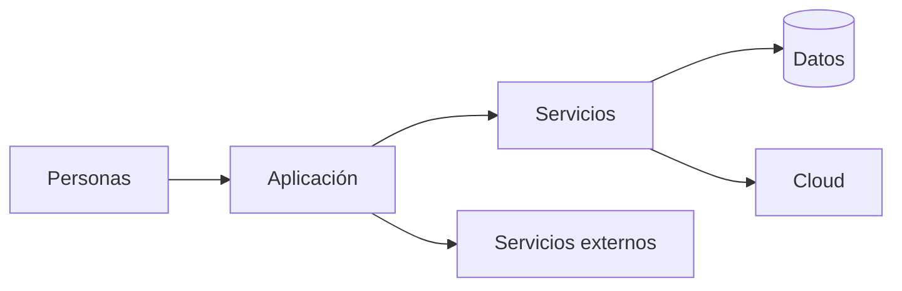
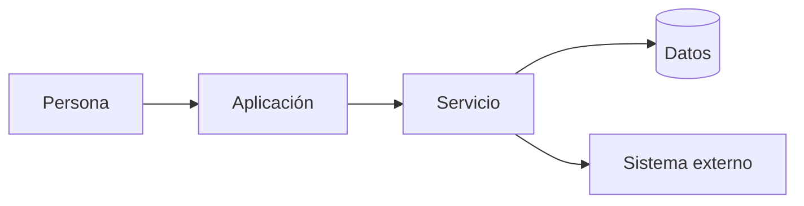
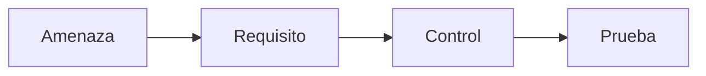

# Software seguro desde el diseño
## Construyendo sistemas antes de defenderlos

> La seguridad empieza antes del código.

<!-- Notas: abrir con la tesis y anticipar que vamos a razonar sobre sistemas, no aprender una herramienta. -->

---

# ¿Dónde nace una vulnerabilidad?

¿En el código? ¿En una decisión de diseño? ¿En una configuración? ¿En una necesidad mal entendida?

**Pregunta:** ¿en qué momento todavía es barato cambiar el rumbo?

---

# Cada sistema tiene algo que proteger

- Personas y sus datos
- Dinero y operaciones
- Disponibilidad y confianza

Primero identifiquemos el valor; después, qué lo pone en riesgo.

---

# El software moderno está conectado



Cada conexión es una oportunidad de intercambio y una pregunta de seguridad.

---

# Defender solo el perímetro no alcanza

Una muralla puede proteger una entrada, pero no corrige una puerta abierta dentro.

- Usuarios legítimos también pueden equivocarse
- Un servicio conectado puede ser comprometido
- La seguridad tiene que acompañar a cada componente

---

# Seguridad es una propiedad del sistema

Agregar una herramienta no convierte automáticamente un sistema en seguro.

La seguridad resulta de decisiones coordinadas sobre diseño, implementación, configuración y operación.

---

# ¿Qué queremos proteger?

**Activos:** aquello cuyo valor importa para alguien.

Información · personas · operaciones · dinero · disponibilidad · reputación

---

# ¿Qué podría pasarle?

Una amenaza es una situación o acción capaz de afectar un activo.

Ejemplos: alguien accede sin permiso, se alteran datos, el servicio deja de estar disponible.

---

# ¿Qué consecuencias tendría?

El impacto describe qué consecuencias tendría un problema.

El riesgo nos ayuda a priorizar: combina la posibilidad de que ocurra con el impacto que tendría.

---

# Vulnerabilidad, amenaza y riesgo no son lo mismo

| Concepto | Pregunta | Ejemplo |
|---|---|---|
| Vulnerabilidad | ¿Qué debilidad existe? | Contraseña fácil de adivinar |
| Amenaza | ¿Qué podría ocurrir? | Alguien intenta adivinarla |
| Riesgo | ¿Qué tan preocupante es? | Acceso a datos sensibles |

---

# No podemos proteger lo que no entendemos

Antes de elegir controles, necesitamos saber qué partes tiene el sistema y cómo se relacionan.

**Primero el mapa; después, las defensas.**

---

# Dibujemos el sistema



Un mapa simple alcanza para empezar a hacer mejores preguntas.

---

# La información se mueve

¿De dónde viene esta información? ¿A dónde va? ¿Quién puede verla o cambiarla?

```text
Persona → Aplicación → Servicio → Datos → Sistema externo
```

---

# ¿En quién confiamos?

No todo componente, usuario o dato merece el mismo nivel de confianza.

Preguntemos qué sabemos del origen y qué validaciones hacen falta antes de actuar.

---

# Fronteras de confianza

Una frontera de confianza marca el paso entre contextos con distintos niveles de confianza.

**Trust Boundary** es el nombre técnico. Al cruzarla, validamos identidad, permisos y datos.

---

# Superficie de ataque

Son los lugares donde alguien puede interactuar con el sistema o influir en él.

Entradas · cuentas · APIs · archivos · interfaces · servicios externos

Reducir entradas innecesarias reduce oportunidades de abuso.

---

# Principios de diseño seguro

No hace falta memorizar una lista extensa. Empecemos con preguntas útiles:

- ¿Quién necesita este acceso?
- ¿Qué pasa si una defensa falla?
- ¿Cómo limitamos el daño?

---

# Confiar lo mínimo necesario

Cada persona y componente debería tener solo los permisos que necesita, durante el tiempo que los necesita.

Menos confianza implícita; menos oportunidades para que un error se convierta en incidente.

---

# No depender de una única defensa

La defensa en profundidad combina controles complementarios.

Si una barrera falla, otras todavía pueden prevenir, detectar o limitar el impacto.

---

# Diseñar también para cuando algo falle

Un fallo no debería abrir el sistema ni exponer más información.

- Fallar de forma segura
- Recuperarse de manera controlada
- Hacer visible lo que requiere atención

---

# Limitar el impacto de un compromiso

Separar permisos y componentes ayuda a contener un problema.

**Limitar el impacto (blast radius):** que una cuenta o servicio comprometido no dé acceso a todo.

---

# ¿Cómo podría abusarse de nuestro sistema?

Cambiemos la pregunta de “¿funciona?” por “¿cómo podría usarse de una manera que no queremos?”.

---

# Threat Modeling

Pensar sistemáticamente qué podría salir mal antes de construir.

Es una conversación estructurada sobre activos, flujos, confianza, amenazas y posibles respuestas; no requiere una herramienta especial.

---

# Una forma de ordenar las amenazas: STRIDE

Una ayuda para explorar seis tipos de abuso: suplantación, manipulación, repudio, exposición de información, denegación de servicio y elevación de privilegios.

No hace falta memorizar categorías: usemos la lista como disparador de preguntas.

---

# Encontrar una amenaza no alcanza

Una observación solo ayuda si produce una decisión: cambiar el diseño, agregar un control o aceptar conscientemente el riesgo.

---

# Del uso esperado al abuso

**Uso esperado:** una persona consulta su saldo.

**Evil User Story:** como atacante, quiero consultar el saldo de otra persona para acceder a información ajena.

La perspectiva de abuso revela requisitos que el camino feliz no muestra.

---

# Del abuso a un requisito de seguridad

**Amenaza:** consultar información ajena.

**Requisito:** cada consulta debe verificar que la persona autenticada puede acceder a esa cuenta.

Después elegimos un control concreto y una forma de comprobarlo.

---

# Amenaza → Requisito → Control → Prueba



Una cadena trazable: sabemos qué problema atendemos y cómo verificar que la respuesta funciona.

---

# Secure Software Development Lifecycle

**SSDLC:** integrar decisiones y verificaciones de seguridad en el ciclo de vida del software.

No es una etapa separada ni una revisión que ocurre solamente al final.

---

# Seguridad durante todo el ciclo de vida

```text
Pensar → Diseñar → Construir → Probar → Desplegar → Operar
```

En el trabajo profesional también veremos estos nombres: Requirements → Design → Code → Build → Test → Deploy → Operate.

---

# Diseñamos seguridad. Ahora hay que conservarla.

¿Qué pasa cuando cambian el código, las dependencias, la configuración y la infraestructura?

**En la próxima clase:** cómo verificar seguridad mientras el software evoluciona.
