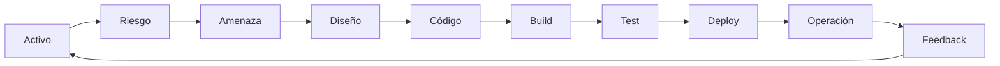

# Shift Left or Get Hacked
## De las decisiones de seguridad a la práctica cotidiana

---

# En la clase anterior…

```text
Activos → Riesgos → Amenazas → Requisitos → Diseño
```

Entendimos qué proteger y cómo anticipar problemas antes de construir.

---

# Pero el software no queda quieto

Después del diseño cambian el código, la configuración, las librerías y la infraestructura.

Cada cambio puede modificar lo que el sistema permite hacer.

---

# Cada cambio puede introducir un problema

Un cambio pequeño puede sumar una vulnerabilidad, una dependencia vulnerable o una configuración insegura.

La seguridad necesita acompañar la evolución del software.

---

# ¿Esperamos hasta producción para comprobarlo?

Cuanto más tarde encontramos un problema, más personas y procesos dependen de él.

¿En qué momento sería más sencillo corregirlo?

---

# Detectar antes

Encontrar problemas cerca del momento en que se introducen permite corregirlos con más contexto y menos retrabajo.

---

# Shift Left

**Shift Left** significa obtener feedback de seguridad lo antes posible dentro del proceso de desarrollo.

No es una fecha exacta: es una manera de distribuir las comprobaciones.

---

# Antes vs. después

```text
Tradicional:  Diseñar → Construir → Probar → Desplegar → Seguridad
Shift Left:   Diseñar → Seguridad → Construir → Seguridad → Probar → Seguridad
```

La idea es incorporar feedback progresivamente, no mover una única actividad.

---

# Shift Left no significa “hacer antes el pentest”

No se trata de adelantar una revisión aislada.

Se trata de incorporar seguridad al trabajo normal: decisiones, código, pruebas y despliegues.

---

# Del código al software en producción

```text
Código → Construcción → Pruebas → Paquete → Despliegue → Producción
```

Este camino convierte cambios de código en software que las personas pueden usar.

---

# Automatizar ese camino: CI/CD

CI/CD es una cadena de pasos automatizados que integra cambios, los comprueba y prepara o realiza su despliegue.

La automatización hace el proceso repetible; también crea lugares para verificar.

---

# El pipeline

```text
CODE → BUILD → TEST → DEPLOY → RUN
```

Un **pipeline** es el camino automatizado que recorre un cambio. Volveremos a este mapa en cada etapa.

---

# ¿Dónde podemos verificar seguridad?

En prácticamente todas las etapas: código, construcción, pruebas, despliegue y operación.

La comprobación adecuada depende del riesgo y del momento.

---

# Seguridad desde el código

- Revisar cambios y errores comunes
- Evitar credenciales dentro del código
- Analizar el código automáticamente

La revisión humana y las herramientas se complementan.

---

# Seguridad durante la construcción

En esta etapa se combinan código, librerías, herramientas y configuración para producir un paquete.

Revisar dependencias e imágenes ayuda a detectar riesgos antes de desplegar.

---

# Nuestro software contiene software de otros

Las librerías externas permiten construir más rápido, pero también traen mantenimiento y riesgo.

Necesitamos saber qué componentes usamos y mantenerlos actualizados.

---

# Saber qué componentes tenemos

Un inventario de componentes facilita responder qué versión usamos y dónde aparece.

**SBOM** (Software Bill of Materials) es una forma estandarizada de representar ese inventario.

---

# Seguridad durante las pruebas

Las pruebas pueden comprobar tanto el comportamiento esperado como propiedades de seguridad.

Buscamos fallos antes de que el cambio llegue a producción.

---

# Distintas formas de encontrar problemas

| Qué revisamos | Enfoque |
|---|---|
| El código sin ejecutarlo | SAST |
| El sistema mientras funciona | DAST |
| Las dependencias | SCA |

Fuzzing es otro ejemplo: probar muchas entradas inesperadas.

---

# Seguridad antes de desplegar

Antes de publicar, revisar configuración y condiciones relevantes para el riesgo.

Un control previo puede evitar que una configuración insegura llegue a producción.

---

# Y después del despliegue…

Shift Left no significa olvidar producción.

Monitorear, detectar y responder sigue siendo necesario: no todos los problemas se anticipan.

---

# Automation First

Cuando una comprobación se repite, automatizarla puede hacerla consistente y rápida.

Automatizar no elimina el criterio humano: libera atención para las decisiones difíciles.

---

# Security Gates

Un **security gate** es una condición automatizada para decidir si un cambio puede continuar.

> Si encontramos un problema definido como inaceptable, el cambio no continúa hasta resolverlo o revisarlo.

---

# No todos los problemas son iguales

Una alerta no equivale automáticamente a un bloqueo.

Consideremos impacto, posibilidad, contexto y controles existentes para priorizar la respuesta.

---

# Detectar → Evaluar → Decidir

```text
Hallazgo (Finding) → Riesgo (Risk) → Regla (Policy) → Decisión (Decision)
```

La política traduce criterios de riesgo en una acción consistente.

---

# Contraseñas y claves también forman parte del software

Una clave en el repositorio puede quedar expuesta en el historial y propagarse a copias.

Los secretos incluyen contraseñas, tokens, claves de API y certificados privados.

---

# Gestionar secretos de forma segura

- No incluirlos en el código ni en el repositorio
- Guardarlos en un mecanismo diseñado para secretos
- Limitar quién puede acceder y rotarlos si se exponen

---

# Las herramientas no alcanzan

Una herramienta puede señalar un problema, pero alguien debe entenderlo, priorizarlo y corregirlo.

La seguridad también depende de cómo colaboran los equipos.

---

# DevSecOps

**Desarrollo + Seguridad + Operaciones** trabajando juntos durante el ciclo de vida.

El término nombra una forma de colaboración, no un producto que se instala.

---

# Seguridad como responsabilidad compartida

Cada rol aporta una perspectiva distinta. Compartir contexto y hacer fácil pedir ayuda mejora las decisiones.

La seguridad no es una tarea que se delega por completo a un equipo especialista.

---

# Security Champions

Una persona referente dentro de un equipo puede conectar al equipo con especialistas y ayudar a difundir prácticas.

No reemplaza al equipo de seguridad ni necesita saberlo todo.

---

# Una seguridad que molesta termina siendo evitada

Demasiadas alertas irrelevantes generan fatiga; pasos confusos incentivan atajos.

Diseñemos controles comprensibles, oportunos y accionables.

---

# Automatizar sin frenar

```text
Velocidad + Calidad + Seguridad
```

El objetivo es integrar verificaciones útiles en el flujo cotidiano, no agregar fricción sin beneficio.

---

# Compliance como consecuencia

Marcos como PCI DSS e ISO 27001 establecen requisitos y evidencias.

Un proceso de desarrollo bien diseñado facilita demostrar controles; el detalle normativo queda como material complementario.

---

# Empezar pequeño y mejorar

```text
Evaluar → Probar → Medir → Mejorar → Escalar
```

Elegir un riesgo importante, probar una mejora y aprender antes de expandirla.

---

# De Secure by Design a Shift Left

```text
DISEÑAR BIEN → CONSTRUIR BIEN → VERIFICAR CONTINUAMENTE → OPERAR Y APRENDER
```

La seguridad diseñada en la clase anterior se conserva con prácticas continuas.

---

# El ciclo completo



Cada etapa informa a la siguiente; la operación devuelve aprendizaje al diseño.

---

# Shift Left or Get Hacked

Diseñar con intención. Construir con cuidado. Verificar continuamente. Aprender en operación.

**La seguridad acompaña al software durante toda su vida.**
