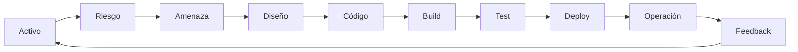

# Shift Left or Get Hacked
## De las decisiones de seguridad a la práctica cotidiana

---

# Shift Left or Get Hacked
## Seguridad desde el primer commit

Carlos Alberto Maceira García Coni · Consultor Senior, Cutter Consortium México  
25 de junio de 2025

<!--
PowerPoint original · diapositiva 1

Shift Left or get hacked
Seguridad desde el primer commit
Por Carlos Alberto Maceira García Coni, Consultor Senior de Cutter Consortium México
25 de junio, 2025
-->

---

# ¿Qué buscamos lograr?

- Detectar vulnerabilidades desde el desarrollo y reducir el riesgo de ciberataques.
- Evitar remediaciones costosas después del despliegue.
- Integrar escaneos en CI/CD sin frenar la entrega.
- Facilitar cumplimiento de PCI DSS e ISO 27001 con evidencia del pipeline.
- Unir desarrollo, QA, seguridad y operaciones para proteger canales digitales críticos.
- Reducir superficie de ataque y vectores explotables en producción.

<!--
PowerPoint original · diapositiva 2

Durante la conferencia se abordará cómo contribuir para el logro de los siguientes aspectos:
Reducir el riesgo de ciberataques detectando vulnerabilidades desde la etapa de desarrollo.
Evitar costos elevados de remediación al detectar errores de seguridad antes del despliegue.
Integrar escaneos de seguridad automatizados en CI/CD sin frenar la entrega de software.
Cumplir normativas de ciberseguridad financiera (PCI-DSS, ISO 27001) desde el pipeline.
Fortalecer la colaboración entre desarrolladores, QA y equipos de seguridad (DevSecOps).
Proteger canales digitales críticos (home banking, onboarding, pagos, etc.) desde el código.
Reducir la superficie de ataque y minimizar vectores explotables en producción.
-->

---

# Sobre el expositor

<div class="grid grid-cols-[1fr_3fr] gap-8 items-center">

<div>

**Carlos Alberto Maceira García Coni**  
Ingeniero en Informática (FIE–UNDEF), docente y consultor senior.

Experiencia en backend, microservicios, DevOps, Azure, networking, infraestructura cloud y gestión de TI; trabajo con PCI DSS, Linux, Python y liderazgo de equipos técnicos.

</div>
</div>

<!--
PowerPoint original · diapositiva 3

Acerca de Carlos Alberto Maceira García Coni, Consultor Senior de Cutter Consortium México
Ingeniero en Informática egresado de la Facultad de Ingeniería del Ejército de la Universidad de la Defensa Nacional Argentina (FIE - UNDEF), con una robusta trayectoria profesional combinando experiencia en desarrollo backend, DevOps,infraestructura cloud y gestión de TI, con una sólida vocación y experiencia como docente en destacadas universidades argentinas. Cuenta con experiencia específica en el diseño, implementación y mantenimiento de microservicios, gestión de infraestructura cloud (Azure) y networking, asegurando el cumplimiento de estándares como PCI-DSS y aplicando metodologías DevOps. Posee habilidades en Linux y Python, además de experiencia en liderazgo de equipos técnicos.
-->

---

# Temario

1. Panorama de amenazas
2. Principios y beneficios de Shift Left
3. Seguridad en el pipeline de CI/CD
4. Cumplimiento normativo
5. Cultura DevSecOps
6. Hoja de ruta y conclusiones

<!--
PowerPoint original · diapositiva 4

Temario
Panorama de amenazas
Principios Claves de Shift Left Security
Beneficios Estratégicos de Shift Left
Integración de la Seguridad en el Pipeline de CI/CD
Cumplimiento Normativo
Cultura DevSecOps
Hoja de Ruta hacia Shift Left
Conclusion
-->

---

# En la clase anterior…

```text
Activos → Riesgos → Amenazas → Requisitos → Diseño
```

Entendimos qué proteger y cómo anticipar problemas antes de construir.

---

# Pero el software no queda quieto

Después del diseño cambian el código, la configuración, las librerías y la infraestructura.

Cada cambio puede modificar lo que el sistema permite hacer.

---

# Cada cambio puede introducir un problema

Un cambio pequeño puede sumar una vulnerabilidad, una dependencia vulnerable o una configuración insegura.

La seguridad necesita acompañar la evolución del software.

---

# ¿Esperamos hasta producción para comprobarlo?

Cuanto más tarde encontramos un problema, más personas y procesos dependen de él.

¿En qué momento sería más sencillo corregirlo?

---

# Detectar antes

Encontrar problemas cerca del momento en que se introducen permite corregirlos con más contexto y menos retrabajo.

---

# Shift Left

**Shift Left** significa obtener feedback de seguridad lo antes posible dentro del proceso de desarrollo.

No es una fecha exacta: es una manera de distribuir las comprobaciones.

---

# Shift Left: una estrategia proactiva

Trasladar al comienzo del ciclo actividades que antes se hacían al final: **prevenir y detectar temprano**.

- Integrar pruebas y seguridad en cada fase del SDLC.
- Cambiar mentalidad, procesos y herramientas.
- Compartir responsabilidad entre Dev, Sec y Ops.

El concepto nació en testing y se extendió a seguridad con DevSecOps.

<!--
PowerPoint original · diapositiva 9

Shift Left: una estrategia proactiva
El principio de Shift Left es tomar tareas que tradicionalmente se hacían en las etapas más tardías del SDLC y traerlas a etapas tempranas.
El concepto se enunció en 2001 aplicado a  testing (TDD and BDD) y luego se extendió a seguridad (DevSecOps).
Requiere:
Cambio en la mentalidad y cultura organizacional.
Modificación de procesos de desarrollo y herramientas.
Objetivo: integrar testing y seguridad de manera intrínseca en cada fase del SDLC
Responsabilidad Compartida entre equipos Dev, Ops y Sec.
PREVENCION
DETECCION
>
-->

---

# Antes vs. después

```text
Tradicional:  Diseñar → Construir → Probar → Desplegar → Seguridad
Shift Left:   Diseñar → Seguridad → Construir → Seguridad → Probar → Seguridad
```

La idea es incorporar feedback progresivamente, no mover una única actividad.

---

# Tradicional vs. Shift Left

<div class="grid grid-cols-2 gap-6 text-center">
<div>

**Tradicional**


</div>
<div>

**Shift Left**


</div>
</div>

<!--
PowerPoint original · diapositiva 10

Tradicional vs Shift Left
-->

---

# Shift Left no significa “hacer antes el pentest”

No se trata de adelantar una revisión aislada.

Se trata de incorporar seguridad al trabajo normal: decisiones, código, pruebas y despliegues.

---
layout: section
---

# Principios clave de Shift Left Security

<!--
PowerPoint original · diapositiva 11

Principios claves de Shift Left security
-->

---
layout: section
---

# Beneficios estratégicos

<!--
PowerPoint original · diapositiva 17

Beneficios estrategicos de Shift Left
-->

---

# Menor riesgo de ciberataques

<div class="grid grid-cols-[3fr_2fr] gap-6 items-center">
<div>

- Detección y remediación antes de producción.
- Menos debilidades desplegadas y menor superficie de ataque.
- Cobertura continua durante el SDLC.
- Postura de seguridad más resiliente.

</div>

</div>

<!--
PowerPoint original · diapositiva 18

Detección temprana: Vulnerabilidades identificadas y remediadas mucho antes de produccion.
Menor superficie de ataque: Menos debilidades explotables desplegadas.
Cobertura Continua: seguridad a lo largo de todo el SDLC.
Postura de seguridad más fuerte y resiliente
Reducción significativa del Riesgo de Ciberataques
-->

---

# Optimizar costos

La remediación tardía también cuesta tiempo de desarrollo, nuevas pruebas, retrasos, operaciones, atención al cliente y reputación.

**Detectar temprano libera tiempo, presupuesto y talento** para innovación y crecimiento.


<!--
PowerPoint original · diapositiva 19

Costos ocultos de la remediación tardía:
Tiempo de desarrolladores.
Esfuerzo de re-pruebas exhaustivas.
Posibles retrasos en lanzamientos.
Impactos en otros desarrollos.
Costos operativos
Atención al cliente.
Daño reputacional y pérdida de confianza del cliente.
Shift left permite liberar recursos (tiempo, presupuesto, talento) para innovación y crecimiento del negocio.
Optimización de Costos
-->

---

# Entregar software seguro más rápido

<div class="grid grid-cols-[3fr_2fr] gap-6 items-center">
<div>

La seguridad integrada y los **security gates** automatizados reducen sorpresas y retrasos.

El objetivo: releases más predecibles y rápidos, con confianza en que se evaluó la seguridad.

</div>

</div>

<!--
PowerPoint original · diapositiva 20

Incrementa la velocidad de forma controlada y escalable.
Reduce la probabilidad de que ocurran retrasos.
Seguridad integrada y continua.
Automatización de security gates en CI/CD sin ser cuello de botella.
Releases más predecibles, rápidos y con confianza de que la seguridad fue considerada.
Aceleración en la entrega segura de Software
-->

---

# Del código al software en producción

```text
Código → Construcción → Pruebas → Paquete → Despliegue → Producción
```

Este camino convierte cambios de código en software que las personas pueden usar.

---

# Automatizar ese camino: CI/CD

CI/CD es una cadena de pasos automatizados que integra cambios, los comprueba y prepara o realiza su despliegue.

La automatización hace el proceso repetible; también crea lugares para verificar.

---

# El pipeline

```text
CODE → BUILD → TEST → DEPLOY → RUN
```

Un **pipeline** es el camino automatizado que recorre un cambio. Volveremos a este mapa en cada etapa.

---
layout: section
---

# Seguridad en CI/CD
## El núcleo operativo

<!--
PowerPoint original · diapositiva 21

Integración de la Seguridad en el Pipeline CI/CD: el Nucleo Operativo
-->

---

# El pipeline también puede ser atacado

CI/CD automatiza la integración, construcción, pruebas y despliegue frecuente de software.

**Activos críticos:** repositorios, servidores de automatización, scripts, credenciales y artefactos.

Un pipeline comprometido puede inyectar código, robar credenciales o manipular artefactos.

<!--
PowerPoint original · diapositiva 22

CI/CD (Integracion/Despliegue Continuo): Practicas automatizadas para construir, probar y desplegar software de forma frecuente, rapida y confiable.
Columna Vertebral de DevOps y Entrega Ágil.
Riesgos de Seguridad en CI/CD: Si no se aseguran pueden ser un vector de ataque significativo.
Componentes criticos: Repositorios de codigo, servidores de automatización, artefactos, scripts del pipeline.
Un pipeline comprometido puede permitir la inyección de código malicioso, robo de credenciales, manipulación de artefactos.
Principios de Seguridad en Pipelines CI/CD
-->

---

# ¿Dónde podemos verificar seguridad?

En prácticamente todas las etapas: código, construcción, pruebas, despliegue y operación.

La comprobación adecuada depende del riesgo y del momento.

---

# Mapa de controles

| Etapa | Ejemplos |
|---|---|
| Code | Secret scanning, code review |
| Build | Análisis de cadena de suministro, escaneo de imágenes |
| Test | SAST, DAST |
| Deploy | Configuración segura, blue-green |
| Production | WAF, monitoreo |

**Shift Left** no elimina la seguridad en producción.

<!--
PowerPoint original · diapositiva 24

Principios de Seguridad en Pipelines CI/CD
Code
🔑 Secret scanning
👁️ Code review
Build
⛓️ Supply Chain Analysis
🐋 Container Image Scan
Test
🔬 SAST
⚡ DAST
Production
🧱 WAF
📈 Monitoreo
Deploy
✅ Configuración Segura
🟢🔵 Green Blue
SECURITY GATES
🛡️
SHIFT LEFT
-->

---

# Seguridad desde el código

- Revisar cambios y errores comunes
- Evitar credenciales dentro del código
- Analizar el código automáticamente

La revisión humana y las herramientas se complementan.

---

# Habilitar a quienes desarrollan

<div class="grid grid-cols-[3fr_1fr] gap-6 items-center">
<div>

La seguridad es responsabilidad compartida y las personas que desarrollan son cruciales.

**Necesitan:** formación continua, herramientas integradas y fáciles de usar, revisiones entre pares y documentación clara.

</div>

</div>

<div class="flex justify-center items-center gap-6 mt-4">


</div>

<!--
PowerPoint original · diapositiva 13

La seguridad es una responsabilidad compartida y los desarrolladores son cruciales.
Se capacidad a los desarrolladores para escribir código seguro y usar herramientas de seguridad.
Implica formacion continua, herramientas fáciles de usar e integradas, reviews entre pares y documentación clara.
Responsabilidad del desarrollador
Engineer enablement
-->

---

# Controles en código fuente

- Estándares de codificación segura (por ejemplo, OWASP).
- Mínimo privilegio en repositorios y protección de ramas.
- Revisión y aprobación de PR/MR, también por referentes de seguridad.
- Escaneo de secretos en hooks y CI/CD para detectar credenciales incrustadas.
- Linters de seguridad para patrones inseguros.

<!--
PowerPoint original · diapositiva 25

Prácticas de Codificación Segura: Fomentar estandares (ej: OWASP Secure Coding Practices)
Control de Acceso a Repositorios: Minimo privilegio.
Protección de Ramas: revisiones de código y aprobación de MR/PR para ramas criticas.
Revisiones de Código Obligatorias (Code Reviews): por otro desarrollador o security champion
Escaneo de Secretos (Pre-commit/Pre-push hooks): detectar automáticamente credenciales hardcodeadas (API Keys/ contrasenas).
Linters de Seguridad Básicos: identificar patrones de código inseguros.
Controles por Etapa: Código Fuente (Source/Commit)
-->

---

# Seguridad durante la construcción

En esta etapa se combinan código, librerías, herramientas y configuración para producir un paquete.

Revisar dependencias e imágenes ayuda a detectar riesgos antes de desplegar.

---

# Controles en build

- **SCA:** revisar vulnerabilidades y licencias de dependencias.
- **IaC:** detectar configuraciones inseguras en Terraform, CloudFormation o Ansible.
- **Contenedores:** escanear imágenes base y capas.
- **Entorno de compilación:** proteger servidores, herramientas y scripts; verificar integridad.

<!--
PowerPoint original · diapositiva 26

Analisis de Composicion de Software (SCA): Escanear dependencias (bibliotecas de terceros) para vulnerabilidades conocidas y licencias. Clave contra ataques a la cadena de suministro.
Escaneo de Infraestructura como Código: Si se usa Terraform, CloudFormation, Ansible, escanear plantillas por configuraciones inseguras.
Escaneo de Imágenes de Contenedores: si se usa Docker, escanear imágenes base y capas por vulnerabilidades.
Aseguramiento del Entorno de Compilación: proteger el servidor y herramientas de compilación. Validar integridad de scripts.
Controles por Etapa: Build (Source/Commit)
-->

---

# Nuestro software contiene software de otros

Las librerías externas permiten construir más rápido, pero también traen mantenimiento y riesgo.

Necesitamos saber qué componentes usamos y mantenerlos actualizados.

---

# Saber qué componentes tenemos

Un inventario de componentes facilita responder qué versión usamos y dónde aparece.

**SBOM** (Software Bill of Materials) es una forma estandarizada de representar ese inventario.

---

# Gestión segura de dependencias

<div class="grid grid-cols-[3fr_2fr] gap-6 items-center">
<div>

- Mantener un **SBOM**: inventario estructurado de componentes.
- Actualizar dependencias y establecer políticas de licencias y riesgo.
- Validar la procedencia para reducir ataques como *dependency confusion*.
- Saber qué versiones se usan facilita investigar y responder a incidentes.

</div>

</div>

<!--
PowerPoint original · diapositiva 32

Riesgo: Aplicaciones modernas dependen masivamente de bibliotecas open source y de terceros.
Mejores Prácticas:
Mantener un Inventario de Dependencias (SBOM - Software Bill of Materials):
Lista formal y estructurada de componentes.
Requisito PCI DSS 4.0
Actualización regular de dependencias.
Políticas de uso de dependencias (licencias aceptables, riesgo tolerable).
Validación de la fuente de las dependencias (evitar dependency confusion).
Gestión Segura de Dependencias
-->

---

# Seguridad durante las pruebas

Las pruebas pueden comprobar tanto el comportamiento esperado como propiedades de seguridad.

Buscamos fallos antes de que el cambio llegue a producción.

---

# Controles en test

- **SAST:** analiza código o bytecode sin ejecutar; por ejemplo, busca inyección o XSS.
- **DAST:** prueba la aplicación en ejecución simulando ataques.
- **APIs:** verificar autenticación, autorización, validación y errores.
- **Fuzzing:** enviar entradas inesperadas o malformadas.
- **IAST:** instrumentar la aplicación para analizarla durante la ejecución.

Registrar resultados para seguimiento y auditoría.

<!--
PowerPoint original · diapositiva 27

Analisis Estatico (SAST): Analizar código fuente/bytecode sin ejecutar (Inyeccion SQL, XSS).
Analisis Dinamico (DAST): Probar aplicación en ejecución simulando ataques.
Pruebas de Seguridad de API: Autenticacion, autorizacion, validación de entradas, manejo de errores.
Pruebas de Fuzzing: enviar datos inesperados/malformados para descubrir fallos.
Pruebas Interactivas (IAST): Combinar SAST/DAST, instrumentando la aplicación.
Documentación de Resultados: para auditoría y seguimiento.
Controles por Etapa: Pruebas (Test)
-->

---

# Distintas formas de encontrar problemas

| Qué revisamos | Enfoque |
|---|---|
| El código sin ejecutarlo | SAST |
| El sistema mientras funciona | DAST |
| Las dependencias | SCA |

Fuzzing es otro ejemplo: probar muchas entradas inesperadas.

---

# Herramientas: elegir por propósito

| Categoría | Propósito | Ejemplos del material original |
|---|---|---|
| SAST | Código sin ejecutar | Semgrep, Checkmarx, SonarQube |
| DAST | Aplicación en ejecución | OWASP ZAP, Burp Suite, Invicti |
| SCA | Componentes y licencias | Dependency-Check, Snyk, JFrog Xray |
| Contenedores | Imágenes y runtime | Trivy, Grype, Aqua |

Otras categorías: IAST, secretos, IaC, RASP y WAF. La elección depende del riesgo y del flujo de trabajo.

<!--
PowerPoint original · diapositiva 30

SAST (Análisis Estático de Seguridad de Aplicaciones):
Propósito: Detecta vulnerabilidades en código fuente/binarios sin ejecutar.
Ejemplos: Checkmarx, Veracode, Fortify, SonarQube, Semgrep.
DAST (Análisis Dinámico de Seguridad de Aplicaciones):
Propósito: Prueba apps en ejecución simulando ataques.
Ejemplos: Invicti, Rapid7 AppSpider, Burp Suite Pro, OWASP ZAP.
SCA (Análisis de Composición de Software):
Propósito: Identifica componentes open source, vulnerabilidades y riesgos de licencia.
Ejemplos: Snyk, Black Duck, JFrog Xray, OWASP Dependency-Check, Aikido Security.
Seguridad de Contenedores e Imágenes:
Propósito: Escanea imágenes, asegura entorno de ejecución.
Ejemplos: Aqua Security , Sysdig , Trivy, Grype.
Otras Categorías Importantes: IAST, Gestión de Secretos, Escaneo de IaC, RASP, WAF.
Herramientas esenciales para la Automatización
-->

---

# Seguridad antes de desplegar

Antes de publicar, revisar configuración y condiciones relevantes para el riesgo.

Un control previo puede evitar que una configuración insegura llegue a producción.

---

# Controles en deploy

- Validar configuración y hardening de la aplicación y del entorno.
- Desplegar con estrategias blue-green o canary y rollback rápido.
- Restringir permisos de despliegue y administración.
- Hacer comprobaciones finales en staging y monitorear anomalías inmediatamente después de publicar.

<!--
PowerPoint original · diapositiva 28

Validación de Configuración de Seguridad: Verificar configuraciones de entorno y app (hardening).
Practicas de Despliegue Seguro: Blue-Green, Canary Releases, Rollback rápido.
Controles de Acceso Granulares al Entorno: Permisos estrictos para desplegar y gestionar.
Pentesting Automatizado (Limitado): En staging, pruebas más ligeras para validación final.
Monitoreo Post-Despliegue Inmediato: buscar anomalías de seguridad o rendimiento.
Controles por Etapa: Despliegue (Deploy)
-->

---

# Y después del despliegue…

Shift Left no significa olvidar producción.

Monitorear, detectar y responder sigue siendo necesario: no todos los problemas se anticipan.

---

# Controles en producción

- **Monitoreo continuo:** registros, SIEM y detección de anomalías.
- **WAF:** filtrar tráfico malicioso contra aplicaciones web.
- **RASP:** detectar y bloquear ataques dentro de la aplicación en ejecución.
- Mantener la capacidad de responder a incidentes y gestionar vulnerabilidades.

<!--
PowerPoint original · diapositiva 29

Monitoreo continuo de seguridad: Herramientas y procesos (SIEM, deteccion de anomalias).
Firewalls de Aplicaciones Web (WAFs): Filtrar trafico malicioso, proteger contra ataques web comunes.
Autoprotección de Aplicaciones en TIempo de Ejecución (RASP): Detectar y bloquear ataques en tiempo real dentro de la aplicación.
Controles por Etapa: Produccion y Operaciones
-->

---

# Automation First

Cuando una comprobación se repite, automatizarla puede hacerla consistente y rápida.

Automatizar no elimina el criterio humano: libera atención para las decisiones difíciles.

---

# Automation First

```text
Commit → Build → Test → Deploy
```

Verificaciones automatizadas en CI/CD ofrecen **feedback continuo**, mantienen la agilidad, reducen errores manuales y liberan al equipo de seguridad de tareas repetitivas.

<!--
PowerPoint original · diapositiva 14

Verificaciones y pruebas de seguridad automatizadas para mantener la agilidad y velocidad.
Integradas en pipelines CI/CD otros flujos de trabajo.
Bucles de retroalimentación continua para corrección inmediata.
Reduce la probabilidad de error humano.
Libera al personal de seguridad de tareas repetitivas.
Automatización Primero (Automation First)
Commit
Build
Test
Deploy
-->

---

# Security Gates

Un **security gate** es una condición automatizada para decidir si un cambio puede continuar.

> Si encontramos un problema definido como inaceptable, el cambio no continúa hasta resolverlo o revisarlo.

---

# Security gates en cada etapa

Un **security gate** es un punto de control automatizado: según una política, un hallazgo detiene el pipeline o genera una alerta.

Los riesgos del pipeline incluyen permisos inadecuados, abuso de dependencias, ejecución contaminada, higiene deficiente de credenciales, falta de validación de artefactos y escasa visibilidad.

[OWASP Top 10 CI/CD Security Risks](https://owasp.org/www-project-top-10-ci-cd-security-risks/)

<!--
PowerPoint original · diapositiva 23

Imperativo: Integrar seguridad en cada etapa del pipeline CI/CD
Incorporar puertas de seguridad (security gates) automatizadas.
Puntos de control donde se realizan verificaciones de seguridad específicas.
Si una verificación falla, el pipeline puede detenerse o generar alertas.
Principios de Seguridad en Pipelines CI/CD
https://owasp.org/www-project-top-10-ci-cd-security-risks/
ID del Riesgo
Descripción del Riesgo
CICD-SEC-1
Insufficient Flow Control Mechanisms
CICD-SEC-2
Inadequate Identity and Access Management
CICD-SEC-3
Dependency Chain Abuse
CICD-SEC-4
Poisoned Pipeline Execution (PPE)
CICD-SEC-5
Insufficient PBAC (Pipeline-Based Access Controls)
CICD-SEC-6
Insufficient Credential Hygiene
CICD-SEC-7
Insecure System Configuration
CICD-SEC-8
Ungoverned Usage of 3rd Party Services
CICD-SEC-9
Improper Artifact Integrity Validation
CICD-SEC-10
Insufficient Logging and Visibility
-->

---

# No todos los problemas son iguales

Una alerta no equivale automáticamente a un bloqueo.

Consideremos impacto, posibilidad, contexto y controles existentes para priorizar la respuesta.

---

# Detectar → Evaluar → Decidir

```text
Hallazgo (Finding) → Riesgo (Risk) → Regla (Policy) → Decisión (Decision)
```

La política traduce criterios de riesgo en una acción consistente.

---

# Contraseñas y claves también forman parte del software

Una clave en el repositorio puede quedar expuesta en el historial y propagarse a copias.

Los secretos incluyen contraseñas, tokens, claves de API y certificados privados.

---

# Gestionar secretos de forma segura

- No incluirlos en el código ni en el repositorio
- Guardarlos en un mecanismo diseñado para secretos
- Limitar quién puede acceder y rotarlos si se exponen

---

# Gestión segura de secretos

| Hacer | Evitar |
|---|---|
| Usar bóvedas (Vault, Azure Key Vault, AWS Secrets Manager) | Incrustar secretos en código, scripts o IaC |
| Recuperar secretos en runtime con identidades de máquina | Compartirlos por correo o chat, o guardarlos en texto plano |
| Aplicar mínimo privilegio y separar entornos | Reutilizar una clave privilegiada en varios servicios |
| Rotar, auditar y alertar sobre accesos | Secretos permanentes, credenciales en logs o archivos `.env` versionados |
| Escanear cada commit y el pipeline | Suponer que una clave expuesta sigue siendo segura |

<!--
PowerPoint original · diapositiva 31

Gestion Segura de Secretos
✅ Qué Hacer (Do's)
❌ Qué No Hacer (Don'ts)
Utilizar bóvedas de secretos centralizadas y seguras (Vault, Azure Key Vault, AWS Secrets Manager).
"Hardcodear" secretos en código fuente, archivos de configuración, scripts o plantillas de infraestructura como código.
Recuperar secretos dinámicamente en tiempo de ejecución (runtime) a través de llamadas seguras a la API de la bóveda.
Almacenar secretos en texto plano, hojas de cálculo, wikis internas, o bases de datos no cifradas.
Aplicar el Principio de Mínimo Privilegio; cada app o usuario solo debe acceder a los secretos estrictamente necesarios.
Usar un único secreto con privilegios elevados para múltiples aplicaciones, servicios o entornos (desarrollo, producción, etc.).
Rotar los secretos regularmente y de forma automática. Implementar políticas de expiración para cada tipo de secreto.
Utilizar secretos estáticos de larga duración que nunca caducan. "Si no está roto, no lo toques" es una mala política aquí.
Auditar y registrar todo acceso a los secretos. Configurar alertas para actividades sospechosas o anómalas.
Ignorar los registros de acceso o no tener visibilidad sobre quién o qué está utilizando los secretos y cuándo.
Escanear el código en busca de secretos de forma automática en cada commit (pre-commit hooks) y en el pipeline de CI/CD.
Enviar o compartir secretos a través de canales inseguros como email, Slack, Microsoft Teams, o cualquier app de mensajería.
Separar y aislar los secretos por entorno (desarrollo, staging, producción) para evitar brechas entre ambientes.
Commitear archivos de entorno (.env) o cualquier archivo que contenga credenciales en repositorios de control de versiones como Git.
Usar identidades de máquina (IAM roles, Managed Identities) para que las aplicaciones se autentiquen en la bóveda sin necesidad de otra clave.
Imprimir secretos en los logs de la aplicación. Los logs son a menudo recolectados y almacenados en sistemas donde pueden ser expuestos.
-->

---

# Las herramientas no alcanzan

Una herramienta puede señalar un problema, pero alguien debe entenderlo, priorizarlo y corregirlo.

La seguridad también depende de cómo colaboran los equipos.

---

# DevSecOps

**Desarrollo + Seguridad + Operaciones** trabajando juntos durante el ciclo de vida.

El término nombra una forma de colaboración, no un producto que se instala.

---

# Colaboración DevSecOps

<div class="grid grid-cols-[3fr_2fr] gap-6 items-center">
<div>

Romper silos entre Desarrollo, Seguridad y Operaciones.

Compartir objetivos, contexto y decisiones; mantener comunicación abierta y colaboración estrecha.

</div>
<div class="flex items-center gap-3">


</div>
</div>

<!--
PowerPoint original · diapositiva 15

Romper silos entre Desarrollo (Dev), Seguridad (Sec) y Operaciones (Ops).
Cultura de colaboración estrecha, comunicación abierta y objetivos compartidos.
A menudo materializado en el modelo DevSecOps.
Colaboración
-->

---
layout: section
---

# Cultura DevSecOps

<!--
PowerPoint original · diapositiva 39

Cultura DevSecOps
-->

---

# Seguridad como responsabilidad compartida

Cada rol aporta una perspectiva distinta. Compartir contexto y hacer fácil pedir ayuda mejora las decisiones.

La seguridad no es una tarea que se delega por completo a un equipo especialista.

---

# Pilares: procesos y personas

- Adaptar flujos de trabajo para que seguridad y operación participen sin crear barreras tardías.
- Sustituir controles aislados por responsabilidad mutua y continua.
- Dar feedback rápido para corregir temprano.
- Compartir objetivos entre Dev, Sec y Ops.

<!--
PowerPoint original · diapositiva 40

Pilares DevSecOps
Adaptar procesos para soportar la cultura colaborativa.
Rediseñar flujos de trabajo para integrar prácticas de seguridad y operativas fluidamente.
Eliminar "puntos de control" de seguridad tradicionales (barreras).
Reemplazar por responsabilidad mutua y continua.
Procesos deben facilitar retroalimentación rápida y corrección temprana.
-->

---

# Pilares: tecnología y gobernanza

**Tecnología:** integrar herramientas (SAST, DAST, SCA, etc.) en el flujo habitual; automatizar tareas repetibles y gestionar deuda de seguridad.

**Gobernanza:** medir efectividad, monitorear progreso, alinear con objetivos de negocio y demostrar cumplimiento. Las métricas deben servir para mejorar, no solo para contar alertas.

<!--
PowerPoint original · diapositiva 41

Pilares DevSecOps
Tecnología:
Crucial para habilitar y automatizar procesos seguros.
Selección e implementación de herramientas de seguridad que se integren fácilmente en flujos de desarrollo y CI/CD (SAST, DAST, SCA, etc.).
Automatización reduce carga manual, mejora consistencia, reduce superficie de ataque, gestiona deuda técnica de seguridad.
Gobernanza:
Cómo se mide rendimiento, monitorea progreso y asegura alineación con objetivos de negocio.
Métricas claras para evaluar efectividad de DevSecOps.
Identificar áreas de mejora continua.
Demostrar valor de la seguridad a la organización.
Asegurar adherencia a políticas y regulaciones.
-->

---

# Romper silos y colaborar

- Comprender roles y objetivos de los demás mediante capacitación cruzada.
- Integrar alertas y seguimiento en herramientas compartidas.
- Dar autonomía a los equipos dentro de un marco de gobernanza.
- Usar métricas compartidas: tiempo medio de remediación y reducción de vulnerabilidades críticas en producción.

**Equilibrar velocidad, estabilidad y seguridad** requiere cambiar los incentivos.

<!--
PowerPoint original · diapositiva 42

Romper silos y colaborar
Establecer Comprensión Funcional Común: Todos deben entender lo básico de los roles, herramientas y objetivos de los demás. Capacitación cruzada, talleres.
Integración de Herramientas y Flujos de Trabajo: Plataformas y herramientas que faciliten colaboración y visibilidad (ej. alertas de seguridad en Jira, ChatOps con Slack/Teams para notificaciones).
Empoderamiento de Equipos: Autonomía para experimentar y adaptar herramientas/procesos (dentro de un marco de gobernanza).
Creación de Objetivos Compartidos y Métricas Alineadas:
Métricas de éxito compartidas por Dev, Sec y Ops.
Ej: En lugar de (Dev = velocidad) y (Sec = #vulns), usar:
"Tiempo medio para remediar vulnerabilidades" (MTTR).
"Reducción de vulnerabilidades críticas en producción".
Clave: Cambiar incentivos y métricas de rendimiento para equilibrar velocidad, estabilidad Y seguridad.
-->

---

# Security Champions

Una persona referente dentro de un equipo puede conectar al equipo con especialistas y ayudar a difundir prácticas.

No reemplaza al equipo de seguridad ni necesita saberlo todo.

---

# Security Champions

Una persona del equipo de desarrollo con interés y formación adicional en seguridad puede ser el primer contacto y puente con especialistas.

Ayuda a adoptar prácticas, interpretar hallazgos, difundir lineamientos y transmitir feedback sobre herramientas y políticas. **No reemplaza al equipo de seguridad.**

<!--
PowerPoint original · diapositiva 43

¿Quién es un Security Champion?
Típicamente un desarrollador o ingeniero dentro de un equipo de desarrollo.
Con interés particular y capacitación adicional en seguridad de aplicaciones.
Actúa como primer punto de contacto para temas de seguridad en su equipo.
Puente vital entre desarrollo y equipo central de seguridad.
Funciones Multifacéticas:
Promover conciencia de seguridad.
Facilitar adopción de herramientas/prácticas de seguridad.
Proporcionar orientación inicial (interpretar escaneos).
Diseminar conocimiento y directrices del equipo central de seguridad.
Retroalimentación al equipo de seguridad (usabilidad de herramientas, viabilidad de políticas).
El rol del Security Champion
-->

---

# Una seguridad que molesta termina siendo evitada

Demasiadas alertas irrelevantes generan fatiga; pasos confusos incentivan atajos.

Diseñemos controles comprensibles, oportunos y accionables.

---

# Automatizar sin frenar

```text
Velocidad + Calidad + Seguridad
```

El objetivo es integrar verificaciones útiles en el flujo cotidiano, no agregar fricción sin beneficio.

---

# Compliance como consecuencia

Marcos como PCI DSS e ISO 27001 establecen requisitos y evidencias.

Un proceso de desarrollo bien diseñado facilita demostrar controles; el detalle normativo queda como material complementario.

---
layout: section
---

# Cumplimiento normativo ágil
## PCI DSS e ISO 27001 desde el diseño

<!--
PowerPoint original · diapositiva 33

Cumplimiento Normativo Ágil: PCI-DSS e ISO 27001 desde el diseño
-->

---

# Cumplimiento como resultado del proceso

En un entorno regulado, integrar controles en diseño, desarrollo y CI/CD facilita demostrar conformidad.

**Mejor que parchear para una auditoría final:** generar evidencia verificable a medida que se construye y opera el software.

<!--
PowerPoint original · diapositiva 34

Entorno altamente regulado: PCI DSS, ISO 27001, etc.
Shift Left facilita el cumplimiento.
Controles de seguridad y cumplimeinto integrados desde el diseño y desarrollo.
No es una auditoría estresante al final para parchear aplicaciones.
Resultado: Cumplimiento como consecuencia natural de un proceso inherentemente seguro. Simplifica la demostración de conformidad.
Fortalecimiento de la postura de cumplimiento normativo
-->

---

# PCI DSS y desarrollo seguro

PCI DSS aplica a organizaciones que almacenan, procesan o transmiten datos de tarjetas de pago.

Su versión 4.0 enfatiza un enfoque basado en riesgos, un ciclo de vida de desarrollo seguro (SSDLC) y pruebas de seguridad continuas: **seguridad en cada fase, no solo al final**.

<!--
PowerPoint original · diapositiva 35

PCI DSS: Requisitos obligatorios para quienes almacenan, Procesan o transmiten datos de tarjetas.
En su versión 4.0 se hace énfasis en enfoque basado en riesgos e integración de seguridad en el SDLC.
Promueve explícitamente un Ciclo de Vida de Desarrollo de Software Seguro (SSDLC)
Seguridad embebida en cada fase, no al final.
Pruebas tempranas y continuas.
Alineacion de Prácticas Shift Left con PCI DSS 4.0
-->

---

# PCI DSS 4.0: ejemplos de alineación

- **Requisito 6:** desarrollar y mantener sistemas y software seguros.
- Capacitación en codificación segura y revisión del software.
- Gestión de vulnerabilidades comunes y pruebas durante el desarrollo.
- Inventario de software y APIs para evaluar riesgos.
- Protección de aplicaciones web públicas.

Las evidencias de revisiones, escaneos y decisiones del pipeline apoyan un cumplimiento proactivo. Verificar siempre el texto vigente de los requisitos aplicables.

<!--
PowerPoint original · diapositiva 36

Requisito 6: Desarrollar y mantener software y sistemas seguros.
6.2.2: Capacitación anual para desarrolladores en codificación segura, Identificación de vulnerabilidades. (Alineado con Developer Enablement).
6.2.3: Revisión de software antes del lanzamiento para corregir vulnerabilidades.
6.2.3: Abordar vulnerabilidades comunes. (OWASP Top 10) en procesos de desarrollo: SAST/DAST en pipelines.
6.3.2: Mantener inventario de software incluyendo APIs. Base para la evaluación de riesgos, pruebas, respuesta a incidentes.
6.4.2: Implementar soluciones técnicas automatizadas para todas las apps web públicas para detectar y prevenir ataques.
CUMPLIMIENTO PROACTIVO Y CON EVIDENCIAS
PCI DSS 4.0: Requisitos Clave y Shift Left
-->

---

# ISO 27001:2022 y DevSecOps

ISO 27001 establece un sistema de gestión de seguridad de la información. La edición 2022 organiza **93 controles** en cuatro temas: organizacionales, personas, físicos y tecnológicos.

Shift Left y DevSecOps ayudan a implementar y demostrar controles, especialmente los tecnológicos.

<!--
PowerPoint original · diapositiva 37

ISO 27001: Estándar para Sistemas de Gestión de Seguridad de la Información.
Version 2022: 93 controles en 4 temas (organizacional, personas, fisico, tecnológico).
Las prácticas Shift Left y DevSecOps se alinean con los controles, especialmente los tecnológicos.
ISO 27001:2022 en DevSecOps
-->

---

# Controles ISO relevantes

- **A.8.9:** gestión de la configuración.
- **A.8.25:** ciclo de vida de desarrollo seguro.
- **A.8.28:** codificación segura.
- **A.8.29:** pruebas de seguridad en desarrollo y aceptación.
- **A.5.15 / A.5.17:** control de acceso e información de autenticación.
- **A.5.23:** seguridad al usar servicios en la nube.

Logs y resultados de CI/CD pueden aportar evidencia para auditorías. Consultar el estándar para alcance y numeración exactos.

<!--
PowerPoint original · diapositiva 38

A.8.9 Gestión de la Configuración: Asegurar configuraciones correctas, sin configuraciones hostiles.
A.8.25 Desarrollo Seguro de Software: Reglas para desarrollo seguro en todo el ciclo de vida.
A.5.8 Información de Autenticación / A.5.15 Control de Acceso: Gestión segura de credenciales, políticas de control de acceso.
A.8.26 Entornos de Desarrollo, Pruebas y Producción Seguros: Separación y protección adecuada.
A.8.28 Pruebas de Seguridad en Desarrollo y Aceptación: Pruebas de seguridad durante todo el SDLC.
A.5.23 Seguridad de la información para el uso de servicios en la nube (Nuevo)
Beneficio: Cumplimiento más efectivo, evidencia extraída de logs de CI/CD, auditorías más eficientes.
ISO 27001:2022: Controles Tecnológicos Relevantes
-->

---

# Empezar pequeño y mejorar

```text
Evaluar → Probar → Medir → Mejorar → Escalar
```

Elegir un riesgo importante, probar una mejora y aprender antes de expandirla.

---
layout: section
---

# Hoja de ruta práctica

<!--
PowerPoint original · diapositiva 44

Hoja de Ruta Práctica
-->

---

# Fase 1 · Evaluar y concientizar

1. Analizar madurez actual de SDLC, DevOps y seguridad de aplicaciones.
2. Identificar brechas de herramientas, procesos y habilidades.
3. Explicar beneficios y cambios culturales a equipos y dirección; buscar apoyo ejecutivo.
4. Elegir un piloto representativo sin criticidad excesiva.

<!--
PowerPoint original · diapositiva 45

Fase 1: Evaluación Inicial y Concienciación.
Análisis de madurez actual (SDLC, DevOps, seguridad de apps).
Identificación de brechas (herramientas, procesos, habilidades).
Educar a equipos y dirección (principios, beneficios, cambios culturales). Obtener apoyo ejecutivo es CRUCIAL.
Selección de un Proyecto Piloto (representativo, no excesivamente crítico).
-->

---

# Fase 2 · Planificar

1. Definir objetivos y métricas de éxito concretos.
2. Seleccionar SAST, SCA o DAST según el riesgo del piloto.
3. Planificar capacitación en codificación segura, herramientas y DevSecOps.
4. Acordar controles, criterios de aceptación y flujos de remediación.

<!--
PowerPoint original · diapositiva 46

Fase 2: Planificación y Diseño de la Estrategia.
Definición de Objetivos Claros y Métricas de Éxito (SMART). Ej: Reducir X% vulns críticas en prod, disminuir costo remediación.
Selección e Integración de Herramientas (SAST, SCA, DAST para piloto).
Desarrollo de Planes de Capacitación (codificación segura, uso herramientas, DevSecOps).
Definición de Procesos Iniciales (puntos de control, criterios aceptación, flujos remediación).
-->

---

# Fase 3 · Pilotar y refinar

1. Aplicar prácticas y herramientas en el proyecto piloto.
2. Medir efectividad y recopilar feedback sobre procesos y fricciones.
3. Ajustar el enfoque en iteraciones cortas.
4. Documentar resultados y lecciones para decidir cómo escalar.

<!--
PowerPoint original · diapositiva 47

Fase 3: Implementación Piloto y Refinamiento
Ejecución del Proyecto Piloto (implementar prácticas, herramientas, procesos).
Monitoreo Cercano y Recopilación de Feedback (efectividad herramientas, viabilidad procesos, desafíos).
Ajuste y Refinamiento (iterar sobre el enfoque).
Demostración de Beneficios y Lecciones Aprendidas (documentar resultados para justificar escalado).
-->

---

# Fase 4 · Escalar y mejorar

1. Extender el enfoque a otros equipos y aplicaciones.
2. Establecer un programa de Security Champions.
3. Institucionalizar la capacitación continua.
4. Revisar prácticas y adaptarlas a nuevas amenazas o regulaciones.

<!--
PowerPoint original · diapositiva 48

Fase 4: Escalado y Mejora Continua.
Desarrollo de Hoja de Ruta de Escalado (extender a otros equipos/apps).
Establecimiento de un Programa de Security Champions.
Institucionalización de la Capacitación en seguridad.
Fomento de la Mejora Continua (revisar prácticas, adaptar herramientas, responder a nuevas amenazas/regulaciones).
-->

---

# Condiciones para implementar

- Invertir en capacitación y herramientas; medir beneficios a largo plazo.
- Asegurar liderazgo y patrocinio ejecutivo visibles.
- Usar métricas: vulnerabilidades por fase y severidad, tiempo de detección y remediación, costo por fase y cobertura de pruebas automatizadas.

<!--
PowerPoint original · diapositiva 49

Consideraciones Clave para la Implementación
Inversión en Capacitación y Herramientas:
Necesaria inversión inicial (adquisición, configuración, capacitación continua).
Beneficios a largo plazo (reducción riesgos, menores costos remediación, eficiencia) superan inversión.
Capacitación debe ser continua y adaptada.
Liderazgo y Apoyo Ejecutivo:
Transformación significativa que necesita respaldo visible, compromiso y patrocinio de alta dirección.
Sin esto, difícil superar resistencia al cambio y asegurar recursos.
Métricas de Éxito Claras:
Para medir efectividad y progreso. Justificar inversión, identificar mejoras.
Ejemplos: # y severidad de vulns por fase SDLC, MTTD/MTTR de vulns, costo remediación por fase, % cobertura pruebas auto.
-->

---

# Obstáculos y respuestas

| Obstáculo | Respuesta |
|---|---|
| Integración compleja y herramientas aisladas | Priorizar integración y capacitación cruzada |
| Costo inicial y presión por entregar | Pilotar, medir y comunicar valor |
| Resistencia al cambio | Incentivos que equilibren velocidad, calidad y seguridad |
| Alertas ruidosas | Dar contexto y pasos de remediación accionables |

Shift Left es una transformación organizacional, no una compra aislada de software.

<!--
PowerPoint original · diapositiva 50

Consideraciones Clave para la Implementación
Superar Obstáculos Comunes:
Desafíos Técnicos: Complejidad integración herramientas con sistemas existentes.
Costo de Implementación Inicial: Percepción de alto costo.
Resistencia al Cambio: Inercia cultural, equipos acostumbrados a lo tradicional.
Falta de Tiempo: Presión por entregar funcionalidades rápido.
Falta de Educación y Habilidades: Brecha de conocimientos en seguridad.
Falta de Automatización y Herramientas Adecuadas.
Estrategias para Superar Obstáculos:
Cambiar Priorización y Cultura: Métricas que recompensen velocidad, calidad y seguridad.
Abordar Herramientas Aisladas y Falta de Habilidades: Buscar plataformas integradas, invertir en capacitación cruzada.
Comunicación Clara y Contextualizada: Asegurar que las alertas de seguridad sean significativas y con guía clara para desarrolladores.
Visión Estratégica: Shift Left no es un proyecto de TI aislado, sino una transformación organizacional profunda alineada con objetivos de negocio.
-->

---

# De Secure by Design a Shift Left

```text
DISEÑAR BIEN → CONSTRUIR BIEN → VERIFICAR CONTINUAMENTE → OPERAR Y APRENDER
```

La seguridad diseñada en la clase anterior se conserva con prácticas continuas.

---
layout: section
---

# Un futuro digital seguro por diseño

<!--
PowerPoint original · diapositiva 51

Conclusión: Construyendo un Futuro Digital Bancario Seguro por Diseño
-->

---

# Beneficios de Shift Left

- Menor riesgo de ciberataques y costos de remediación.
- Entrega segura más predecible y rápida.
- Mejor evidencia para PCI DSS e ISO 27001.
- Más confianza de clientes y mejor reputación.
- Cultura de colaboración y calidad mediante DevSecOps.

<!--
PowerPoint original · diapositiva 52

Reducción Significativa del Riesgo de Ciberataques.
Optimización de Costos (remediación temprana).
Aceleración en la Entrega Segura de Software (mejor time-to-market).
Fortalecimiento del Cumplimiento Normativo (PCI DSS, ISO 27001).
Mejora de la Confianza del Cliente y Reputación de Marca.
Fomento de una Cultura de Colaboración y Calidad (DevSecOps).
Recapitulación de los Beneficios Transformadores de Shift Left
-->

---

# La llamada a la acción

**Shift Left or Get Hacked.** Esperar a producción es reactivo, costoso e insostenible.

- Integrar seguridad en las decisiones de cada día.
- Automatizar comprobaciones útiles.
- Colaborar entre Dev, Sec y Ops.
- Aprender continuamente y tratar la seguridad como habilitador del negocio.

<!--
PowerPoint original · diapositiva 53

El Mensaje Central: En el negocio digital bancario actual, la elección es:
Shift Left or get Hacked!
Esperar a que las vulnerabilidades se manifiesten en producción es reactivo, costoso e insostenible.
Para el Personal Técnico:
Integrar la seguridad en cada pensamiento y acción.
Buscar proactivamente oportunidades para automatizar verificaciones.
Colaborar estrechamente con Dev, Sec y Ops.
Capacitarse continuamente en desarrollo seguro.
Defender la seguridad como un habilitador del negocio.
Shift Left: No solo buena práctica, sino pilar estratégico para innovación, competitividad y confianza.
Llamada a la Acción: Adoptar la Seguridad desde el Primer Commit
-->

---

# El ciclo completo



Cada etapa informa a la siguiente; la operación devuelve aprendizaje al diseño.

---

# Shift Left or Get Hacked

Diseñar con intención. Construir con cuidado. Verificar continuamente. Aprender en operación.

**La seguridad acompaña al software durante toda su vida.**

---

# ¡Muchas gracias!
## ¿Preguntas?

<!--
PowerPoint original · diapositiva 54

Muchas Gracias!
¿Preguntas?
-->

---

# Sobre Cutter Consortium México

Firma de consultoría y conocimiento integrada por una red internacional de especialistas en tecnología y negocios.

Su misión es ayudar a las organizaciones a cumplir sus objetivos mediante el uso eficaz de TI, con asesoramiento y herramientas prácticas para mejorar la gestión y los resultados.

<!--
PowerPoint original · diapositiva 55

Acerca de Cutter Consortium México
Cutter Consortium México es una firma de consultoría y conocimiento integrada por una red internacional de expertos practicantes en el ámbito de las Tecnologías de la Información y Negocios, que colaboran comprometidos para la generación de consejos críticos, objetivos y de alto nivel.
Nuestra misión es ayudar a las organizaciones en el cumplimiento de su estrategia y objetivos de negocio a través del uso de las Tecnologías de Información logrando un óptimo desempeño en su gestión y aprovechamiento.
La propuesta de valor de Cutter Consortium México consiste en dar acceso a nuestros clientes al conocimiento, talento  y capacidades de nuestros expertos, para contribuir con el logro de sus objetivos de negocio, así como a herramientas prácticas, para evaluar y mejorar el desempeño y resultados de las áreas de Tecnologías de la Información
-->

---

# Contacto del material original

**Cutter Consortium México**  
Retorno 30 No. 2, Col. Avante, Coyoacán  
CDMX, C.P. 04460

Tel. 55-5336-0418 · contacto@cutter.com.mx  
www.cutter.com.mx · @cuttermexico

<div class="flex gap-4 mt-4 items-center">


</div>

<!--
PowerPoint original · diapositiva 56

Cutter Consortium MéxicoRetorno 30 No. 2 Col. Avante, CoyoacánCDMX, C.P. 04460 			Tel. 55-5336-0418contacto@cutter.com.mxwww.cutter.com.mx@cuttermexicocuttermexico
-->
