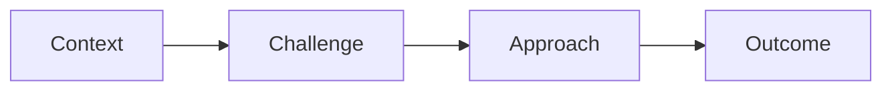

# Razorfish

A new deck starts here.

<!--
Presenter notes: Add context for the opening slide here.
-->

---

# The story

- **Context:** What does the audience need to know?
- **Challenge:** What problem are we solving?
- **Approach:** What is our proposal?
- **Outcome:** What should happen next?

---

# A visual or example

Use Markdown, Vue components, code snippets, and diagrams to make the story concrete.

---

# Questions?

Thank you.
